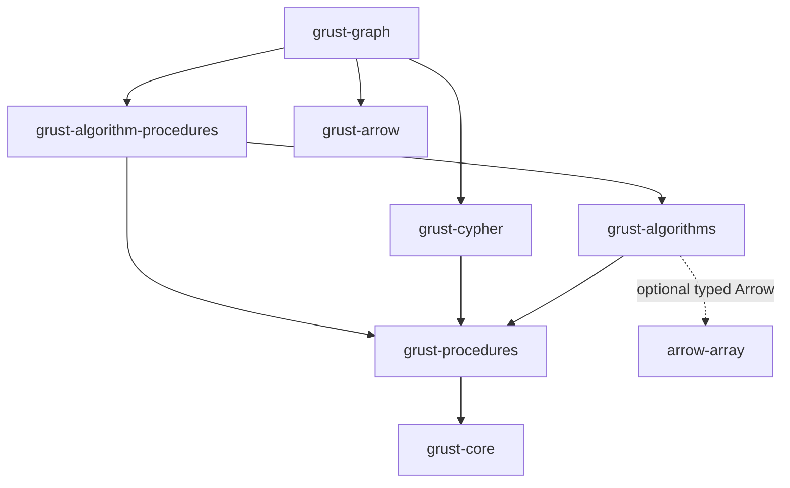

# Generalized graph algorithms

Status: generalized algorithms are implemented and source-qualified for Acorn
0.14.0, published and tagged as `v0.14.0`. All 19 public crates were verified
from outside the workspace; their registry archive hashes match the uploads.
See the [registry receipt](releases/acorn/registry-verification.json) and
[release validation](releases/acorn/validation.json) for the
exact source, package checks and backend boundaries.
Contract: the 2026-09-13 generalized algorithms handoff in
`adversarial-graph-algorithms/docs/grust-generalized-graph-algorithms-handoff.md`.
Engineering guide: QueryGraph `RUST.md`, retrieved 2026-09-13.

## Dependency and feature design

Procedure contracts own shared execution accounting, immutable graph capabilities,
signatures, registration, introspection and checked cursors. They have no parser
dependency. Algorithms use the same execution context as Cypher consumers.
No dependency on Icecat or Grustcat exists. The MIT source notice is retained in
`crates/grust-algorithms/NOTICE.md` and its accompanying license.

| Facade feature | Effect |
| --- | --- |
| `algorithms` | Direct kernels and registry adapters; no required Arrow dependency |
| `arrow` | Graph interchange; enables typed algorithm adapters when algorithms is also enabled |
| `cypher` | Existing Cypher API plus procedure contracts and explicit registry entrypoints |

The Arrow branch `62b8b0fa2b12ec84ee02b5296969efeaf0367a58` was reconciled onto
main `1de21d5`, preserving newer upstream work. Its interchange wrapper remains
separate from direct typed algorithm input.

## Migrating existing callers

Existing `run_read_query` and bounded-read entrypoints retain their built-in
catalog/TVF behavior. Analytics are opt-in: enable the facade's `algorithms` and
`cypher` features, register algorithm providers, and call a `*_with_registry`
entrypoint. A custom `RegistryBuilder` starts empty; call `register_builtins`
when that registry also needs the existing catalog/TVF procedures. The facade
re-exports these contracts as `grust::procedures`.

Bounded analytics must explicitly set `ReadQueryPolicy::allow_read_procedures`.
Existing catalog permission does not grant it. Callers using complete policy
struct literals must account for this new field; defaults keep analytics denied.
Use `LocalSnapshot` and the snapshot-aware prepared/bounded entrypoints when
revision and principal identity come from a backend capture. A plain Graph call
uses a fresh local execution identity and cannot establish backend authorization.

The runnable `grust-cypher` example `custom_procedure` demonstrates an independent
provider and correlated ordinary Cypher. The `grust-algorithms` example
`weighted_paths` demonstrates direct projection, Dijkstra and borrowed path visits.
Arrow is a separate opt-in feature; callers retaining raw Arrow array clones must
retain the owning result wrapper or supply their own admission.

## Algorithm and option coverage

All algorithm rows below have direct Rust calls, ordinary registry-backed Cypher
and optional native Arrow result adapters. Names use `grust.algorithms.`; no GDS
compatibility aliases are claimed. The maintainer for this initial catalog and
its deferred roadmap is the Grust algorithms module owner.

| Priority/status | Operation | Result and independent check |
| --- | --- | --- |
| Required / implemented | `bfs` | Hop distance, external source validation; exhaustive three-node matrix-distance oracle |
| Required / implemented | `dijkstra` | Nonnegative weighted distances; independent Bellman–Ford oracle |
| Required / implemented | `shortestPaths` | One selected path per reachable target; every interior edge/cost checked on small graphs, large actual-consumption receipts |
| Required / implemented | `wcc` | Weak reachability, isolates; exhaustive matrix closure |
| Required / implemented | `scc` | Mutual reachability; exhaustive matrix closure and iterative 65,536-node chain |
| Required / implemented | `pagerank` | Weighted probability scores, dangling mass and convergence; closed-form and probability-mass checks |
| Next slice / implemented (unreleased) | `degree` | Exact projected degree and optional weighted strength; exhaustive two-node multigraph/orientation oracle |
| Next slice / implemented | `dfs` | Deterministic discovery order, each reachable vertex once |
| Next slice / implemented | `multiSourceBfs` | Minimum hop distance from nonempty source array; duplicates harmless |
| Next slice / implemented | `topologicalSort` | Complete DAG order or concrete closed cycle witness |
| Inspection / implemented | `projectionStats` | Selected nodes, original edges, traversal arcs, loops and outgoing CSR bytes |
| Sizing / implemented | `estimateCsr` | O(1) nominal CSR upper bounds from whole snapshot counts; not total memory admission |
| Deferred P2 | A*, Bellman–Ford, DAG/all-pairs/k-shortest paths | Require negative-cycle, heuristic and output-bound contracts/oracles |
| Deferred P2 | Closeness/harmonic, betweenness, eigenvector/HITS | Require directed/disconnected normalization and sampling oracles |
| Deferred P2 | Triangles, clustering, k-core, bridges, bipartiteness | Require explicit multigraph semantics and small exhaustive oracles |
| Deferred P3 | Communities | Require seeded randomness, convergence and objective validation |
| Deferred P3 | Forests, flow/cut | Require capacity, direction and disconnection contracts |
| Deferred P3 | Similarity | Require candidate-pair limits and independent pairwise oracle |
| Deferred P4 | Embeddings/ML | Separate opt-in model/artifact lifecycle and training provenance |

Common options are orientation (`outgoing`, `incoming`, `undirected`), node and
relationship label selection, weight property and missing/null weight policy.
Unknown keys fail. Null label arrays select all; empty arrays select none.
Selected isolates survive. Undirected loops contribute one arc, other edges two;
parallel edges remain distinct. Finite nonnegative weights are required, including
an explicitly supplied default. Integer property weights must be within
`0..=2^53`; larger integers are rejected rather than rounded. Unweighted projections
omit weight buffers. BFS/DFS/components/order use topology, irrespective of weight.

`degree` returns `nodeId`, exact integer `degree`, and nullable numeric
`strength`. A weighted projection supplies finite strength sums; an unweighted
projection supplies null strength. Degree counts zero-weight arcs too. Outgoing
and incoming orientations select that direction; undirected self-loops count
once under the existing projection convention. Nonfinite accumulated strength
is a numerical error. This is not a claim of GDS negative-weight handling:
Grust rejects negative projection weights, whereas GDS degree ignores
non-positive weights. Rust exposes `Degrees::counts()` and `strengths()`;
Arrow uses UInt64 counts and nullable Float64 strength. No normalization,
backend-native execution, or result write-back is implied.

PageRank additionally accepts damping (default .85, in [0,1)), L1 tolerance
(default 1e-8), positive maximum iterations (1000), and personalization. It starts
uniformly; normalized personalization controls teleportation and dangling mass.
Zero outgoing weight is dangling. Parallel edges contribute separately. Weight
scaling avoids overflowing sums of large finite edge weights. Iteration count,
residual and convergence are explicit; an iteration limit is not success evidence
for convergence. Empty graphs return no scores.

Dijkstra uses strict improvement with stable input adjacency order. Equal-cost
ties select one valid path and cannot create predecessor cycles on zero weights.
Reachable arithmetic overflow fails. Direct unreachable distances are infinity;
Cypher and Arrow expose null. Full paths omit unreachable targets and include
the zero-hop source. Source-first cumulative costs begin at zero. Original edge
ordinals map back to the selected snapshot and disambiguate parallel edges even
when external edge IDs repeat. Components use the external ID at the minimum
projection row as their canonical label, not a lexicographic minimum.

## Registry, admission and planning

`RegistryBuilder` freezes canonical names, aliases, signature version, provider,
types/defaults/nullability, options, outputs, mode, determinism, correlation,
graph requirements and computation boundary. Names are ASCII case-insensitive;
output fields are case-sensitive. Registration rejects collisions and invalid
schemas. Resolved handles and `PreparedProcedureQuery` pin the registry generation.
Independent providers implement `ProcedureProvider` without parser/executor edits;
`crates/grust-cypher/tests/read_conformance/procedures.rs` is the external-provider
integration example and tests preflight, aliases, correlation and errors.

`register_builtins` preserves catalog/TVF compatibility and adds `db.procedures`,
whose rows come from the final registry definitions. Extending a registry rebuilds
its catalog while old plans keep their generation. `PreparedProcedureQuery::explain`
reports provider schemas, graph requirements, computation boundaries and the actual
incremental/materializing consumer classifier without executing providers.
`explain_snapshot` additionally binds graph/revision/principal. This is a typed
planning API; a literal Cypher `EXPLAIN` prefix is not implemented by this extension.

The bounded policy separates `allow_read_procedures` from catalog/table permission.
Write providers fail. Graph-free providers receive neither graph nor preparation
cache. A local snapshot pins immutable Graph data and carries explicit graph,
revision and principal identity. These identities are assertions by a trusted
adapter after access checks, not access grants. The Graph convenience API uses
`local-caller` and a fresh execution revision. Prepared snapshot execution rejects
a different graph before invocation; bounded execution revalidates current policy.

Projection preparation is cached per query, keyed by graph, revision, principal,
representation namespace, selection, orientation and weight policy. Correlated CALL
still invokes the kernel once per incoming row. Sources and algorithm parameters
are not projection parameters. Failed preparation is not cached; cached buffers
retain admission until their last owner drops. No cross-query cache is claimed.

| Source / requested execution | Status and boundary |
| --- | --- |
| Immutable local Graph | Supported explicit local projection |
| Memory `indexed_snapshot()` | Tested local projection; old snapshots survive later store writes |
| Private in-memory Turso `indexed_snapshot()` | Tested local projection under adapter gate; old snapshots survive writes |
| Externally mutated Turso database | No claim of transaction-stable capture across independent writers |
| Arrow typed RecordBatches | Direct Rust input, multiple node/edge batches; no backend authorization inferred |
| Backend-native procedure execution | Explicitly unsupported by this local executor; no download/fallback |
| Other backend local capture | Caller must explicitly provide an authorized stable snapshot; not separately qualified here |
| Mutate/write, spill, dynamic shared-library plugins | Unsupported; no hidden write-back or truncation |

Backend proofs are in `crates/grust/tests/algorithm_snapshots.rs`.
Capture, retained input storage and backend index construction are caller-owned,
outside the query execution allowance. No backend timer is attributed to another.

## Representations, streaming and resources

Graph projection validates topology globally, then selects nodes/relationships
and extracts properties once. It allocates owned ID maps, original edge mappings
and packed CSR. It shares external ID payloads where the model permits, but does
not claim zero-copy topology. Reverse reachability CSR is lazy and contains only
node offsets and targets; SCC does not duplicate weights or edge slots.

`from_arrow_batches` reads structural Utf8 columns and selected numeric properties
without constructing Graph, Value or property maps. `present.<key>` distinguishes
absence from explicit null in `property.<key>`. Topology validation/indexing/CSR
still copy. Typed output uses bounded RecordBatches, UInt64 ordinals/iterations,
nullable distances, and LargeList path/order arrays. Utf8 and LargeList offset
bounds are checked. `grust-arrow` IPC remains two single-batch Arrow **files**,
not streaming IPC, mmap, spill or a hard untrusted-input allocation sandbox.

CALL/YIELD filters, simple WITH, UNWIND, plain RETURN and ungrouped COUNT/SUM/AVG
consume incrementally when classified for that path. Generic typed array/index/
aggregate fusion consumes real elements; it has no procedure-name or chain-formula
dispatch. Differential tests compare the fused and ordinary scalar evaluation.
There is no per-path-entry binding clone in the fused path. Grouping, DISTINCT,
sorting, collecting and other shapes use existing budgeted materialization; no
spill is implemented. LIMIT after an aggregate still consumes its entire input.
Early LIMIT stops consumption but may follow blocking projection/kernel work.

One shared `ExecutionContext` accounts for projection, kernel buffers, provider
batches and downstream live intermediate/result storage. Reservations precede
owned allocations; fallible allocation is used where practical. Consumed temporary
rows release lexical admission. Legacy materializing operators retain their
cumulative-copy accounting. Work, cancellation and deadline polling span preparation,
kernels, reconstruction and consumption. Execution is synchronous, one invocation
at a time, with no prefetch. Concurrent queries have independent contexts; callers
may explicitly share a context for a common envelope.

Owned scalar/Arrow batches retain reservations through wrapper clones. A raw Arrow
array clone must retain the wrapper or obtain consumer admission. Borrowed path
visitor slices expire on callback return; the pull cursor reuses one scratch path.
Oversized individual arrays fail admission. Errors are terminal and release cursor
state; prior output must not be reported as complete. Counts are conservative
logical admission, not allocator/RSS measurement or protection from a malicious
in-process provider. Caller input and externally retained final legacy tables need
caller admission after query scope ends.

`CsrEstimate` reports outgoing buffers, lazy reverse buffers and temporary insertion
positions only. It excludes graph/ID/edge storage, allocators, kernels and results;
whole-snapshot counts conservatively ignore selection. Actual admission remains
mandatory. Comprehensive per-kernel peak/output estimates are deferred.

## Qualification and release handoff

Acorn qualification has 1,502 passing workspace tests, zero failures and 47
explicitly ignored tests across 95 targets. Formatting, all-features build,
all-target Clippy with warnings denied, warnings-denied rustdoc, verification of
all 23 workspace tarballs and package attribution pass on macOS ARM64 with
Rust/Cargo 1.97.1. Native Ladybug, LanceDB and CocoIndex integration checks pass;
Turso WAL/MVCC and Memory run through their embedded tests. The final LanceDB
recreation regression fails on the previous cache and passes with generation
invalidation. See the [current receipt](releases/acorn/validation.json) and its
[raw logs](releases/acorn/qualification-logs.tar.gz).

The following service and Docker observations belong to the earlier checkpoint;
they are retained as historical evidence, not current performance qualification.

The reachability oracle exhausts all 512 directed three-node topologies in all
three orientations. Independent weighted and structural checks cover the nine
kernels, Arrow, provider contracts, streaming, preparation isolation and both
backend snapshots. Live Ladybug, LanceDB, CocoIndex and SurrealDB checks pass.
Helix is unavailable on this host; its unit tests pass, but live service behavior
is not claimed. Other unrun service checks remain explicit in the
[source qualification receipt](../benchmarks/algorithms/evidence/2026-09-13/acorn-source-validation.json).

The earlier pinned Acorn Docker image passes 72 upstream correctness cases, two
30-case matrices at 128 and 1,024 nodes, and full weighted chains at 16,384 and
65,536 nodes. Separately named direct and ordinary Cypher participants preserve
all historical participants and official GDS calls. Both upstream modes consume
2,147,516,416 entries in each large-chain path array, producing node checksum
46,912,496,107,520 and weighted-cost checksum 750,516,181,958,851. The full comparison
passes. The earlier local unit-weight receipts have a different cost checksum;
they remain separately identified.

See [receipts and reproduction boundaries](../benchmarks/algorithms/README.md)
for exact source/image identities, input hashes, query text, phase timings,
process outcomes and memory samples. The benchmark and Neo4j each have a separate
two-CPU/four-GiB container. The sampled benchmark-container peak was 216,145,920
bytes, including all sequential native participants and file cache; this is not
per-participant RSS. Runs use single measured repetitions and the host performed
release compilation during part of qualification. No statistical performance or
identical timer/allocation boundary is claimed.

The Acorn [book](book/build/dist/VERSION.md) and
[release TextPack](blog/grust-acorn/dist/VERSION.md) are built, verified, committed
and pushed for the released surface, including compact snapshots, prepared Turso
loads, and LanceDB cache generations. Crate publication follows the package gate
in dependency order, with outside-workspace registry verification and a tag of
the uploaded source. The current-source algorithm benchmark rerun remains
separate from source qualification and retains each host's execution boundary.
The broader deferred catalog is explicit; the extension does not imply arbitrary
Cypher or universal GDS coverage.
