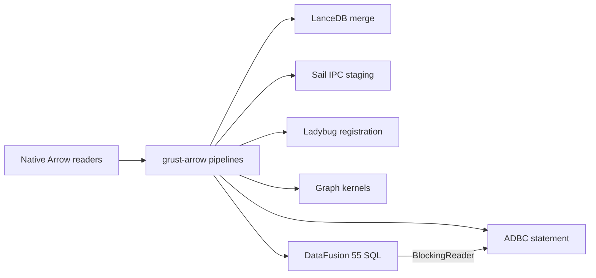

# Arrow pipelines, ADBC and DataFusion

Grust's Arrow-based adapters use `grust-arrow` for common batch and IPC
operations. The graph core and other adapters remain independent of Arrow.
LanceDB and Sail select Arrow 58; the private Ladybug adapter selects Arrow 55.
The default interchange and ADBC helper use Arrow 59. These modules compile the
same implementation against the native SDK types.



## Native tables and readers

`ArrowTable` retains arbitrary native Arrow columns, metadata and batch
boundaries. Its schema is checked when constructed. Its `into_reader` method
transfers ownership into the standard `RecordBatchReader` interface without
concatenating batches or serializing their contents.

`BatchReader` wraps a standard reader with a row limit and an input-batch memory
limit. It pulls on demand and slices without copying buffers. Errors terminate
the stream after one error result. A slice can retain its complete original
allocation. The memory limit applies to decoded Arrow arrays, not process RSS or
the upstream decoder's temporary allocations. `ByteLimitWriter` separately bounds
encoded output, including schema bytes, before the sink grows past its limit.

The shared IPC functions accept standard readers and caller-owned sinks. They
support multiple batches and schema-only empty streams. IPC remains an explicit
encoding boundary; it is not needed when producer and consumer already share
native Arrow types.

## Property-graph interchange

The original `ArrowGraph` is a validated pair of scalar-property batches:

| Table | Structural columns |
| --- | --- |
| Nodes | non-null UTF-8 `node_id`, `label` |
| Edges | non-null UTF-8 `source`, `target`, `label`; nullable UTF-8 `edge_id` |

Property columns use `property.<key>` and a non-null Boolean `present.<key>`.
The marker distinguishes a missing property from an explicit null. Scalar
properties support Null, Boolean, Int64, Float64 and UTF-8, preserving integer
precision. Mixed non-null types and complex graph properties are rejected by
this scalar interchange contract rather than silently coerced.

```rust
use grust::arrow::ArrowGraph;
use std::fs::File;

fn main() -> Result<(), Box<dyn std::error::Error>> {
    let graph = grust::Graph::default();
    let tables = ArrowGraph::from_graph(&graph)?;
    tables.write_ipc(
        File::create("nodes.arrow")?,
        File::create("edges.arrow")?,
    )?;
    let restored = ArrowGraph::read_ipc(
        File::open("nodes.arrow")?,
        File::open("edges.arrow")?,
    )?.to_graph()?;
    assert_eq!(graph, restored);
    Ok(())
}
```

This legacy file-format API still stores one batch in each of two Arrow files.
`ArrowGraphTables` supports the same graph contract across multiple batches. It
validates global node identity and edge endpoints without building property rows
or adjacency. It preserves isolates, loops, parallel edges and row order.
`ArrowGraph::into_tables` and `ArrowGraphTables::into_tables` expose general Arrow
tables whose readers compose with other consumers.

These graph restrictions do not constrain arbitrary `ArrowTable` values passed
to ADBC or backend-native registration. Those pipelines retain nested,
dictionary, temporal and extension columns according to the destination's
capabilities.

## Database ingestion

The shared universal storage layout uses `id,label,props` for nodes and
`key,id,from_id,to_id,label,props` for edges. The property payload preserves
Grust's tagged serialization, including complex values. Native storage encoders
and decoders share the stable edge-key validation rule. Projection can rename
columns without copying their arrays.

LanceDB's `load_arrow` takes standard readers in that storage layout and merges
native batches, maintaining typed mirrors. Sail's `load_arrow` accepts its
existing SQL column names and plain-JSON property representation. It reuses
identity columns and performs required property normalization and endpoint-label
resolution. Spark Connect transports the staged batches as IPC. Sail's graph IPC
convenience loader now uses the same streaming path.

Stream graph loads validate a batch before writing it. Nodes precede edges,
and earlier batches can remain committed if a later operation fails or is
cancelled. They do not promise atomic whole-import replacement. Consult the
adapter contract for existing-row upserts, constraints and typed mirror behavior.

Ladybug can register native readers without IPC, and visit query batches without
collecting all output. Registration requires all input batches simultaneously;
a conservative retained-memory bound applies before registering the table.
Registration creates a queryable Arrow table, not an implicit persisted graph
upsert. Persisted graph loading continues through the adapter's Arrow-backed COPY
path and transaction policy.

## ADBC and extension

Enable the facade's `adbc` feature, or `grust-arrow`'s optional `adbc` feature,
to bind an Arrow 59 reader to a caller-owned ADBC statement with
`grust_arrow::adbc::ingest`. ADBC controls connection lifecycle, target
catalog/schema, ingestion mode, transactions and cancellation. The helper
preserves driver errors and unknown affected-row counts. An ingestion mode such
as append is not reinterpreted as graph upsert.

The optional `ffi` feature exports standard Arrow C streams through upstream
Arrow's implementation and release callbacks. Grust adds no unsafe FFI code.
Rust callers using the same Arrow major can share readers directly; IPC is an
explicit option for serialized cross-language or cross-version boundaries.

New adapters should reuse the standard reader and shared batch operations,
keeping only their schema and backend semantics locally. Enable the facade's
`datafusion` feature for the shared DataFusion 55 foundation. It registers native
Arrow 59 tables and validated graph catalogs without re-encoding their buffers,
accepts upstream table providers, and exposes DataFrames and streaming SQL
results. Working-memory, parallelism, batch size and spill policy are explicit.
Input buffers and retained results remain caller-owned admission; the working
pool is not a process RSS limit.

`BlockingReader` connects a result stream to synchronous Arrow and ADBC
consumers on an ordinary thread or `spawn_blocking`, using a caller-owned live
Tokio runtime. It adds no worker, prefetch queue or IPC boundary. Existing
backend SDKs keep their own compatible Arrow and execution-engine versions.
Cypher lowering and algorithm kernel selection require separate semantic and
performance qualification; this foundation does not automatically change them.

See the repository's `docs/arrow-pipelines.md` for detailed admission,
compatibility and testing contracts. Reproducible pipeline benchmarks measure
native slicing, explicit IPC boundaries and graph validation separately from
backend load and algorithm timings.

## Typed Cypher planning under development

The optional `grust-datafusion` feature `cypher` now provides an explicit
planning bridge over the existing parsed Cypher AST and immutable native Arrow
node providers. It builds DataFusion 55 logical expressions directly, without
SQL text generation. `plan_node_scan` reports either a supported DataFrame or
an unsupported reason; semantic and DataFusion planning errors remain errors.
This interface is unreleased and is not yet wired into automatic route selection.

The implemented surface includes scalar Bool/Int/String/null predicates, scalar
parameters, inline node property maps, projections and DISTINCT, count variants
and grouping, integer/string MIN/MAX, node identity, ordering by projected
expressions or aliases, and literal or
parameterized pagination. Implicit output names share the portable Cypher
projection helper. Duplicate names require future result remapping. Floats,
mixed numeric types, arithmetic, joins and other aggregates need their own
semantic qualification. In particular, integer SUM must preserve overflow
behavior across execution partitions, not only an equal final total.

Caller policy remains a separate unfinished integration: DataFusion's working
memory pool does not enforce Cypher candidate-work, intermediate-copy or encoded
output budgets. Providers must retain snapshot identity and validated native
schemas. Automatic selection and end-to-end performance claims require these
contracts and measurements, including capture, conversion and result consumption.

Qualification includes provider replacement: a DataFrame planned against an
immutable memory provider retains that provider when the session catalog name is
replaced; replanning sees the replacement. This does not establish snapshot
isolation for every external provider. WHERE lowering also preserves the portable
executor's rule that only Boolean true retains a row, including scalar and null
cases. Boolean AND/OR/XOR truth tables are checked through actual execution.

The unreleased `ExpressionBindings` contract resolves multiple graph variables
to typed physical expressions. Scalar and aggregate lowering share that
resolver, including missing-property nulls and explicit unknown-binding errors.
Callers can prepare inputs with multiple bindings; relationship-pattern join
planning is still pending.
