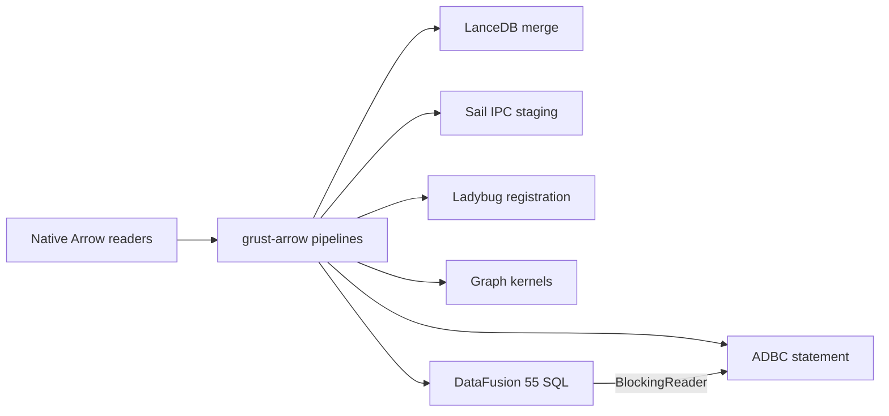

# Arrow pipelines, ADBC and DataFusion

Grust's Arrow-based adapters use `grust-arrow` for common batch and IPC
operations. The graph core and other adapters remain independent of Arrow.
LanceDB and Sail select Arrow 58; the private Ladybug adapter selects Arrow 55.
The default interchange and ADBC helper use Arrow 59. These modules compile the
same implementation against the native SDK types.



## Native tables and readers

`ArrowTable` retains arbitrary native Arrow columns, metadata and batch
boundaries. Its schema is checked when constructed. Its `into_reader` method
transfers ownership into the standard `RecordBatchReader` interface without
concatenating batches or serializing their contents.

`BatchReader` wraps a standard reader with a row limit and an input-batch memory
limit. It pulls on demand and slices without copying buffers. Errors terminate
the stream after one error result. A slice can retain its complete original
allocation. The memory limit applies to decoded Arrow arrays, not process RSS or
the upstream decoder's temporary allocations. `ByteLimitWriter` separately bounds
encoded output, including schema bytes, before the sink grows past its limit.

The shared IPC functions accept standard readers and caller-owned sinks. They
support multiple batches and schema-only empty streams. IPC remains an explicit
encoding boundary; it is not needed when producer and consumer already share
native Arrow types.

## Property-graph interchange

The original `ArrowGraph` is a validated pair of scalar-property batches:

| Table | Structural columns |
| --- | --- |
| Nodes | non-null UTF-8 `node_id`, `label` |
| Edges | non-null UTF-8 `source`, `target`, `label`; nullable UTF-8 `edge_id` |

Property columns use `property.<key>` and a non-null Boolean `present.<key>`.
The marker distinguishes a missing property from an explicit null. Scalar
properties support Null, Boolean, Int64, Float64 and UTF-8, preserving integer
precision. Mixed non-null types and complex graph properties are rejected by
this scalar interchange contract rather than silently coerced.

```rust
use grust::arrow::ArrowGraph;
use std::fs::File;

fn main() -> Result<(), Box<dyn std::error::Error>> {
    let graph = grust::Graph::default();
    let tables = ArrowGraph::from_graph(&graph)?;
    tables.write_ipc(
        File::create("nodes.arrow")?,
        File::create("edges.arrow")?,
    )?;
    let restored = ArrowGraph::read_ipc(
        File::open("nodes.arrow")?,
        File::open("edges.arrow")?,
    )?.to_graph()?;
    assert_eq!(graph, restored);
    Ok(())
}
```

This legacy file-format API still stores one batch in each of two Arrow files.
`ArrowGraphTables` supports the same graph contract across multiple batches. It
validates global node identity and edge endpoints without building property rows
or adjacency. It preserves isolates, loops, parallel edges and row order.
`ArrowGraph::into_tables` and `ArrowGraphTables::into_tables` expose general Arrow
tables whose readers compose with other consumers.

These graph restrictions do not constrain arbitrary `ArrowTable` values passed
to ADBC or backend-native registration. Those pipelines retain nested,
dictionary, temporal and extension columns according to the destination's
capabilities.

## Database ingestion

The shared universal storage layout uses `id,label,props` for nodes and
`key,id,from_id,to_id,label,props` for edges. The property payload preserves
Grust's tagged serialization, including complex values. Native storage encoders
and decoders share the stable edge-key validation rule. Projection can rename
columns without copying their arrays.

LanceDB's `load_arrow` takes standard readers in that storage layout and merges
native batches, maintaining typed mirrors. Sail's `load_arrow` accepts its
existing SQL column names and plain-JSON property representation. It reuses
identity columns and performs required property normalization and endpoint-label
resolution. Spark Connect transports the staged batches as IPC. Sail's graph IPC
convenience loader now uses the same streaming path.

Stream graph loads validate a batch before writing it. Nodes precede edges,
and earlier batches can remain committed if a later operation fails or is
cancelled. They do not promise atomic whole-import replacement. Consult the
adapter contract for existing-row upserts, constraints and typed mirror behavior.

Ladybug can register native readers without IPC, and visit query batches without
collecting all output. Registration requires all input batches simultaneously;
a conservative retained-memory bound applies before registering the table.
Registration creates a queryable Arrow table, not an implicit persisted graph
upsert. Persisted graph loading continues through the adapter's Arrow-backed COPY
path and transaction policy.

## ADBC and extension

Enable the facade's `adbc` feature, or `grust-arrow`'s optional `adbc` feature,
to bind an Arrow 59 reader to a caller-owned ADBC statement with
`grust_arrow::adbc::ingest`. ADBC controls connection lifecycle, target
catalog/schema, ingestion mode, transactions and cancellation. The helper
preserves driver errors and unknown affected-row counts. An ingestion mode such
as append is not reinterpreted as graph upsert.

The optional `ffi` feature exports standard Arrow C streams through upstream
Arrow's implementation and release callbacks. Grust adds no unsafe FFI code.
Rust callers using the same Arrow major can share readers directly; IPC is an
explicit option for serialized cross-language or cross-version boundaries.

New adapters should reuse the standard reader and shared batch operations,
keeping only their schema and backend semantics locally. Enable the facade's
`datafusion` feature for the shared DataFusion 55 foundation. It registers native
Arrow 59 tables and validated graph catalogs without re-encoding their buffers,
accepts upstream table providers, and exposes DataFrames and streaming SQL
results. Working-memory, parallelism, batch size and spill policy are explicit.
Input buffers and retained results remain caller-owned admission; the working
pool is not a process RSS limit.

`BlockingReader` connects a result stream to synchronous Arrow and ADBC
consumers on an ordinary thread or `spawn_blocking`, using a caller-owned live
Tokio runtime. It adds no worker, prefetch queue or IPC boundary. Existing
backend SDKs keep their own compatible Arrow and execution-engine versions.
Cypher lowering and algorithm kernel selection require separate semantic and
performance qualification; this foundation does not automatically change them.

See the repository's `docs/arrow-pipelines.md` for detailed admission,
compatibility and testing contracts. Reproducible pipeline benchmarks measure
native slicing, explicit IPC boundaries and graph validation separately from
backend load and algorithm timings.

## Typed Cypher execution

Combining facade features `cypher` and `datafusion` enables the bridge at
`grust::datafusion::cypher`. Direct consumers can enable `grust-datafusion`
feature `cypher`. It provides an explicit execution
bridge over native Arrow graph tables. `GraphSnapshot::execute` accepts Cypher
text, parameters and `OutputLimits`; it uses the existing parser and semantic
analyzer, builds DataFusion 55 expressions directly, and returns an ordinary
`CypherResultTable`. No SQL text or intermediate row-oriented graph is generated.
Isopod 0.17.0 adds this explicit surface. Ordinary Cypher entrypoints do not yet select it
automatically, and it does not implement the complete bounded read policy.

### Snapshot and composition

`GraphSnapshot` captures validated immutable node/edge providers, independent of
session catalog replacement. Existing Arrow buffers remain shared. An additional
UInt64 ordinal, costing eight bytes per edge, supplies physical relationship
identity within the snapshot. Parallel edges and optional/repeated external edge
IDs remain distinct. Backend transaction and authorization identity, input
storage and ordinal allocation remain caller responsibilities.

`GraphSnapshot::plan` selects the node or relationship compiler from the parsed
query shape. `QueryPlan` records its `PlanKind` and either a DataFrame or an
unsupported reason. `CypherExecution` distinguishes completed execution from an
unsupported query that never executed. Parse, semantic, planning, execution and
output-limit errors propagate without retrying another executor or snapshot.

Applications can also use `plan_node_scan`, `plan_relationship_scan`, and the
snapshot's directed/undirected relationship operators directly. The shared
`ExpressionBindings` contract resolves graph variables to typed physical
expressions for scalar and aggregate compilation. Missing properties become
null; unknown variables remain errors. This allows composition without copying
the scalar semantics into each pattern planner.

### Qualified language surface

The current compiler supports node scans and fixed-length relationship paths in either
direction or undirected form; labels, relationship types and scalar inline maps;
named, anonymous and repeated endpoint bindings; WHERE, projection, DISTINCT,
count variants/grouping, integer/string MIN/MAX, node identity, projected
ordering, and literal/parameter pagination. Scalar domains are Boolean, Int64,
UTF-8 and null. Only Boolean true retains a WHERE row.

Undirected matching emits both orientations of non-loop edges and each self-loop
once. Repeated endpoints constrain matching to self-loops using one node join;
the undirected form omits its reverse branch. Anonymous names are generated after
semantic analysis and cannot collide with explicit pattern bindings.

Variable-length paths, OPTIONAL MATCH, correlated maps, floating-point
and mixed numeric expressions, arithmetic, additional aggregates and duplicate
projection names still need mappings or result remapping. Integer SUM requires
particular care: preserving an equal final total does not preserve sequential
overflow behavior across partitions. Unsupported cases are not silently coerced.

### Output and remaining policy work

`decode_result_batch` preserves column order/names, row multiplicity, nulls and
exact Int64 values when converting native scalar batches to portable rows. Types
are resolved once per column; unsupported types fail before allocating rows.
Arrow/ADBC consumers can retain native batches and avoid owned row conversion.

`collect_result` checks cumulative row counts before decoding each batch and
counts exact serialized JSON output bytes without allocating a JSON buffer.
The count includes column metadata, delimiters, escaping and inter-row commas,
including empty results. Exceeding either limit returns an error with no partial
result. One decoded batch still requires separate memory admission.

Mantis 0.19.0's `decode_result_batch_with_context` charges cumulative logical
copy bytes before creating portable rows and strings. It measures the actual
Arrow slice, including null-aware UTF-8 lengths, column names and row/value
containers. `collect_result_with_context` also charges collection metadata and
moved row containers, and shares cancellation/deadline control. Controlled
`GraphSnapshot::execute_with_context` now uses this collector. The charge stays
consumed after output is dropped; it is not a live-heap or allocator-capacity
measurement. Arrow input, validation descriptors and operator allocations remain
separate. No query is automatically routed on this basis.

DataFusion's working-memory pool and these output checks do not enforce Cypher's
candidate-work, intermediate-copy, query/input or deadline contracts. Automatic
selection remains pending until those boundaries and measured cost decisions
are integrated. The completed scan profile reports conversion/preparation costs
separately; the parallel-ring path profile also retains preparation and admission boundaries. Passing explicit execution
tests does not establish backend-wide speed or resource-policy parity.

`RelationshipPlan::join_trail` composes plans through shared node bindings and
excludes physical edge reuse across all joined parts. Parallel edges remain
distinct. Plans must come from the same captured snapshot; cloned handles retain
that identity. Physical columns are renamed before composition to avoid alias
collisions. The parsed path planner composes these operators for fixed-length paths;
variable-length lowering and path-resource admission remain separate work.

Fixed-length paths reuse the shared RETURN and predicate compilers after trail
composition. Labels, relationship types, inline maps and repeated nodes constrain
the complete path, with physical edge uniqueness across all segments. Direction
may differ per segment. Variable-length bounds and named path values remain
unsupported; the pinned parallel-ring profile measures two- and three-hop execution with
separate preparation costs; it is not a general routing threshold.

### Shared cancellation and deadlines (Ostracod 0.18.0)

`ExecutionContext::cancelled()` is a runtime-independent notification shared by
procedures and relational execution. `grust_datafusion::run_cancellable` races
an operation with that notification and the context's absolute deadline.
`GraphSnapshot::execute_with_context` applies it through complete Cypher result
consumption. The operation and its owned streams are dropped on cancellation or
deadline; errors are never retried. Dropping one wrapper unregisters its waiter
without cancelling sibling work. A deadline needs Tokio's time driver.

Control is cooperative: synchronous work within one poll is not preempted, and
providers/kernels must checkpoint during computation. Wrapping stream creation
alone does not control later consumption. These methods do not charge candidate
work or intermediate allocations and do not establish complete read-policy
admission or automatic routing.

`control_stream` retains cancellation and deadline control for an Arrow stream's
whole lifetime. `DataFusionEngine::execute_stream_with_context` controls both
SQL preparation and the returned stream. Batches pass through without buffer
copies, queues or worker tasks. Completion or the first error immediately drops
the provider stream and timer; subsequent polls remain finished. The controlled
stream can feed `BlockingReader` and ADBC ingestion directly.

### Prepared read admission (Ostracod 0.18.0)

`grust_cypher::PreparedReadRequest` owns the validated AST, policy and original
absolute deadline, borrows the admitted immutable parameters, and retains any
application registry generation. The bounded reference executor uses its
request, graph/index and output checks. Indexed graph checks reuse the cached
exact serialized size; parameter/output counting does not allocate encoded JSON.
Oversized parameters fail before graph inspection. Preparation does not authorize
or bind a backend snapshot, install execution budgets, or qualify a DataFusion
route. Route-specific candidate/intermediate accounting must still be enforced.

### Exact snapshot statistics (Ostracod 0.18.0)

`GraphSnapshot::statistics()` returns exact node/edge row counts, original input
batch counts and the logical bytes added for UInt64 relationship ordinals. These
are cached during capture and read in constant time without a provider scan or
graph export. Cloned snapshots keep identical statistics; session catalog
replacement cannot change them. Batch counts do not claim execution parallelism.
Selectivity, join cardinalities, serialized graph size and total memory are not
inferred from these counts. Automatic routing still requires qualified costs and
complete resource admission.

### Borrowed graph serialization (Ostracod 0.18.0)

`ArrowGraphTables::as_serializable_graph()` presents the ordinary Grust graph
serde contract directly over native Arrow 55/58/59 columns. It preserves row and
batch order, identity, sorted property keys, scalar tags, and missing versus null
properties. It builds only per-batch column descriptors, without row graphs,
property maps or string-value copies. The caller selects the serializer and sink;
a bounded writer over `std::io::sink()` can count exact JSON bytes without keeping
the encoded output. Writer errors propagate and may leave a prefix in a real sink.
This enables native input-size admission; automatic routing and full query
resource-policy integration remain separate work.

### Native Arrow input admission (Ostracod 0.18.0)

`GraphSnapshot::try_new_with_input_policy` checks a prepared request's node/edge
limits and exact graph JSON size before capturing native providers. It uses the
borrowed Arrow serialization view and bounded counting writer, with no row graph
or encoded JSON buffer. Row rejection precedes serialization; the original
request deadline also covers capture. `SnapshotStatistics::serialized_graph_bytes`
is `Some(exact_bytes)` after measured capture and `None` for ordinary capture,
including an unmeasured empty graph. Clones retain the measurement.

`PreparedReadRequest::check_serializable_graph` shares these checks with trusted
native adapters. `check_measured_graph` reuses exact cached measurements for the
same immutable projection; estimates are not admissible substitutes. Backend
snapshot authority, pre-existing input buffers, ordinal allocation and execution
work/intermediates remain separate obligations. This is input-size admission,
not a complete bounded DataFusion executor or automatic routing.

### Owned buffer admission (Brine 0.20.0)

`retain_buffer_owner` attaches an application token to an immutable Arrow buffer
through safe `bytes::Bytes` ownership. Native slices, array clones and C Data
exports retain that owner without copying bytes. Existing clones made before
attachment do not acquire the token. Reserve storage before allocation; this
helper preserves ownership and does not itself measure memory.

`GraphSnapshot::try_new_with_context` admits the added UInt64 ordinal payload
and construction work. Reservations stay with the buffers after the snapshot,
provider or result stream disappears. The combined
`try_new_with_input_policy_and_context` also checks exact input size and requires
an execution deadline no later than the prepared request's deadline. Input
buffers, provider/schema metadata and allocator capacity remain outside the
logical ordinal-payload bound. These capture checks do not establish backend
authority, full operator accounting or automatic execution selection.

`retain_array_owner` extends buffer ownership through an array's validity bits
and nested children. It rebuilds and validates metadata without copying payload
bytes. Arrays with no physical buffers retain no token; a wrapper remains
necessary when metadata-only lifetime must be admitted. Algorithm result batches
use the same mechanism so raw batch clones and retained child slices keep their
original reservation. New reservations are not charged for each clone.
