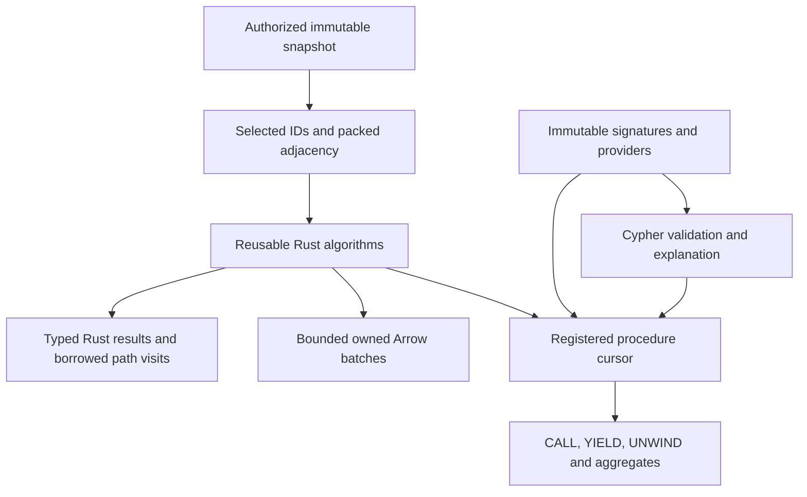

# Graph analytics through one Rust implementation

Acorn adds graph analytics to Grust's backend-neutral property-graph API.
Applications prepare an explicit immutable snapshot, run a Rust kernel, and choose
Rust, Arrow or ordinary Cypher consumption. Algorithms do not own a database
connection or choose another graph. Memory and private Turso snapshots demonstrate
the same prepared query against two independently captured sources.



`grust-algorithms` has no Cypher dependency. `grust-procedures` owns signatures,
providers, checked cursors and the shared execution budget. The
`grust-algorithm-procedures` crate connects them. An application can register an
independent provider without changing the parser, analyzer or executor. The facade
exposes these through `algorithms`, `cypher` and optional `arrow` features.

## Starting from the facade

```toml
[dependencies]
grust = { package = "grust-graph", version = "0.14.0", features = ["algorithms", "cypher", "arrow"] }
```

Register the desired providers once and retain the immutable registry:

```rust
use grust::{algorithm_procedures, procedures, CypherParameters};

let mut builder = procedures::RegistryBuilder::default();
procedures::register_builtins(&mut builder)?;
algorithm_procedures::register_algorithms(&mut builder)?;
let registry = builder.build();
let result = grust::run_read_query_with_registry(
    &graph,
    "roads",
    "CALL grust.algorithms.dijkstra('start', {weightProperty: 'cost'}) \
     YIELD nodeId, distance RETURN nodeId, distance",
    &CypherParameters::new(),
    &registry,
)?;
```

Here `graph` is a caller-owned `grust::Graph`. A bounded query additionally opts
into `ReadQueryPolicy::allow_read_procedures`; catalog permission alone cannot
admit analytics. For a backend capture, construct a `LocalSnapshot` after access
checks, with an explicit graph, revision and principal. A prepared plan rejects a
different graph name before invoking a provider. The capability pins data; the
identity strings do not grant access.

For direct Rust, create an `ExecutionContext` with memory/work limits, batch size
and optional deadline. `GraphProjection::from_graph` accepts label selection,
orientation and a weight policy. `from_topology` accepts external IDs and typed
edges; `from_arrow_batches` reads typed columns directly. Kernel results share
the projection, so dropping the caller's projection handle cannot invalidate IDs.
Runnable source examples are `weighted_paths` in `grust-algorithms` and
`custom_procedure` in `grust-cypher`.

## Available operations

All procedure names below have the prefix `grust.algorithms.`. They call the same
kernels as direct Rust and have typed Arrow result adapters.

| Operation | Contract |
| --- | --- |
| `bfs` | Hop distances from one external source ID |
| `multiSourceBfs` | Minimum hop distance from a nonempty source array |
| `dfs` | Deterministic reachable-node discovery order |
| `dijkstra` | Distances with finite nonnegative weights |
| `shortestPaths` | One selected full shortest path per reachable target |
| `wcc` | Weak components, including isolates |
| `scc` | Directed strong components with iterative traversal |
| `pagerank` | Weighted scores, residual, iterations and convergence status |
| `topologicalSort` | Complete DAG order or a concrete closed cycle witness |

`projectionStats` inspects selected topology. `estimateCsr` reports nominal
adjacency-buffer upper bounds from snapshot counts, excluding graph storage,
ID maps, original edge tables, kernel scratch, output and allocator overhead.
Selection can reduce those counts. The estimate is not total memory admission.

The common configuration keys are `orientation`, `nodeLabels`,
`relationshipTypes`, `weightProperty` and `defaultWeight`. Unknown keys fail.
Null label arrays select all labels; empty arrays select none. Edges crossing
outside the selected node set are excluded, while selected isolates remain.
Orientations are outgoing, incoming and undirected. Undirected loops contribute
one traversal arc; other undirected edges contribute two. Parallel edges remain
distinct. Topology algorithms ignore weights after projection validation.

Weights must be finite and nonnegative. Integer weights outside `0..=2^53` are
rejected rather than rounded. Missing or null weights fail unless a finite
nonnegative default is explicitly supplied. Unit projections omit weight storage.
Dijkstra uses strict improvement and stable adjacency order for equal costs;
zero-weight ties cannot create predecessor cycles. Reachable cost overflow is an
error. Unreachable distances are infinity in direct Rust and null in Cypher/Arrow.
Component IDs are the external ID at the minimum projection row in each component.

PageRank defaults to damping .85, L1 tolerance 1e-8 and 1000 iterations. Scores
start uniformly. Optional personalization controls teleportation and dangling
mass; zero outgoing weight is dangling. Parallel edges contribute separately.
Finite large weights are scaled before sums. Iteration-limit results explicitly
report non-convergence. Seeds, community algorithms, negative-weight paths,
all-pairs/k-shortest paths, flow, similarity and ML are deferred; the current
catalog is not universal GDS compatibility.

## Full paths and incremental consumption

A full path contains source-first external node IDs and cumulative costs beginning
at zero. Original edge ordinals identify the selected multigraph edges. The
zero-hop source path is included; unreachable targets are omitted.

```cypher
CALL grust.algorithms.shortestPaths('start', {weightProperty: 'cost'})
YIELD nodeIds, costs
UNWIND range(0, size(costs) - 1) AS i
RETURN count(nodeIds[i]), sum(costs[i])
LIMIT 1
```

This query consumes every actual requested array element. LIMIT bounds the final
aggregate output, not its input. The executor incrementally handles CALL/YIELD
filters, simple WITH, UNWIND, plain RETURN and ungrouped COUNT/SUM/AVG. Generic
array/index aggregation avoids allocating a binding row for every path element.
It does not recognize a benchmark graph or substitute a closed-form answer.
Other shapes use the existing budgeted materializing executor. Grouping, sorting,
DISTINCT and collecting have no spill implementation and may exceed admission.
Early LIMIT can stop consumption, but a global kernel may already have computed
its result before producing the first batch.

One shared execution context accounts for projection buffers, scratch, provider
results and downstream intermediates. Reservations stay attached through internal
ownership transfers. Temporary consumed values release live admission; legacy
materializing operators retain cumulative-copy accounting. Cancellation, deadline
and work checks span preparation, kernels, reconstruction and consumption.
Execution is synchronous without prefetch or parallel kernel workers.

Borrowed path visitor slices expire when the callback returns. Pull cursors reuse
scratch storage. Owned scalar and Arrow batches retain admission through wrapper
clones; raw Arrow clones require retaining the wrapper or independent consumer
admission. Full paths and cycle/order arrays use LargeList offsets with explicit
limits. An individual oversized path fails instead of truncating. Caller-owned
input and externally retained legacy result tables require caller admission;
logical accounting is not a process RSS sandbox for untrusted provider code.

## Discovery, preparation reuse and execution classes

`db.procedures` describes the final registry generation, including argument and
option defaults, outputs, provider identity, modes, correlation and computation
boundary. Prepared explanations use the same definitions and consumer classifier.
`explain_snapshot` also identifies the admitted revision and principal without
running algorithms. These are Rust planning methods; a literal Cypher EXPLAIN
prefix is not added by this extension.

Projection reuse is query-scoped and keyed by snapshot, principal, representation,
selection, orientation and weight policy. Correlated CALL still executes once per
incoming row; caching preparation does not cache algorithm answers. Reverse SCC
adjacency is built lazily and stores only topology, without duplicate weights or
edge identities. Projections retain their selection policy for inspection.

The current procedure executor accepts an explicitly selected local snapshot.
Backend-native execution is rejected when unsupported, with no automatic whole-
graph download. Memory and a private Turso database have snapshot integration
proofs, including reads from old captures after later writes. Arbitrary external
writers, remote snapshot stability and native analytics are not thereby qualified.
Mutation/write-back needs a separate atomic transaction design and remains absent.

Both local direct Rust and ordinary Cypher completed the 65,536-node full-path
chain, consuming 2,147,516,416 entries in each array. Those single observations
have disclosed process envelopes and differ from the frozen Docker protocol.
The repository retains independent small-graph oracles, source/binary receipts,
frozen baseline results and current qualification status. See the
[coverage and resource contracts](https://github.com/querygraph/grust/blob/main/docs/GENERALIZED_ALGORITHMS.md)
and [benchmark evidence](https://github.com/querygraph/grust/tree/main/benchmarks/algorithms).
