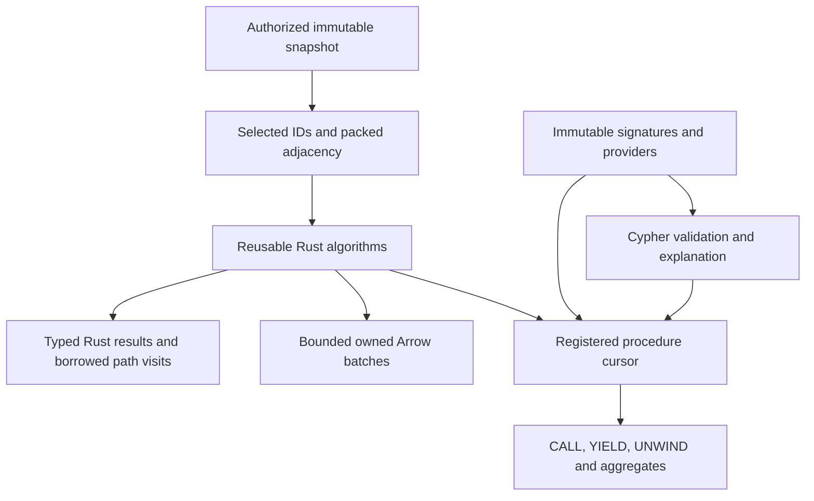

# Graph analytics through one Rust implementation

Acorn adds graph analytics to Grust's backend-neutral property-graph API.
Applications prepare an explicit immutable snapshot, run a Rust kernel, and choose
Rust, Arrow or ordinary Cypher consumption. Algorithms do not own a database
connection or choose another graph. Memory and private Turso snapshots demonstrate
the same prepared query against two independently captured sources.



`grust-algorithms` has no Cypher dependency. `grust-procedures` owns signatures,
providers, checked cursors and the shared execution budget. The
`grust-algorithm-procedures` crate connects them. An application can register an
independent provider without changing the parser, analyzer or executor. The facade
exposes these through `algorithms`, `cypher` and optional `arrow` features.

## Starting from the facade

```toml
[dependencies]
grust = { package = "grust-graph", version = "0.21.0", features = ["algorithms", "cypher", "arrow"] }
```

Register the desired providers once and retain the immutable registry:

```rust
use grust::{algorithm_procedures, procedures, CypherParameters};

let mut builder = procedures::RegistryBuilder::default();
procedures::register_builtins(&mut builder)?;
algorithm_procedures::register_algorithms(&mut builder)?;
let registry = builder.build();
let result = grust::run_read_query_with_registry(
    &graph,
    "roads",
    "CALL grust.algorithms.dijkstra('start', {weightProperty: 'cost'}) \
     YIELD nodeId, distance RETURN nodeId, distance",
    &CypherParameters::new(),
    &registry,
)?;
```

Here `graph` is a caller-owned `grust::Graph`. A bounded query additionally opts
into `ReadQueryPolicy::allow_read_procedures`; catalog permission alone cannot
admit analytics. For a backend capture, construct a `LocalSnapshot` after access
checks, with an explicit graph, revision and principal. A prepared plan rejects a
different graph name before invoking a provider. The capability pins data; the
identity strings do not grant access.

For direct Rust, create an `ExecutionContext` with memory/work limits, batch size
and optional deadline; `ExecutionContext::with_accounting` runs with less
checking, as described under "Running without accounting". `GraphProjection::from_graph` accepts label selection,
orientation and a weight policy. `from_topology` accepts external IDs and typed
edges; `from_arrow_batches` reads typed columns directly. Kernel results share
the projection, so dropping the caller's projection handle cannot invalidate IDs.
Runnable source examples are `weighted_paths` in `grust-algorithms` and
`custom_procedure` in `grust-cypher`.

## Available operations

All procedure names below have the prefix `grust.algorithms.`. They call the same
kernels as direct Rust and have typed Arrow result adapters.

| Operation | Contract |
| --- | --- |
| `bfs` | Hop distances from one external source ID |
| `multiSourceBfs` | Minimum hop distance from a nonempty source array |
| `dfs` | Deterministic reachable-node discovery order |
| `dijkstra` | Distances with finite nonnegative weights |
| `shortestPaths` | One selected full shortest path per reachable target |
| `wcc` | Weak components, including isolates |
| `scc` | Directed strong components with iterative traversal |
| `degree` | Exact projected arc counts and optional weighted strength |
| `pagerank` | Weighted scores, residual, iterations and convergence status |
| `articleRank` | As `pagerank`, with the mean outgoing weight added to every divisor, so a sparse citer confers less |
| `topologicalSort` | Complete DAG order or a concrete closed cycle witness |
| `bellmanFord` | Distances where weights may be negative, or the negative cycle that makes them meaningless |
| `astar` | One shortest path to a named target, guided by great-circle distance from two coordinate properties |
| `yens` | The `k` shortest loopless paths to a named target, ranked by `pathIndex`, with ties broken by node order |
| `allPairsShortestPaths` | Distance for every reachable ordered pair, streamed one source at a time and never held as a matrix; unreachable pairs are omitted, and `sourceNodes` restricts the sources |

### Centrality

| Operation | Contract |
| --- | --- |
| `betweenness` | Ordered-pair dependency per node, exact or from a seeded sample |
| `closeness` | Reach over mean distance, per component, optionally Wasserman-Faust corrected |
| `harmonic` | Sum of reciprocal distances, needing no convention for disconnected graphs |
| `eigenvector` | Principal eigenvector by shifted power iteration, with convergence evidence |
| `katz` | Attenuated walk count, with convergence evidence |
| `hits` | Hub and authority scores, each at unit length |

### Community and structure

| Operation | Contract |
| --- | --- |
| `louvain` | Modularity communities, named by their smallest member |
| `leiden` | As Louvain, with every community guaranteed connected |
| `labelPropagation` | Communities by weighted majority, on a reproducible schedule |
| `k1Coloring` | A colour per node so that no edge joins two of the same, greedily |
| `modularity` | Modularity and conductance of a partition the caller supplies |
| `kCore` | Core number per node and the graph's degeneracy |
| `triangleCount` | Triangles per node on the simple graph, and the total |
| `localClusteringCoefficient` | Triangles over possible triangles, null where undefined |
| `nodeSimilarity` | Node pairs by Jaccard, overlap or cosine over neighbour sets |
| `linkPrediction` | A score per node pair — common neighbours, Adamic–Adar, resource allocation, preferential attachment, total neighbours or same community — over every pair at distance two or a supplied list |
| `bridges` | Edges whose removal disconnects their endpoints |
| `articulationPoints` | Nodes whose removal disconnects two neighbours |
| `biconnectedComponents` | Edges grouped by the cycles they share |
| `spanningTree` | Minimum or maximum spanning forest, ties by edge ordinal |
| `maxFlow` | Maximum flow per edge from one source to one target |
| `minCut` | Which side of the minimum cut each node falls on |
| `fastRP` | A fixed-length embedding per node, from sparse random projection |

`projectionStats` inspects selected topology. `estimateCsr` reports nominal
adjacency-buffer upper bounds from snapshot counts, excluding graph storage,
ID maps, original edge tables, kernel scratch, output and allocator overhead.
Selection can reduce those counts. The estimate is not total memory admission.

The common configuration keys are `orientation`, `nodeLabels`,
`relationshipTypes`, `weightProperty` and `defaultWeight`. Unknown keys fail.
Null label arrays select all labels; empty arrays select none. Edges crossing
outside the selected node set are excluded, while selected isolates remain.
Orientations are outgoing, incoming and undirected. Undirected loops contribute
one traversal arc; other undirected edges contribute two. Parallel edges remain
distinct. Topology algorithms ignore weights after projection validation.

Weights must be finite and nonnegative. Integer weights outside `0..=2^53` are
rejected rather than rounded. Missing or null weights fail unless a finite
nonnegative default is explicitly supplied. Unit projections omit weight storage.
Dijkstra uses strict improvement and stable adjacency order for equal costs;
zero-weight ties cannot create predecessor cycles. Reachable cost overflow is an
error. Unreachable distances are infinity in direct Rust and null in Cypher/Arrow.
Component IDs are the external ID at the minimum projection row in each component.

`degree` returns every selected node, including isolates. Direct Rust
`degree(&projection)` exposes exact `usize` counts and optional `f64` strengths.
Arrow columns are `nodeId: Utf8`, `degree: UInt64`, and nullable
`strength: Float64`; Cypher returns an exact checked integer count and null
strength for unweighted projections. No normalization is implicit.

```cypher
CALL grust.algorithms.degree({orientation: 'incoming', weightProperty: 'cost'})
YIELD nodeId, degree, strength
RETURN nodeId, degree, strength
```

Counts include parallel and zero-weight arcs. Undirected loops count once under
this projection contract. Weighted strength sums finite nonnegative weights;
overflow fails explicitly. Negative weights remain unsupported. Unweighted
execution reads existing CSR offsets in O(V); weighted execution takes O(V+A).
Result buffers retain the shared memory admission, and bounded work-accounting
chunks preserve cancellation polling without a lock per scalar. This contract
does not establish universal degree-centrality compatibility with other engines.

PageRank defaults to damping .85, L1 tolerance 1e-8 and 1000 iterations. Scores
start uniformly. Optional personalization controls teleportation and dangling
mass; zero outgoing weight is dangling. Parallel edges contribute separately.
Finite large weights are scaled before sums. Iteration-limit results explicitly
report non-convergence. Seeds, community algorithms, negative-weight paths,
all-pairs/k-shortest paths, flow, similarity and ML are deferred; the current
catalog is not universal GDS compatibility.

## Full paths and incremental consumption

A full path contains source-first external node IDs and cumulative costs beginning
at zero. Original edge ordinals identify the selected multigraph edges. The
zero-hop source path is included; unreachable targets are omitted.

```cypher
CALL grust.algorithms.shortestPaths('start', {weightProperty: 'cost'})
YIELD nodeIds, costs
UNWIND range(0, size(costs) - 1) AS i
RETURN count(nodeIds[i]), sum(costs[i])
LIMIT 1
```

This query consumes every actual requested array element. LIMIT bounds the final
aggregate output, not its input. The executor incrementally handles CALL/YIELD
filters, simple WITH, UNWIND, plain RETURN and ungrouped COUNT/SUM/AVG. Generic
array/index aggregation avoids allocating a binding row for every path element.
It does not recognize a benchmark graph or substitute a closed-form answer.
Other shapes use the existing budgeted materializing executor. Grouping, sorting,
DISTINCT and collecting have no spill implementation and may exceed admission.
Early LIMIT can stop consumption, but a global kernel may already have computed
its result before producing the first batch.

One shared execution context accounts for projection buffers, scratch, provider
results and downstream intermediates. Reservations stay attached through internal
ownership transfers. Temporary consumed values release live admission; legacy
materializing operators retain cumulative-copy accounting. Cancellation, deadline
and work checks span preparation, kernels, reconstruction and consumption.
Execution is synchronous without prefetch or parallel kernel workers.

Borrowed path visitor slices expire when the callback returns. Pull cursors reuse
scratch storage. Owned scalar batches retain admission through wrapper clones.
Brine 0.20.0's Arrow ownership extension also retains algorithm-result admission
through raw batches, buffer slices and nested children; shared physical buffers
keep the original reservation without charging each clone again. Full paths and cycle/order arrays use LargeList offsets with explicit
limits. An individual oversized path fails instead of truncating. Caller-owned
input and externally retained legacy result tables require caller admission;
logical accounting is not a process RSS sandbox for untrusted provider code.

## Discovery, preparation reuse and execution classes

`db.procedures` describes the final registry generation, including argument and
option defaults, outputs, provider identity, modes, correlation and computation
boundary. Prepared explanations use the same definitions and consumer classifier.
`explain_snapshot` also identifies the admitted revision and principal without
running algorithms. These are Rust planning methods; a literal Cypher EXPLAIN
prefix is not added by this extension.

Projection reuse is query-scoped and keyed by snapshot, principal, representation,
selection, orientation and weight policy. Correlated CALL still executes once per
incoming row; caching preparation does not cache algorithm answers. Reverse SCC
adjacency is built lazily and stores only topology, without duplicate weights or
edge identities. Projections retain their selection policy for inspection.

The current procedure executor accepts an explicitly selected local snapshot.
Backend-native execution is rejected when unsupported, with no automatic whole-
graph download. Memory and a private Turso database have snapshot integration
proofs, including reads from old captures after later writes. Arbitrary external
writers, remote snapshot stability and native analytics are not thereby qualified.
Mutation/write-back needs a separate atomic transaction design and remains absent.

Both local direct Rust and ordinary Cypher completed the 65,536-node full-path
chain, consuming 2,147,516,416 entries in each array. Those single observations
have disclosed process envelopes and differ from the frozen Docker protocol.
The repository retains independent small-graph oracles, source/binary receipts,
frozen baseline results and current qualification status. See the
[coverage and resource contracts](https://github.com/querygraph/grust/blob/main/docs/GENERALIZED_ALGORITHMS.md)
and [benchmark evidence](https://github.com/querygraph/grust/tree/main/benchmarks/algorithms).

## What the cooperative budget costs

Kernels charge the shared execution budget once per unit of graph work: per
visited entry, and per step of a reconstructed path. That granularity is what
makes a budget meaningful — an exhausted allowance stops the kernel where it
stands rather than after the next batch — and it means the meter runs as often
as the work it guards. On a 16384-node weighted chain with full path
reconstruction, the meter is entered about 134 million times.

Two properties of that meter are therefore part of the algorithm contract.

**Admission is lock-free and exact.** The cumulative work counter and the
cancellation flag are atomics. Each charge admits through a compare-exchange
that recomputes admission against the value it actually replaces, so a
concurrent charge cannot overshoot the limit between load and store, and an
exhausted budget still fails exactly at its limit. Accounted memory and its
high-water mark are atomics admitted the same way, so a byte limit is as exact
as a work limit. Only the cancellation wakers keep a mutex: they are rare, and
they are the one place several fields must move together.

Memory had to follow work off the lock because of who charges it. A kernel
reserves memory per batch, but a materializing Cypher consumer charges the
logical bytes of every value it copies, once or more per row, through
`charge_cumulative_memory` and `MemoryAccount::charge`. Those sample the
deadline as work charges do; `reserve` still reads the clock. Two things follow
from dropping the lock. `usage()` reads its figures one after another rather
than as one snapshot, so read it after execution for exact totals; while an
execution runs, `peak_bytes` is never below `live_bytes`. And a poisoned lock no
longer fails a memory charge, because there is no lock to poison; only waker
registration can still report it.

**The deadline is sampled; everything else is not.** An execution that sets no
deadline pays nothing for deadline enforcement — neither a clock read nor a
counter. An execution that sets one has its deadline observed within 1024
charges rather than on every charge, because reading the clock per unit of work
costs more than the work itself wherever the host clocksource is paravirtualised
rather than a register read. Cancellation remains an unconditional atomic load
and is observed immediately. Budget limits remain exact. `checkpoint` reads the
clock every time, so a caller that needs a precise poll has one.

The practical consequence for callers: choose a deadline deliberately. A bounded
read policy requires a finite one, and a kernel that charges per entry will
consult it often. If a caller needs expiry observed more tightly than 1024 units
of work, `checkpoint` is the exact instrument; the sampled path is for the
charges themselves.

These are contract properties rather than tuning knobs, and they are visible in
measurements. In the companion algorithms benchmark, replacing per-charge mutex
locking improved full-path Dijkstra by 14 to 29% on direct execution and
PageRank by 23 to 29% across graph families, and sampling the deadline reduced a
full-path Cypher query on a 4096-node chain from 21,721 ms to about 2,300 ms.
Both figures come from one host with a Xen clocksource and are not portable
constants; the boundary statements and raw evidence accompany them there.

## Running without accounting

The budget's cost is real, and a library that does no accounting does not pay
it. For a comparison with such a library to be like-for-like, an execution can
be constructed with less checking, explicitly and by name:

```rust
use grust_algorithms::{Accounting, ExecutionContext, ExecutionLimits};

let context = ExecutionContext::with_accounting(
    ExecutionLimits {
        memory_bytes: 1 << 30,
        work_units: usize::MAX, // required: an uncounted budget cannot be enforced
        batch_rows: 8192,
        deadline: None,
    },
    Accounting::WORK_UNCOUNTED,
)?;
```

`ExecutionContext::new` is unchanged and counts work. An unlimited budget is not
an opt-out: `work_units: usize::MAX` still counts every unit and still reports
the total. Two switches, independent because they give up different things:

| Mode | Work counted | Cancellation and deadline | Memory admission |
| --- | --- | --- | --- |
| `Accounting::COUNTED` (default) | yes, budget exact | observed | enforced |
| `Accounting::WORK_UNCOUNTED` | no | observed | enforced |
| `Accounting { work: Counted, interruption: Disabled }` | yes, budget exact | not observed | enforced |
| `Accounting::UNCHECKED` | no | not observed | enforced |

**Uncounted work** skips the shared counter, the block grants of work meters and
the budget comparison, and a meter is never registered, so creating and dropping
one takes no lock. What is given up is the work budget and the work total.
Cancellation is still observed at every charge, and the deadline is still
sampled at the counted cadence: once per 1024 charges on the context, once per
block on a meter.

**Disabled interruption** additionally stops every charge, checkpoint and
reservation from reading the cancellation flag or the clock. What is given up is
the ability to stop a running kernel. It is a separate switch because it is the
larger trade, and because the check is itself a measurable share of a
charge-dense loop; neither is implied by the other.

**Memory admission is never switched off.** It is charged per allocation rather
than per visited entry, so it is not the hot-loop cost, and it is what stops a
projection from exhausting the host.

A limit the mode cannot enforce is refused when the context is constructed: a
finite `work_units` with uncounted work, or a deadline with interruption
disabled. On an execution with interruption disabled, `cancel()` returns
`Unsupported` instead of accepting a signal nothing will observe, and a
`cancelled()` waiter completes at once with the same error.

The mode is part of the result. `ExecutionContext::accounting()` and
`ResourceUsage::accounting` name it, and `Accounting` displays as `counted`,
`work-uncounted`, `uninterruptible` or `unchecked` for a report row.
`ResourceUsage::work_units` is a `WorkCount`: `Counted(n)` or `NotCounted`,
which is not zero; `ResourceUsage::counted_work()` returns it as an `Option`.
Results are bit-identical in every mode, sequentially and at every worker count.
