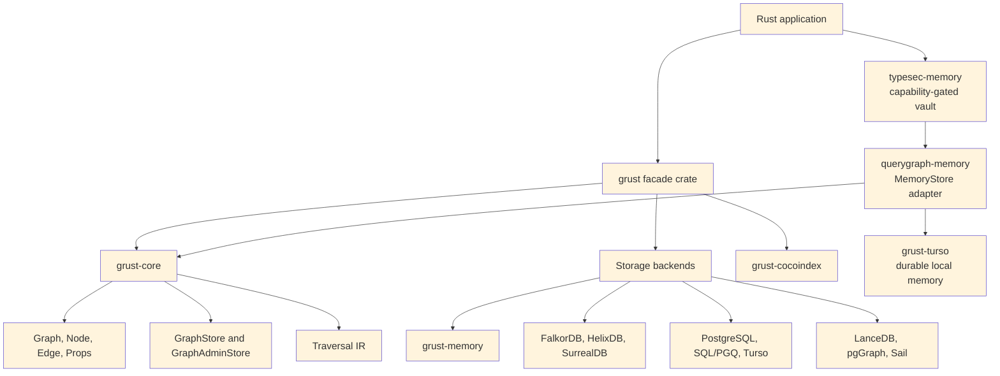
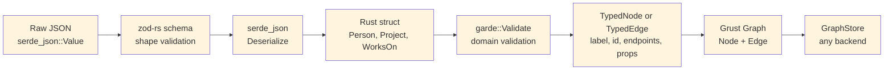
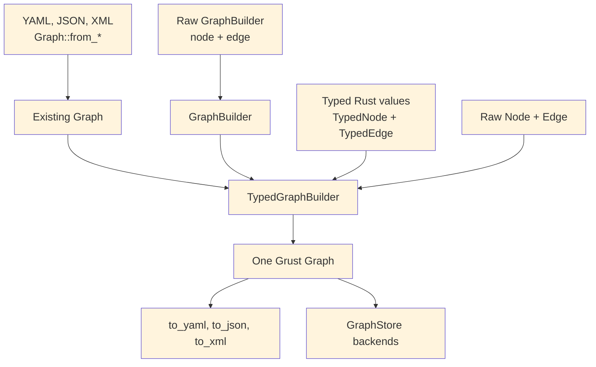
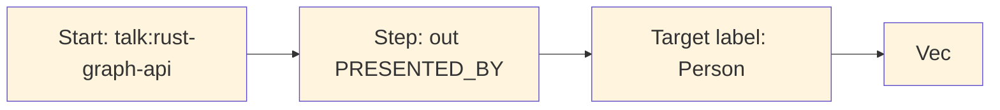
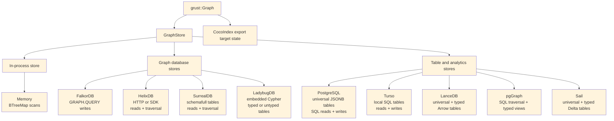
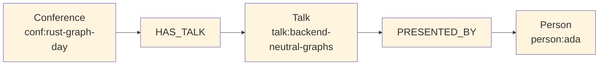
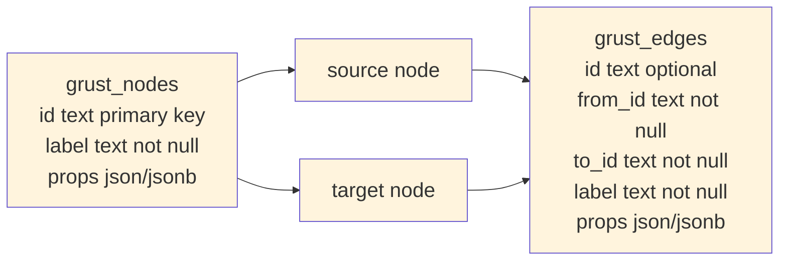

# Preface {.unnumbered}

Grust is a small Rust property graph API with a large architectural promise:
application code should be able to build, validate, traverse, and persist graph
data without committing itself to a database query language too early.

That goal matters because many graph-shaped Rust applications live between
worlds. A crawler wants a local graph while it extracts facts. An indexing
pipeline wants deterministic target state. A data product may begin with tests
and an in-memory backend, then later need SurrealDB, FalkorDB, PostgreSQL,
LanceDB, Sail, or another backend. Grust gives those applications one model to
program against:

```text
Graph = nodes + edges
Node  = id + label + properties
Edge  = optional id + from + to + label + properties
```

This book is a guided tour of that model. It covers the workspace architecture,
the Rust concepts the code leans on, the core graph types, traversal IR, backend
contracts, implemented backend profiles, query safety, semantic-model
projection, and practical examples.

# The Shape of Grust

Grust is not trying to be every graph library for Rust. It is not an algorithm
crate like `petgraph`, and it is not a thin wrapper around a single database. It
is a property graph layer: a compact model of labeled nodes, labeled edges, and
typed properties that can be carried across storage engines.

The current workspace is arranged around one core crate, one public facade, and
backend or integration crates:



The `grust-core` crate owns the durable concepts. It defines identifiers,
labels, property values, graph builders, schemas, traversals, error types, load
reports, and backend traits. The `grust` crate re-exports those pieces and gates
backend crates behind Cargo features.

Core also owns the small lowering helpers that have to mean the same thing
everywhere. `relationship_type` normalizes edge labels for backends that need
database-safe relationship names. `schema_identifier` normalizes schema labels
and fields for SQL-like typed surfaces. `edge_key` gives table and export
backends the same structural fallback key for an edge when the caller has not
provided an explicit `EdgeId`.

That split is important. Core model code stays light, deterministic, and mostly
dependency-free. Backends are allowed to depend on Redis, SurrealDB, LanceDB,
PostgreSQL, Spark Connect, HTTP clients, gRPC clients, or SDKs without dragging
those dependencies into every Grust user.

# The Core Property Graph

At the center of Grust are three public data structures:

```rust
pub struct Graph {
    pub nodes: Vec<Node>,
    pub edges: Vec<Edge>,
}

pub struct Node {
    pub id: NodeId,
    pub label: Label,
    pub props: Props,
}

pub struct Edge {
    pub id: Option<EdgeId>,
    pub from: NodeId,
    pub to: NodeId,
    pub label: Label,
    pub props: Props,
}
```

`NodeId`, `EdgeId`, and `Label` are newtypes over `String`. They are small
wrappers, but they carry meaning through Rust's type system. A function that
expects a `Label` cannot accidentally receive an `EdgeId` without an explicit
conversion. The wrappers implement common conversion traits such as `From<&str>`
and `From<String>`, so the public API remains ergonomic.

Properties are stored in a `BTreeMap<String, Value>`:

```rust
pub enum Value {
    Null,
    Bool(bool),
    Int(i64),
    Float(f64),
    String(String),
    DateTime(RfcDate),
    Decimal(Decimal),
    Duration(Duration),
    StringArray(Vec<String>),
    IntArray(Vec<i64>),
    FloatArray(Vec<f64>),
    Path(PathValue),
    Graph(GraphValue),
    Json(serde_json::Value),
}
```

The use of `BTreeMap` is a quiet but useful choice. Iteration order is stable,
which makes generated JSON, tests, and backend query generation more
predictable. That is especially helpful in a project whose backends turn one
graph into SQL, Cypher-like queries, Arrow batches, JSON target state, or SDK
calls.

`GraphValue` deduplicates relationships by explicit ID or structural identity.
Those identities use length-framed components rather than payload delimiters,
so punctuation and control text inside an ID, label, or endpoint cannot make
two distinct relationship values look identical. Persisted compatibility keys
have a different contract: `checked_edge_key` rejects U+001F in every component
before a tabular or export backend materializes the delimiter-based key.

`Node::new` also inserts an `id` property if one is not already present. That
means a Grust node has a first-class typed identity and an ordinary property
view of that identity, which helps backends that identify records through
property maps.

# Building Graphs

Most application code should not construct every `Node` and `Edge` by hand. It
should use `GraphBuilder`:

```rust
use grust::prelude::*;

let mut builder = GraphBuilder::new();

let talk = builder
    .node("Talk", "talk:rust-graph-api")
    .prop("title", "A Modern Graph API for Rust")
    .prop("year", 2026_i64)
    .finish();

let speaker = builder
    .node("Person", "person:ada")
    .prop("name", "Ada Example")
    .finish();

builder
    .edge("PRESENTED_BY", &talk, &speaker)
    .prop("source", "conference-schedule")
    .finish();

let graph = builder.build();
```

The builder deduplicates nodes by `NodeId`. If an existing node has the same
label, additional properties are merged into it. Edges default to
`EdgePolicy::DedupeByFromLabelTo`, so the tuple `(from, label, to)` is treated
as the relationship identity. Domains that need true multi-edges can opt into
`EdgePolicy::AllowDuplicates`.

```rust
let mut builder = GraphBuilder::new()
    .edge_policy(EdgePolicy::AllowDuplicates);
```

This is an example of Grust's overall style: put the common property-graph case
on the simple path, but leave an explicit escape hatch for graph models with
different identity rules.

## Loading and Saving Graph Documents

A `Graph` can also move through textual document formats without touching a
backend. The core crate exposes paired constructors and serializers for YAML,
JSON, and XML:

```rust
let graph = Graph::from_yaml(yaml_text)?;
let yaml_text = graph.to_yaml()?;

let graph = Graph::from_json(json_text)?;
let json_text = graph.to_json()?;

let graph = Graph::from_xml(xml_text)?;
let xml_text = graph.to_xml()?;
```

These methods are useful for fixtures, migration inputs, examples, audits, and
small graph interchange files. They all feed the same validation path, so a
document with duplicate node ids or an edge that points at a missing node fails
before it reaches a store.

YAML and JSON share the same document shape. A property value can be written as
a plain JSON-like scalar when the type is obvious, or as the tagged Grust
`Value` representation when the exact variant matters:

```json
{
  "nodes": [
    {
      "id": "talk:rust-graph-api",
      "label": "Talk",
      "props": {
        "title": "A Modern Graph API for Rust",
        "year": 2026,
        "tracks": {
          "type": "string_array",
          "value": ["rust", "graphs"]
        }
      }
    },
    {
      "id": "person:ada",
      "label": "Person",
      "props": {
        "name": "Ada Example"
      }
    }
  ],
  "edges": [
    {
      "label": "PRESENTED_BY",
      "from": "talk:rust-graph-api",
      "to": "person:ada",
      "props": {
        "source": "conference-schedule"
      }
    }
  ]
}
```

The XML form is more explicit because XML has no native object or array type.
Properties are represented as repeated `prop` entries with a `key` and a tagged
`value`:

```xml
<graph>
  <nodes>
    <node>
      <id>talk:rust-graph-api</id>
      <label>Talk</label>
      <props>
        <prop>
          <key>title</key>
          <value>
            <type>string</type>
            <value>A Modern Graph API for Rust</value>
          </value>
        </prop>
      </props>
    </node>
    <node>
      <id>person:ada</id>
      <label>Person</label>
    </node>
  </nodes>
  <edges>
    <edge>
      <label>PRESENTED_BY</label>
      <from>talk:rust-graph-api</from>
      <to>person:ada</to>
    </edge>
  </edges>
</graph>
```

Serialization removes the generated `id` property from node property maps when
it only mirrors the node's `NodeId`. That keeps exported documents readable
without changing what `Node::new` guarantees after loading.

# Typed Graph Ingestion with garde and zod-rs

The core `Graph`, `Node`, and `Edge` types are intentionally dynamic. A node has
a label and a property map; an edge has a label, endpoints, and a property map.
That dynamic shape is the right interchange format for backends, graph
documents, audits, and cross-system movement. Application code, however, often
starts with typed Rust structs: a `Person`, a `Project`, a `WorksOn`
relationship, or some domain-specific event. Grust's typed ingestion layer
connects those two worlds.

The typed layer is optional. It is enabled through Cargo features:

```toml
[dependencies]
grust = { package = "grust-graph", version = "0.18.0", features = ["typed-garde"] }
```

`typed-garde` adds Rust-struct validation and typed lowering. A second feature,
`typed-zod-rs`, layers raw JSON shape validation on top:

```toml
[dependencies]
grust = { package = "grust-graph", version = "0.18.0", features = ["typed-zod-rs"] }
```

`typed-zod-rs` implies `typed-garde`. That relationship matters: zod-rs checks
untrusted JSON shape first, Serde turns the JSON into Rust values, and garde
checks typed domain invariants before Grust lowers the value into a normal
`Node` or `Edge`.



The important promise is that typed ingestion does not create a second graph
model. Once validation succeeds, everything becomes the ordinary Grust graph
shape. Backends do not need to know whether a node came from `GraphBuilder`, a
YAML document, a typed Rust struct, or a zod-rs-validated JSON payload.

## garde: Typed Rust Validation

`garde` is a Rust validation library built around a derive macro. You attach
validation rules to fields, derive `garde::Validate`, and then call
`validate()` or `validate_with(...)`. The rules live near the Rust type, so they
travel with the domain model instead of being hidden in a loader function.

Common garde rules include:

- `length(min = 1)` for nonempty strings and collections.
- `range(min = 1, max = 100)` for numeric bounds.
- `inner(...)` for validating items inside a collection.
- `custom(...)` for domain-specific validation functions.
- `dive` for validating nested values that also implement `Validate`.

In Grust, a typed node implements `TypedNode`. It supplies a graph label and a
stable node id. The default property conversion serializes the struct through
Serde and converts the resulting object fields into Grust properties:

```rust
use grust::prelude::*;
use grust::typed::garde;
use serde::Serialize;

#[derive(Debug, Serialize, garde::Validate)]
#[garde(allow_unvalidated)]
struct Person {
    #[garde(length(min = 1))]
    id: String,
    #[garde(length(min = 1))]
    name: String,
    #[garde(length(min = 1), inner(length(min = 1)))]
    skills: Vec<String>,
}

impl TypedNode for Person {
    const LABEL: &'static str = "Person";

    fn node_id(&self) -> NodeId {
        format!("person:{}", self.id).into()
    }
}
```

Typed edges implement `TypedEdge`. They provide a label and endpoint ids:

```rust
#[derive(Debug, Serialize, garde::Validate)]
#[garde(allow_unvalidated)]
struct WorksOn {
    #[garde(length(min = 1))]
    person_id: String,
    #[garde(length(min = 1))]
    project_id: String,
    #[garde(range(min = 1, max = 100))]
    allocation_percent: u8,
}

impl TypedEdge for WorksOn {
    const LABEL: &'static str = "WORKS_ON";

    fn source_node_id(&self) -> NodeId {
        format!("person:{}", self.person_id).into()
    }

    fn target_node_id(&self) -> NodeId {
        format!("project:{}", self.project_id).into()
    }
}
```

`TypedGraphBuilder` validates and lowers these values:

```rust
let mut builder = TypedGraphBuilder::new();

builder.add_node(&Person {
    id: "nia".to_string(),
    name: "Nia".to_string(),
    skills: vec!["rust".to_string(), "graphs".to_string()],
})?;

builder.add_edge(&WorksOn {
    person_id: "nia".to_string(),
    project_id: "grust".to_string(),
    allocation_percent: 80,
})?;

let graph = builder.build();
```

Validation fails before graph construction. If `allocation_percent` is `0`, the
`range(min = 1, max = 100)` rule produces a Grust schema error and the edge is
not added. This keeps invalid domain facts out of the graph rather than relying
on a backend to reject them later.

Typed values can also be reconstructed from ordinary Grust reads. The read path
decodes node or edge properties back through serde, runs garde validation, and
checks that the typed identity still matches the graph value:

```rust
let stored = store
    .get_node(&NodeId::new("person:nia"))
    .await?
    .expect("person exists");

let person = Person::from_node(&stored)?;
assert_eq!(person.id, "nia");
```

Edges follow the same pattern with `WorksOn::from_edge(&edge)?`. For validation
contexts, use `from_node_with` or `from_edge_with`.

## Typed and Untyped Graphs Coexist

The typed layer is an ingestion layer over the ordinary `GraphBuilder`. It does
not force an all-or-nothing choice. A graph can start as a document, accept raw
nodes and edges, and then be extended with typed values:

```rust
let existing = Graph::new(
    vec![Node::new("Document", "doc:garde-proposal", Props::new())],
    Vec::new(),
);

let mut builder = TypedGraphBuilder::from_graph(existing);

builder.add_node(&Person {
    id: "nia".to_string(),
    name: "Nia".to_string(),
    skills: vec!["rust".to_string(), "graphs".to_string()],
})?;

builder.add_raw_edge(Edge::new(
    "AUTHORED",
    "person:nia",
    "doc:garde-proposal",
    Props::new(),
));

let graph = builder.build();
```

The coexistence API is explicit:

- `TypedGraphBuilder::from_graph(graph)` starts from an existing `Graph`.
- `TypedGraphBuilder::from_builder(builder)` starts from an existing
  `GraphBuilder`.
- `add_raw_node(node)` and `add_raw_edge(edge)` add ordinary Grust values.
- `into_builder()` returns the inner `GraphBuilder` when lower-level builder
  operations are needed.



This is useful during migrations. A project can keep loading existing graph
documents while adding typed definitions for the domain facts that benefit most
from Rust validation. Over time, more labels can move to typed constructors
without breaking the storage or document formats.

## What Zod Means Here

Zod is best known from TypeScript. It lets developers define a runtime schema
and validate untrusted input before treating it as application data. In
TypeScript, this closes an important gap: static types disappear at runtime, so
a value received from JSON, an HTTP request, a form, or a message queue still
needs runtime validation.

Rust has a different type system, but the boundary problem still exists.
External data arrives as bytes or JSON. Serde can deserialize those bytes into a
Rust struct, but it is often useful to separate two questions:

1. Does this JSON have the expected shape?
2. Does the resulting Rust value satisfy my domain rules?

`zod-rs` answers the first question. `garde` answers the second. Grust's
`typed-zod-rs` feature wires those stages together:

```rust
use grust::prelude::*;
use serde::{Deserialize, Serialize};
use serde_json::json;
use zod_rs::prelude::{Schema, number, object, string};

#[derive(Debug, Deserialize, Serialize, garde::Validate)]
#[garde(allow_unvalidated)]
struct Person {
    #[garde(length(min = 1))]
    id: String,
    #[garde(length(min = 1))]
    name: String,
    #[garde(length(min = 1), inner(length(min = 1)))]
    skills: Vec<String>,
}

impl TypedNode for Person {
    const LABEL: &'static str = "Person";

    fn node_id(&self) -> NodeId {
        format!("person:{}", self.id).into()
    }
}

let person_schema = object()
    .field("id", string().min(1))
    .field("name", string().min(1))
    .field("skills", string().min(1).array())
    .strict();

let json = json!({
    "id": "nia",
    "name": "Nia",
    "skills": ["rust", "graphs"]
});

let person: Person = parse_typed_json(&person_schema, &json)?;
```

The same schema can feed the graph builder directly:

```rust
let mut builder = TypedGraphBuilder::new();
builder.add_node_from_json::<Person, _>(&person_schema, &json)?;
```

For edges, the pattern is the same:

```rust
#[derive(Debug, Deserialize, Serialize, garde::Validate)]
#[garde(allow_unvalidated)]
struct WorksOn {
    #[garde(length(min = 1))]
    person_id: String,
    #[garde(length(min = 1))]
    project_id: String,
    #[garde(range(min = 1, max = 100))]
    allocation_percent: u8,
}

impl TypedEdge for WorksOn {
    const LABEL: &'static str = "WORKS_ON";

    fn source_node_id(&self) -> NodeId {
        format!("person:{}", self.person_id).into()
    }

    fn target_node_id(&self) -> NodeId {
        format!("project:{}", self.project_id).into()
    }
}

let works_on_schema = object()
    .field("person_id", string().min(1))
    .field("project_id", string().min(1))
    .field("allocation_percent", number().int().min(1.0).max(100.0))
    .strict();

builder.add_edge_from_json::<WorksOn, _>(
    &works_on_schema,
    &json!({
        "person_id": "nia",
        "project_id": "grust",
        "allocation_percent": 80
    }),
)?;
```

The adapter intentionally deserializes the original JSON after zod-rs accepts
it. This preserves Rust integer types. For example, `zod-rs` validates numbers
through a floating-point schema, but Serde should still be allowed to decode the
original JSON integer `80` into a Rust `u8`.

## How the Options Interact

There are four common construction paths:

```text
Raw GraphBuilder:
  trusted Rust code -> Node/Edge -> Graph

Graph documents:
  YAML/JSON/XML -> Graph::from_* validation -> Graph

typed-garde:
  Rust struct -> garde validation -> TypedNode/TypedEdge lowering -> Graph

typed-zod-rs:
  raw JSON -> zod-rs shape validation -> Serde -> garde validation -> Graph
```

Choose `GraphBuilder` when the data is already trusted Rust code and the
dynamic graph model is enough. Choose graph documents when you need readable
fixtures, interchange files, or migration inputs. Choose `typed-garde` when the
domain model lives in Rust structs and should enforce Rust-level invariants.
Choose `typed-zod-rs` when the input is untrusted JSON and you want a separate
shape gate before Serde and garde.

These options compose. A single graph can contain nodes loaded from YAML, raw
edges added by `GraphBuilder`, typed nodes validated by garde, and request
payloads validated first by zod-rs. The result is still just `Graph`.

The distinction between zod-rs and garde is worth keeping crisp:

- zod-rs sees `serde_json::Value`.
- Serde converts JSON into Rust types.
- garde sees Rust fields with Rust types.
- `TypedNode` and `TypedEdge` convert validated Rust values into Grust labels,
  ids, endpoints, and properties.

For example, this JSON fails at the zod-rs stage because `skills` is not an
array:

```json
{
  "id": "nia",
  "name": "Nia",
  "skills": "rust"
}
```

This JSON can pass a loose zod-rs shape check but fail at the garde stage if the
Rust type requires at least two skills:

```json
{
  "id": "nia",
  "name": "Nia",
  "skills": ["rust"]
}
```

That separation gives application authors precise error boundaries. Shape
errors usually belong near the API or file-ingest boundary. Domain errors belong
near the typed model.

## Relationship to GraphSchema

`GraphSchema` and typed ingestion solve different problems. `GraphSchema`
describes graph labels, fields, uniqueness, and backend-facing metadata. It can
drive indexes, migrations, table layouts, or validation inside a store. Typed
ingestion validates values before they become graph data.

In practice they can reinforce each other:

- `TypedNode` and `TypedEdge` keep application construction honest.
- zod-rs schemas protect JSON ingress points.
- `GraphSchema` tells storage backends what structure to expect.
- `GraphStore` remains the common persistence contract.

This layered design keeps Grust from becoming either too loose or too rigid.
Projects can start with raw graph construction, add typed Rust validation for
important labels, add zod-rs for JSON ingress, and later add `GraphSchema` for
backend optimization.

The same schema can also validate and write in one step:

```rust
let report = store.put_typed_graph(&schema, &graph).await?;
```

That call validates labels, required fields, field value types, and edge
endpoint labels before delegating to the backend. Schema-capable stores then use
`apply_schema` to lower the portable model into their native storage surfaces.

# Traversal as an Intermediate Representation

Grust traversal is not Cypher, SQL, GQL, SurrealQL, Spark SQL, or a graph
database dialect. It is a small Rust intermediate representation:

```rust
let traversal = Traversal::from_node("talk:rust-graph-api")
    .out("PRESENTED_BY")
    .to("Person")
    .limit(10);
```

A traversal has a start expression, a sequence of steps, and an optional limit.
The start can be a single node, all nodes with a label, or nodes with a property
value. Each step has a direction, an optional edge label, and an optional target
node label.



The IR is deliberately modest. That makes it implementable across a wide range
of backends. The memory backend can scan maps. LanceDB can query tables by hop.
pgGraph can lower to SQL over universal graph tables. Sail can lower to Spark
SQL through Spark Connect. Backends that do not yet support reads can return
`GrustError::Unsupported`.

This design also protects application code. A caller asks for a graph-shaped
operation; the backend decides whether that operation becomes a map scan, a SQL
join, a DataFrame query, a Redis graph command, or a future native graph query.

For local analytics and backend planning, `grust-core` also exposes
`GraphIndex`. It builds a dense vertex index from a `Graph`, validates that
every edge endpoint exists, and stores incoming and outgoing edge indexes per
vertex. That gives adapters and examples one shared adjacency layer instead of
rebuilding node-id maps in each backend. The `grust-graph` facade includes a
dependency-free `benchmarks` example that exercises graph cloning,
`GraphIndex` construction, degree scans, endpoint scans, and structural
edge-key generation over ring, grid, layered, clustered, Graph500-style R-MAT,
and GAP-style R-MAT graph families.

# The Store Contract

The central backend trait is `GraphStore` (capability and native-constraint
methods are omitted here for brevity):

```rust
#[async_trait::async_trait]
pub trait GraphStore: Send + Sync {
    async fn apply_schema(&self, schema: &GraphSchema) -> Result<()>;
    async fn put_node(&self, node: &Node) -> Result<PutOutcome>;
    async fn put_edge(&self, edge: &Edge) -> Result<PutOutcome>;
    async fn put_graph(&self, graph: &Graph) -> Result<LoadReport>;
    async fn put_typed_graph(&self, schema: &GraphSchema, graph: &Graph) -> Result<LoadReport>;
    async fn get_node(&self, id: &NodeId) -> Result<Option<Node>>;
    async fn get_nodes(&self, ids: &[NodeId]) -> Result<Vec<Node>>;
    async fn get_edges(&self, query: EdgeQuery) -> Result<Vec<Edge>>;
    async fn traverse(&self, traversal: Traversal) -> Result<Vec<Node>>;
}
```

The trait is async because real graph stores usually cross a process, network,
database, or object-store boundary. The `async_trait` crate hides the current
limitations around async functions in object-safe traits and lets backend
implementations present one uniform interface.

`put_graph` takes `&Graph` instead of consuming `Graph`. That keeps retry,
audit, comparison, and multi-backend loading workflows straightforward:

```rust
let report = store.put_graph(&graph).await?;
backup_store.put_graph(&graph).await?;
println!("loaded {} nodes and {} edges", report.nodes, report.edges);
```

Single-element writes return `PutOutcome`. Memory and builder paths can report
precise inserted/updated/deduped outcomes. Remote upsert-oriented backends
commonly return `Upserted` because distinguishing insert from update would
require an extra read or a backend-specific write primitive. Portable callers
should treat all written outcomes as success rather than depending on
inserted-versus-updated. `LoadReport` counts elements that were written or
upserted, not necessarily newly created rows.

Administrative operations are split into `GraphAdminStore`:

```rust
#[async_trait::async_trait]
pub trait GraphAdminStore: GraphStore {
    async fn bootstrap(&self) -> Result<()> { Ok(()) }
    async fn clear(&self) -> Result<()>;
}
```

This separation keeps ordinary application persistence apart from setup and
destructive workflows. A production service may receive a `GraphStore`, while a
test harness or migration tool can require `GraphAdminStore`.

# Rust Concepts Used

Grust is a good example of idiomatic Rust applied to a storage abstraction.

Newtypes give semantic weight to strings. `NodeId`, `EdgeId`, and `Label` are
cheap wrappers, but they prevent accidental parameter swaps and produce clearer
APIs.

Trait-based polymorphism defines the backend boundary. Application code can be
generic over `impl GraphStore`, while each backend owns its own connection,
configuration, batching, serialization, and query strategy.

Feature flags keep the facade crate light. The public `grust` crate re-exports
backend crates only when features such as `memory`, `lancedb`, `postgres`,
`postgres-pgq`, `pggraph`, `turso`, `sail`, `falkor`, `surreal`, or
`cocoindex` are enabled. The HelixDB and LadybugDB adapters remain internal
`publish = false` workspace crates and are deliberately absent from the
crates.io facade.

Serde makes the graph model portable. Core types derive `Serialize` and
`Deserialize`, and backends can turn properties into JSON strings, JSONB,
Arrow string columns, or target-state maps.

Interior mutability appears where it is appropriate. The memory backend stores
its graph behind `Arc<RwLock<...>>`, making cloned stores share state while
keeping mutation synchronized.

Error typing is explicit. `GrustError` distinguishes backend, schema,
unsupported-feature, and serialization failures. That lets a caller tell the
difference between "the database rejected this" and "this backend does not yet
support traversal."

# Backend Architecture

Backends share the same input model but not the same execution model:



Some backends are full read/write/traversal stores today. Others still focus on
writes and administrative loading. That is normal for an early multi-backend
project, and the trait makes the maturity boundary explicit.

## Memory

`grust-memory` is the deterministic local backend. It interns node ids and
labels as `u32` handles and stores each edge once, as a 16-byte record keyed by
source, label, destination, and optional explicit edge ID, with ids and
properties kept out of line. That means structural edges still behave
deterministically, while id-bearing parallel edges between the same endpoints
can coexist. Reads return nodes and edges in id and edge-key order. It is the best backend for
tests, examples, and local workflows that need no external service.
When a `GraphSchema` is applied, the memory backend validates writes against it,
which makes it a useful conformance harness for typed storage behavior before a
database enters the picture.

For repeated language reads, `indexed_snapshot()` returns a shared immutable
`TypedGraphIndex`. The first call after a write builds typed incoming/outgoing
adjacency over the store's own copy-on-write storage rather than a copy of the
graph; later calls reuse it, including through
cloned store handles. Every write attempt invalidates the cache, while snapshots
already returned remain unchanged. Construction holds the store's read lock
and therefore delays writers. Ordinary `GraphStore` reads and traversals keep
their map-based behavior; indexed Cypher entrypoints are a separate choice.

```rust
use grust::prelude::*;

# async fn demo(graph: Graph) -> grust::Result<()> {
let store = MemoryGraphStore::new();
store.put_graph(&graph).await?;

let people = store
    .traverse(
        Traversal::from_node("talk:rust-graph-api")
            .out("PRESENTED_BY")
            .to("Person"),
    )
    .await?;
# Ok(())
# }
```

## LanceDB

`grust-lancedb` treats LanceDB first as a durable Arrow-native table store. It
uses two tables, one for nodes and one for edges. Nodes are keyed by `id`. Edges
are keyed by an explicit edge id when present, or by a deterministic
`from + label + to` key otherwise. That fallback key is shared with other
tabular/export backends through `grust-core::edge_key`, so structural edge
identity does not drift across implementations. Writes use LanceDB
`merge_insert`, and traversal performs hop-by-hop table queries. When a hop fans
out to multiple target nodes, the backend reads those target nodes with
`get_nodes` instead of issuing one node query per edge. Property-start
traversal filters by label in LanceDB, then compares decoded Grust properties
exactly so nested JSON or serialized fragments cannot produce false positives.
Before persisting either an explicit or structural edge key, LanceDB calls the
checked identity path and rejects U+001F in the source ID, label, target ID, or
explicit ID. CocoIndex, LadybugDB, Sail, and Cypher capture/refetch use the same
guard, and mixed explicit/idless comparisons also require the same structural
owner instead of trusting a key-shaped string alone. Ladybug's managed metadata
index reserves the same delimiter, so its adapter rejects U+001F in node IDs
before a user record can alias a table marker.

Schema object identity is checked separately. The shared
`validate_physical_identifier_claims` helper lets FalkorDB, Helix, LadybugDB,
LanceDB, and Sail reject lossy-name collisions and exact duplicate declarations
within each native namespace before schema or write operations are emitted.

This backend is a natural home for later vector-search extensions. The core
`GraphStore` trait should stay graph-focused; LanceDB-specific nearest-neighbor
search can live in an extension trait without leaking into every backend.

With `GraphSchema`, LanceDB also creates typed Arrow tables per node and edge
label. The universal `grust_nodes` and `grust_edges` tables remain the portable
read/traversal surface, while schema-labeled rows are mirrored into tables such
as `grust_node_person` or `grust_edge_presents` with typed columns for declared
fields. That gives analytical consumers and future vector extensions a native
columnar surface without giving up the backend-neutral graph model.

## LadybugDB

`grust-ladybug` embeds LadybugDB directly through the Rust `lbug` 0.20.2 crate.
It is the durable local graph-database backend: no Docker service, no HTTP bridge,
and no separate daemon. The store opens either an in-memory Ladybug database or
an on-disk Ladybug directory and creates Grust-managed Ladybug node and
relationship tables from graph labels.

Ladybug can be used for typed or untyped property graphs, and the Grust backend
now exposes that distinction directly. The default `LadybugGraphMode::Untyped`
accepts ordinary Grust graphs and creates the needed Ladybug node and
relationship tables from graph labels and endpoint labels on write. That mode
matches Grust's raw `Graph`, JSON, YAML, and XML loading path, where labels and
properties are data owned by the application.

`LadybugGraphMode::Typed` requires `apply_schema` or `put_typed_graph` before
writes. In that mode the backend creates the declared Ladybug tables up front,
does not create undeclared tables during writes, and validates later writes
against the applied `GraphSchema`. Reads reconstruct Grust `Node` and `Edge`
values from the managed tables, while traversal evaluates the portable Grust
traversal IR by walking Ladybug relationship tables and reading target nodes
through the same `GraphStore` contract.

Ladybug's managed metadata index uses U+001F to frame table markers and node
entries. The adapter therefore rejects that delimiter in node IDs before any
mutation; this is stricter than the backend-neutral `NodeId` type and is part
of the Ladybug storage contract.

The internal crate's `arrow` feature also exposes Ladybug's embedded Arrow
table path through Arrow IPC streams. A workspace caller can register IPC node tables,
relationship tables, and CSR relationship tables directly with Ladybug, then
query them with Ladybug Cypher and receive result chunks back as Arrow IPC. The
public boundary is IPC bytes rather than a Rust `RecordBatch` type, so callers
do not have to match Ladybug's internal Arrow crate version exactly.

The first implementation stores Grust properties as JSON text for portable
round trips. Later schema lowering can add typed Ladybug columns, full-text
indexes, vector indexes, and direct graph-RAG extension traits without changing
the core graph model.

## PostgreSQL and pgGraph

`grust-postgres` stores the source of truth in ordinary PostgreSQL tables:

```sql
grust_nodes(id text primary key, label text not null, props jsonb not null)
grust_edges(id text, from_id text not null, to_id text not null,
            label text not null, props jsonb not null)
```

The generic backend creates tables and indexes with ordinary PostgreSQL DDL.
It does not require PostgreSQL extensions, so the same `PostgresGraphStore`
can target local PostgreSQL, Neon, or another managed PostgreSQL-compatible
service. Reads use SQL against the universal tables. Traversal is lowered to
SQL joins over those tables. Mutation batches are wrapped in PostgreSQL
transactions.

The shared connection is serialized across every explicit transaction. A
recovery marker is set before `BEGIN` and cleared only after PostgreSQL
acknowledges `COMMIT` or `ROLLBACK`; if cancellation drops a future mid-flight,
the next serialized caller rolls back the uncertain transaction before doing
new work. The public raw `PostgresGraphStore::execute` surface is deliberately
autocommit-only. Its lexical guard rejects transaction-control statements in a
batch while ignoring lookalike words inside strings, identifiers, dollar-quoted
bodies, and comments. PostgreSQL PGQ forwards through the same contract.

Schema application adds typed label views and expression indexes. For example,
a `Person` node schema with `name: String` and `age: Int` can produce a
`grust_node_person` view over the universal node table, with `age` exposed as a
`bigint` expression. This is a deliberately incremental typed-storage path:
PostgreSQL keeps the flexible JSONB source of truth while callers that know the
schema get typed SQL surfaces.

`grust-pggraph` is now the pgGraph extension layer over that same shared
PostgreSQL implementation. It bootstraps the `graph` extension, registers the
universal tables, and can optionally build the pgGraph projection for
graph-index experiments without forking the storage and traversal code.

`grust-postgres-pgq` targets PostgreSQL 19's native SQL/PGQ support. It uses
the same universal tables as the durable storage layout, creates a native
`PROPERTY GRAPH` over them, and executes bounded traversal through
`GRAPH_TABLE`. That keeps writes, reads, schema views, and mutation batches on
the proven PostgreSQL backend while letting traversal exercise PostgreSQL's
standard property-graph query engine.

The reusable SQL boundary lives in `grust-sql-core`. It owns the parts that are
really common across row-store SQL graph backends: universal table DDL, reads,
bounded traversal joins, mutation framing, schema views, expression indexes,
identifier quoting, and literal escaping. Dialects keep the pieces that affect
correctness or efficiency. PostgreSQL keeps JSONB predicates, `ON CONFLICT`,
`CREATE OR REPLACE VIEW`, transaction text, and lateral joins for undirected
steps. Turso keeps JSON text, `json_extract`, `json_patch`, SQLite-compatible
views, and a derived-table undirected join shape. Sail does not use this SQL
core because its SQL path runs through Spark Connect, Arrow IPC staging, and
distributed Spark SQL rather than a direct row-store connection.

Recursive walk pushdown no longer stores raw node IDs between sentinel
delimiters. PostgreSQL, Spark SQL, and the generic SQLite dialect encode IDs as
hexadecimal, delimiter-free tokens before constructing visited sets. A dialect
without both recursive-CTE support and an encoding hook declines variable-path
or shortest-walk pushdown and preserves correctness through fallback.

`GraphSqlDialect::max_identifier_bytes` lets a dialect declare a limit for
generated schema identifiers. PostgreSQL reports its 63-byte ceiling: typed
node/edge view and property-index names at the limit remain valid, while longer
names fail with `GrustError::Schema` before the server can silently truncate
them into an ambiguous or colliding identifier. Dialects that retain the
default `None` keep their existing behavior.

## Turso

`grust-turso` uses the Turso Rust SDK directly. The default connection path
opens a local in-process Turso database:

```rust
# use grust::prelude::*;
# async fn open() -> grust::Result<()> {
let store = TursoGraphStore::connect(TursoConfig {
    path: "data/grust.db".to_string(),
    table_prefix: "grust".to_string(),
    batch_size: 500,
    journal_mode: TursoJournalMode::Wal,
})
.await?;
# Ok(())
# }
```

The storage layout mirrors the universal table shape used by the PostgreSQL
backend, but uses SQLite-compatible types and JSON text properties:

```sql
grust_nodes(id text primary key, label text not null, props text not null)
grust_edges(id text, from_id text not null, to_id text not null,
            label text not null, props text not null)
```

Reads and traversal use ordinary SQL over the local Turso connection. Schema
application creates label-specific SQL views and expression indexes using
`json_extract`. Mutation batches are wrapped in a Turso transaction.

The `journal_mode` option selects the concurrency model. The default `Wal` is
Turso's single-writer write-ahead log. Selecting `Mvcc` enables Turso's
multi-version concurrency control (`PRAGMA journal_mode = mvcc`, a database-header
mode applied to a fresh database); data writes then run inside `BEGIN CONCURRENT`
transactions with bounded conflict retry, so concurrent writers make progress.

With the `turso-sync` facade feature, callers can construct a synced store
from a local path, remote URL, and optional auth token. The `GraphStore` API
continues to operate on the local SQL connection; callers decide when to call
the store's `push` and `pull` helpers.

## QueryGraph Memory: TypeSec over Grust

`querygraph-memory` is a concrete application of the Grust backend contract. It
implements TypeSec's synchronous `MemoryStore` interface over a compatible
Grust mutation backend without moving authority or plaintext handling into the
storage layer:

```rust
pub struct GraphStoreMemoryStore<G: GraphMutationStore> { /* ... */ }

use querygraph_memory::TursoMemoryStore;

let store = TursoMemoryStore::open("data/querygraph-memory.db")?;
```

`GraphStoreMemoryStore<G>` is the generic adapter for an already-initialized
`GraphMutationStore`. The production-oriented v1 alias,
`TursoMemoryStore`, binds that adapter to `TursoGraphStore`.
`TursoMemoryStore::open(path)` creates missing parent directories, opens a
file-backed local database with the stable `querygraph_memory` table prefix,
and runs Grust's bootstrap before returning. `open_with_config` is the explicit
form for applications that need another table prefix, batch size, path, or
journal mode. A default `TursoConfig` still uses `:memory:`, so durable callers
must supply a file path.

The adapter projects memory into a small property graph:

```text
(:MemoryRecord {record: <opaque JSON>, space: ...})
    -[:MENTIONS]->(:MemoryEntity {name, kind})
(:MemoryEntity)-[:RELATES]->(:MemoryRelation {rel, fact_id})
    -[:RELATES]->(:MemoryEntity)
```

Each `MemoryRelation` is an assertion, not merely an endpoint pair. Its node ID
is a SHA-256 identity over length-prefixed source, relationship name, target,
and record ID components. Replaying one record is stable, while two records
that assert the same named relation between the same entities retain separate
lineage. Neighborhood traversal follows the two-edge assertion shape and also
reads the legacy direct `RELATES {rel, fact_id}` representation so existing
durable stores remain compatible. Tombstone preflight first discovers the
record's assertion nodes and any legacy fact edges, then submits deletion of
that discovered set with the record node as one mutation batch. A transactional
backend makes that deletion batch atomic, and other records' assertions
survive. The discovery reads are not isolated inside that transaction: callers
must synchronize a tombstone with concurrent links for the same record so a
new assertion cannot appear after discovery and escape the deletion batch.

The complete TypeSec `StoredRecord` is serialized into one opaque JSON property
and round-tripped whole. Grust does not open the protected content. TypeSec's
`MemoryVault` remains the only component that rehydrates it, verifies typed
capabilities, applies a recall clearance ceiling, excludes quarantined records,
joins sensitivity labels during consolidation, and emits audit evidence. That
separation is the security boundary: Grust supplies durable graph mechanics;
TypeSec decides which subject may learn what.

Queries push only memory-space equality into the graph as
`Start::NodesByProperty`. The other `StoreQuery` dimensions—kind, time, label,
entities, text, invalidation state, and ordering—continue through TypeSec's
shared `StoreQuery::matches` implementation. This is semantically complete and
conformance-tested, but it is deliberately not advertised as full GQL
pushdown. A neighborhood traversal may discover record identifiers associated
with global entity nodes across several spaces; the vault rejects every record
outside the authorized space before content can be revealed. Tenant isolation
in v1 is therefore authorization at the vault boundary, not physical graph
partitioning.

Consolidation uses the mutation boundary rather than a special memory-only
transaction API. `MemoryStore::apply_batch` converts its puts and invalidations
into one `GraphMutation` slice and calls `apply_mutations` once. Turso reports
transactional mutation atomicity, so superseding old records and inserting the
replacement commits as one unit. TypeSec performs the SecLib label join before
that batch reaches storage, which means a replacement derived from a Sensitive
source remains Sensitive after closing and reopening the database. A generic
backend that reports `OrderedNonAtomic` remains usable for simpler operations
but cannot promise atomic consolidation.

The adapter also owns the sanctioned bridge between TypeSec's synchronous
`MemoryStore` and Grust's asynchronous `GraphStore`. A dedicated current-thread
Tokio runtime carries I/O and time drivers. Calls made outside Tokio drive it
directly; calls made from an existing Tokio runtime execute on a scoped thread.
This keeps an MCP or HTTP service from nesting runtimes or panicking, and lets
the store shut down safely when dropped from asynchronous application code.

Semantic ranking and cognition preserve the same boundary. The reference
`VectorIndex<E: Embedder>` is an in-process cosine index. An `Embedder` declares
whether it is local; a remote embedder is never handed Sensitive or Secret
text, and those records remain available to ordinary authorized recall without
participating in remote vector ranking. Search returns candidate IDs, with an
optional bounded entity co-mention boost, but the vault still performs the
authorization and label checks. Reference deduplication, contradiction, and
importance analyzers likewise make no writes. They consume already-recalled
views and emit inert `ConsolidationPlan` values that must return through the
capability-gated vault.

The governed cognition path extends that rule instead of bypassing it. A
`CognitionRequest` contains one TypeSec-authorized input, its canonical binding,
its optional vault-verified governed source scope, the exact LakeCat snapshot
and policy-narrowed projection, the field mapping used by governed ingestion
to derive the selected memory records, a durable job
identity, and either the deduplicate or reconcile operation. The trusted host
selects a fixed reference or native Sail profile
before protected input is loaded; public engine implementations cannot report
their own trusted identity. Both asynchronous engines return a bound
`CognitionProposal`, never a store handle or direct write.

Every bound proposal uses TypeSec proposal schema version 4. That wire contract
identifies `input_snapshot` with the canonical immutable snapshot digest,
keeps the LakeCat grant digest as separate binding evidence, and carries an
explicit `mutated` or `no_change` effect. Reference and Sail derive that effect
from the complete proposal: zero drafts and zero plan steps means no-change;
every nonempty plan is mutating. Earlier bound schema versions fail closed;
unbound schema version 1 remains only an inert local planning value. This wire
version is independent of the operation algorithm version below.

Deduplicate and reconcile each own an explicit version-2 semantic contract.
Reference and Sail profiles bind the same per-operation version because they
must produce the same canonical plan. Crate, package, and build versions remain
useful implementation metadata, but never substitute for the algorithm version
in signed TypeDID authority. Previously signed version-1 or package-bound
intents are deliberately incompatible and must be authorized again; no native
profile silently upgrades their authority.

Live Sail does not re-read LakeCat rows or reinterpret the ingestion mapping.
It derives and stages only authorized IDs, normalized text keys,
contradiction prefix/tail keys, and validity timestamps under a collision-safe
session view; it does not stage the raw text column. Planning has independent
finite operation, abort, and cleanup deadlines, and cleanup is attempted after
success, failure, timeout, or caller cancellation. The Spark client and
cognition decoder reuse the same public 16 MiB Arrow IPC payload limit; the
decoded protobuf message has one additional MiB of bounded envelope headroom.
Normalized and contradiction keys remain content-derived rather than
anonymized, so the Sail endpoint belongs inside the processing boundary
authorized for that protected input.
Arrow framing, schemas, declared rows, buffers, compressed expansion, result
counts, and local reconciliation work are checked before Arrow result-array
allocation and then rechecked against the complete result. The reference and
Sail engines use the same deterministic planning functions, so input
permutation and timestamp ties produce canonical output.

Durability is a separate storage capability. `GraphCommitStore` combines exact
node or absence expectations, a mutation batch, an idempotency digest, and a
backend receipt in one transaction. Turso mints the receipt's canonical UTC
RFC 3339 timestamp at nanosecond precision immediately before inserting that
receipt into the same transaction. It is backend-issued transaction-boundary
evidence, not a wall-clock observation taken after storage fsync, and recovery
returns those exact persisted bytes or fails closed on malformed time. The
cognition scheduler stores only scoped digests, issues bounded renewable bearer
leases, persists only the canonical
proposal digest, and survives reopen. During application, TypeSec supplies the
opaque prepared commit; Grust atomically checks source revisions, applies its
exact memory operations and ID-only index outbox, writes the audit record,
persists the outcome, and completes the job. A no-change token has empty
operations, affected IDs, and outbox, and retains the prior memory version, but
the exact source guards, job, audit, outcome, and guarded ledger still commit
as one decision. Recovery is read-only and cross-validates the job, audit,
outcome, authority scope, optional governed source scope, proposal, effect, and
backend receipt. Durable outcome schema version 3 requires TypeSec audit schema
version 2, which carries the same typed effect, distinct grant and snapshot
digests, and the trusted authority-revalidation and preparation times. Audit
and commit-envelope digests use version-3 domains so this evidence layout
cannot be confused with either predecessor. TypeSec owns scope
selection and authoritative reload checks; Grust preserves that evidence and
atomically enforces the prepared full-record preconditions. Tests exercise
concurrent identical decisions and commit-then-response loss and prove that
retry plus reopen retain exactly one job, audit record, outcome, guarded ledger,
and the exact mutation/outbox shape required by the effect.

The scheduler's `transitionedAt` is a caller-supplied logical transition time;
for `Completed` it is explicitly the TypeSec audit's `preparedAt`. It is not a
backend commit timestamp. A completed job's `completionDigest` is exactly the
canonical TypeSec prepared digest for either effect, never the resulting memory
version; this avoids collapsing no-change into an unchanged memory version.
Recovery checks durable schema versions before deserialization, rejects
incompatible historical outcome and audit layouts, and requires affected IDs
to retain TypeSec's strict canonical order. Authoritative
`committedAt` evidence exists only in the outcome and receipt, must be canonical
RFC 3339, and cannot predate preparation. Grust rejects malformed or regressive
backend time on initial return and recovery instead of substituting a timestamp
from another phase.

The scheduler and outbox APIs are storage primitives behind Marciana's
authenticated scheduler and trusted worker pool. A worker intentionally need
not equal the submitter, which lets expired work move safely, but canonical
owner strings and scoped job keys are not credentials. Once issued, lease and
claim tokens are bearer credentials for worker transitions. Marciana must
authorize acquisition and cancellation and keep those tokens confidential;
only a freshly prepared opaque TypeSec commit can authorize memory mutation.

This is a native Grust, TypeSec, LakeCat, and Sail composition. Cognee supplied
design inspiration only; no Cognee runtime, adapter, or storage dependency is
present.

The durable proof still has explicit limits. `MemoryId::next()` uses a
process-local counter, so a restarted ordinary writer can collide with
persisted `mem-N` identifiers; a hosted or multi-process service should mint
collision-resistant IDs at its boundary. `VectorIndex` is not a persistent
LanceDB ANN implementation, and memory predicates beyond space are not fully
pushed into GQL. Cognition job idempotency does not replace durable TypeDID
nonce replay protection shared across gateway replicas. Finally,
vault-level tenant checks, restart persistence, and running-service conformance
do not by themselves constitute a hosted multi-tenant service with quotas,
migrations, backups, deletion propagation, and service-level objectives.

## Sail

`grust-sail` connects to a Sail Spark Connect server over gRPC. It stores graph
data in Spark DataFrames backed by Delta tables. SQL commands and reads are
sent as Spark Connect SQL relation plans, and read results are decoded from
Arrow IPC streams.

Portable count projections may lower to `SELECT 1` when no named binding must
be returned. Sail sends that row-presence marker as an Arrow integer rather
than a string. Grust decodes integer markers alongside text columns, preserving
one row per match for the shared Rust projection; it does not mistake this
path for a server-side aggregate. This boundary is regression-tested for
multiple result batches, nulls, and empty results.
Sail 0.7.1 cannot execute the generated recursive walk CTE, so variable-length
path reads use the shared reference fallback. Benchmark evidence labels this
as graph materialization plus Rust execution, not native Sail path performance;
downloaded-scale admission may reject that materialization path.

Call `SailGraphStore::close().await` after a session's operations finish to
release its remote temporary views and session state. This consumes the Rust
client and invalidates any other client sharing that session ID; durable
warehouse files are not deleted. Ordinary Rust drop cannot perform this
asynchronous cleanup. Bound the close future if your application requires a
deadline, and treat timeout or failure as uncertain cleanup. A release
acknowledgement alone does not prove an interrupted query has stopped.

Connection establishment validates the client configuration. The default
`SailWarehouse::ServerManaged` policy does not set
`spark.sql.warehouse.dir`; Sail's catalog and warehouse configuration remain
authoritative. Connection failures use a stable message and do not render the
configured endpoint or transport error because either can disclose endpoint
credentials or signed parameters. The warehouse policy is safe across a remote
client boundary and does not silently select a new client-local persistence
path. Co-located development
can opt into `SailWarehouse::LocalSessionScoped`, which derives a path beneath
the client's temporary directory from the session ID. Grust does not delete
that directory; callers own cleanup, and reusing the session ID reuses the
path. Durable callers can use `SailWarehouse::ExplicitPath` with a stable
absolute path visible to the server; Grust sets and reads that override back
through the same Spark Connect session. Reopening tables across sessions
additionally requires Sail to provide persistent catalog metadata. If Sail's
unconfigured warehouse fallback is the relative `spark-warehouse` path, the
server needs an absolute setting or the client must select one of the explicit
Grust overrides before creating managed Delta tables.

Bulk writes stage Arrow IPC batches as Spark Connect `LocalRelation` temp views
and then merge from those views. That avoids building one giant SQL literal per
row, keeps user values out of SQL text, and gives long-running requests an
operation id with reattachment enabled. Query filters bind user values through
Spark Connect named arguments. Delete mutations stage their values as Arrow
temp views before running argument-free SQL commands, which avoids string
substitution while matching Sail's current command-parameter behavior.
Traversal joins use globally unique node ids; source and destination label
columns may be empty for single-edge writes where the full graph is not in
scope.

Sail's Arrow boundary is now public too. Applications can stage arbitrary Arrow
IPC streams as session temp views and query them with Spark SQL, collect Spark
SQL results as Arrow IPC chunks, or load Grust-shaped node and edge IPC streams
through the normal graph write path. This gives Sail the same data-source role
as Ladybug while keeping Sail's internal Arrow 58 dependency separate from
Ladybug's Arrow 55 dependency. Staged views can be dropped through a validated,
idempotent helper, allowing protected batch inputs to be cleaned up on success,
execution failure, or an uncertain retry.

When a schema is applied, Sail creates typed Delta tables per node and edge
label and mirrors writes into them with `MERGE INTO`. The universal Spark
tables keep traversal simple and portable; the typed tables make declared graph
labels available as ordinary Spark columns. Their declared names survive table
creation, while Delta constraints reject null structural node and edge
identities. Constraint-registry values likewise enter through staged Arrow
rather than SQL string interpolation.

Sail also has reusable graph analytics helpers over the persisted generic
tables. `read_graph` collects the generic `grust_nodes` and `grust_edges`
tables back into a portable Grust `Graph`. `in_degrees`, `out_degrees`,
`degrees`, and `degree_pairs` run Spark SQL over those same tables and decode
the Arrow results into small Rust row types. These helpers are deliberately
low-level: they expose common graph measurements without making the
backend-neutral `GraphStore` trait depend on Spark-specific analytics.

The Sail crate now also publishes its generic table contract. Constants name
`grust_nodes`, `grust_edges`, and the physical node and edge columns, including
the persisted generic edge `edge_key` and optional explicit edge `id`.
Projection helpers classify requested graph fields as physical columns or JSON
properties, map edge `label` to the stored `edge_type`, and check when a typed
Sail node or edge table can satisfy a graph query directly. This keeps
Sail-native graph planning and GrustFrames-style distributed lowerings aligned
with the same backend layout that Grust writes.

The same contract layer exposes typed table descriptors derived from
`GraphSchema` and directional triplet SQL. The triplet helpers join generic
edges back to their source and destination nodes, and can orient rows as
outgoing, incoming, or undirected pairs. That is the shared primitive needed by
distributed triplet filters, motif expansion, and aggregate-message style
passes without making the backend-neutral store trait depend on those higher
level algorithms.

Writable Cypher is not a separate Sail persistence path. The portable Cypher/GQL layer (see *Cypher and GQL*) owns parsing, semantics, planning, and the read engine; for the bounded read subset it lowers the `MATCH`/`WHERE` filter into Spark SQL while the `RETURN` projection runs through the shared reference. `SailGraphStore` executes resolved `GraphMutationPlan`s through `CypherMutationExecutor`, so Cypher writes use the same staged-Arrow, `MERGE INTO`, typed-Delta mirror, and delete paths as ordinary Grust writes. The plan and report types are backend-neutral — Memory, Sail, and Turso all execute them — while Sail adds the SQL read pushdown and typed-table mirrors on top.

## FalkorDB, HelixDB, and SurrealDB

The FalkorDB backend writes through Redis `GRAPH.QUERY` using Cypher-like
`MERGE` statements. It batches nodes by label path and edges by relationship
type. Schema application creates label/property indexes for declared node
types. Configurable identity-property names and generated labels,
relationships, and properties are validated before Cypher construction.
Property names retain their physical spelling through backtick quoting where
FalkorDB permits it; unsafe delimiters and normalized-name collisions within a
schema or complete graph load fail closed. The configured structural ID wins
over property-map data, and connection-pool/query failures do not render the
Redis URL or credentials.

The HelixDB backend has HTTP and SDK stores. Both support batched writes, node
reads, edge reads, and backend-neutral traversal through Helix dynamic queries.
Edge writes store Grust relationship metadata (`relationship`, `from_id`,
`to_id`, and optional `edge_id`) so `EdgeQuery` can reconstruct Grust edges from
Helix relationship rows. Helix writes preserve supported scalar and array
properties instead of silently dropping non-string values; unsupported JSON
object properties return an explicit error. The current schema hook validates
that labels, relationships, and fields can be safely lowered through the
dynamic-query path; backend-native schema-file generation can build on that same
`GraphSchema` contract later. Schema and graph preflight also reject normalized
relationship collisions and attempts to declare or write the structural
`id`/label and edge-metadata fields. Both HTTP and SDK graph loads validate all
chunks before transport, and transport failures omit configured URLs and their
embedded credentials or query strings.

The SurrealDB backend also has HTTP and SDK stores. It can bootstrap, clear,
upsert nodes, relate edges, delete nodes and edges, read nodes and edges, and
execute traversal hop-by-hop through the `GraphStore` contract. Applying a
schema lowers node and edge declarations to Surreal `DEFINE TABLE` and
`DEFINE FIELD` statements so the backend can run in schemafull mode where the
schema calls for it. Reads use configured labels and relationships, plus
ID-derived table names, to find records across Surreal's label-specific tables.
Generic edge reads and node deletes require `SurrealConfig.relationships`; when
that list is empty, the backend returns a configuration error instead of
silently scanning no relation tables. Explicit edge-label reads and deletes can
still target a known relation table directly. Traversal batches target-node
reads per step through `get_nodes`, avoiding a serial node lookup for every
edge in a fan-out. Mutation batches are wrapped in SurrealDB transactions.
Both transports push edge endpoint filters to SurrealQL using `meta::id(in)`
and `meta::id(out)` with complete escaped logical IDs, then retain the Rust
postfilter. This avoids transferring unrelated relation rows without guessing
an endpoint table from its ID prefix. It is not a claim that the server uses an
index seek; live query-plan and performance validation remain separate work.
SurrealDB 3.2 identifiers are quoted without lossy property-name rewriting.
Every newly written node stores its original, case-sensitive Grust label in
the reserved `__grust_label` field instead of reconstructing that label from a
normalized, lowercase physical table. Reads of older rows fall back to the
physical table label exposed as `__grust_physical_label`. Record decoding
separates the table at the first colon and removes only a matching outer
backtick pair, preserving colon-bearing logical IDs such as `City:4` without a
trailing backtick.
Configuration, schema fields, normalized node/relation table claims, reserved
storage fields, and complete graph batches validate before bootstrap or write
I/O. Optional Grust edge IDs are stored separately as `edge_id`; node `id` and
`labels`, relation `in`/`out`, and internal metadata cannot be overwritten by
user properties. HTTP and WebSocket failures omit URL userinfo and query
secrets.

## CocoIndex

`grust-cocoindex` is intentionally not an ordinary `GraphStore`. CocoIndex is an
incremental target-state system, so the Grust integration exports a graph as
serializable node and relationship state:

```rust
let export = graph.to_cocoindex_export()?;
let graph = cocoindex_export_to_graph(export)?;
```

The export uses Grust node IDs as target keys, converts properties to JSON, and
requires edge endpoints to exist in the graph so relationship source and target
labels can be emitted. The import path expects the same key shape, validates
relationship endpoints against imported nodes, and preserves explicit
relationship keys as Grust edge IDs.

## Backend Integration Tests

Unit tests stay self-contained, but live backend tests are explicit. They are
marked ignored in Cargo so a normal workspace test run does not accidentally
depend on local services. When a live test is requested, however, it must reach
the backend; it no longer returns early and pretends success when a server is
missing.

The repository provides a launcher for those checks:

```sh
scripts/integration-test.sh doctor --profile docker --mode docker
scripts/integration-test.sh --profile docker --mode docker
```

The Docker profile is the contributor path: it starts the Docker-backed
services and runs local LanceDB and CocoIndex checks. The full maintainer
profile is still available:

```sh
scripts/integration-test.sh --profile all
```

The launcher reads `integration/backends.conf`. In `auto` mode it prefers
already-running services, then configured local source checkouts such as
`~/src/sail`, `~/src/SurrealDB`, `~/src/FalkorDB`, and `~/src/HelixDB`, then
Docker Compose where a service is available. The repository-level
`docs/INTEGRATION.md` guide covers profiles, modes, Docker image pins,
source-checkout configuration, and CI strategy.

Acorn 0.14.0 is a lockstep release of all publishable Grust crates. It adds
reusable graph algorithms, optional Arrow interchange/results, extensible Cypher
procedures and shared resource admission. It retains earlier Sail session and
path-admission fixes and the backend identity/transport corrections documented
in the repository changelog. Backend-native feature parity remains explicit;
the portable local algorithm executor does not imply native backend analytics.

Surreal and Helix HTTP distinguish bulk-load batch size from incremental writes.
LanceDB reuses table handles while checking latest-read consistency; an async gate
prevents a concurrent first lookup from republishing a handle across local table
recreation. Turso's sync constructor initializes its snapshot cache, and a pull
retires cached captures before it can change local data, even if cancelled.

LanceDB stays at 0.30.0:
the attempted 0.38.0 default-feature local build fails within upstream
`lancedb` because `job.rs` references the remote-only `Error::Http` variant
when `remote` is disabled. The unpublished Helix adapter now targets exact
`helix-db` 3.0.0: its SDK path uses typed nested-AST `QueryRequest` builders and
`Client::query(request)` rather than `DynamicQueryRequest` and `dynamic_query`.
The direct HTTP/v1 store remains separate, with explicit bulk-load batching.
Unit tests cover SDK serialization and HTTP behavior. The separate
SDK/v2 Docker example run now has 264 passing observations across baseline and
adversarial queries, with a retained runtime audit. Historical HTTP service evidence is not
reused as proof of SDK/v2 compatibility. The repository's
`benchmarks/lsqb/BACKENDS.md` records the full qualification matrix and live
gate evidence.

## LSQB Compatibility Microbenchmark

The repository also carries a Docker-reproducible compatibility workload in
[`benchmarks/lsqb`](https://github.com/querygraph/grust/tree/main/benchmarks/lsqb).
The unmodified upstream side pins Graph Data Council LSQB commit
`242cb2fd31340ca688954cb94794d74c0d5b6f92`, LadybugDB 0.19.0, and a
digest-pinned Python 3.12.11 container. It validates LSQB's nine count queries
independently of Grust.

The adapted Grust side is rectangular across twelve declared backends: Memory,
Turso, PostgreSQL, Ladybug, FalkorDB, SurrealDB, LanceDB, Sail, pgGraph,
PostgreSQL PGQ, Helix, and CocoIndex. Baseline and adversarial suites each
contain one cell per backend, yielding 24 count reports in a complete run even
when a declared cell is unsupported, unavailable, or not applicable. For every
backend, the baseline cell declares nine LSQB-derived queries and the
adversarial cell declares 13 separately labeled count attacks. A distinct
backend-neutral suite has 14 required policy rejections, so the adversari.al
extension contains 27 attacks across two non-overlapping expectation models.

The executable additionally exposes distinct `helix-sdk` and `surreal-sdk`
network-client lanes, while the historical twelve-backend launcher and receipts
remain unchanged. Both Helix and Surreal retain their direct HTTP lanes.
Surreal's separately published Rust SDK/WebSocket example cohort passes 108
baseline and 156 adversarial observations, with two warm-ups and ten measured
repetitions per query in rotating order. It measures backend materialization
plus Rust reference execution, not native Surreal query-engine performance.
Load, worker setup, query, and recovery timings remain separate. Helix's SDK3
source-built `/v2/query` service also passes all 264 example observations under
the same sampling protocol. Both SDK cohorts are independently admitted on
adversari.al/graph. Helix's frozen bundles retain client and server build
receipts, recipes and logs alongside the observations and runtime records.
Neither a build guide nor a matching image label alone establishes a result.

Reports name the measured execution class as `in-process-reference`,
`backend-native-aggregate`, `backend-row-source-rust-projection`,
`backend-materialize-rust-reference`, or `backend-neutral-policy`. Each query
ends as `pass`, `mismatch`, `unsupported`, `unavailable`, `timeout`, `error`, or
`not_applicable`; policy cases separately record pass/fail and a stable
rejection category. A capability or service gap remains visible rather than
becoming a fallback pass. Those execution classes are not performance
equivalent and their timings must not be collapsed.

New matrix observations also record a worker-declared execution `plan`:
`clause-pipeline`, `count-factorized`, `sql-row-source`, `sql-count`, or
`backend-native`. This is the selected Grust route, not the database's physical
plan. It is retained in incremental records, including timeouts. Historical
observations without it remain explicitly unknown; frozen Neo4j and upstream
bundles are not rewritten. Mixed plans do not form one timing distribution.

The 28-node, 72-edge `sfexample` graph is a conformance and orchestration gate,
not a backend ranking. Authenticated LSQB SF0.1 and SF0.3 downloads add larger
tiers with sealed archive and extracted-manifest identities. At those scales,
the harness admits in-process reference, backend row-source with disclosed Rust
projection, and backend-native aggregate execution, while whole-store
materialization plus the Rust reference is explicitly `unsupported`. The
manifest additionally binds a per-query, per-execution-class logical-row bound:
only exact cardinalities or certified upper bounds at or below 1,000,000 are
timed on downloaded tiers for row-producing Rust plans. Larger or insufficient
Rust-row bounds are explicit unsupported outcomes without samples. A separate,
hash-bound registry admits proven indexed counts as `count-factorized` with
`not-materialized` Rust rows; this describes the algorithm, not an empty query
result or zero memory usage. Native scalar aggregates remain a separate class.
For the pinned workload, Memory selects indexed counts for all 22 cases
(q1–q9 and a1–a13); Turso and PostgreSQL select scalar SQL counts for q1, q4,
a1 and a7. Unproven shapes retain their existing routes and gates. All 22
example cases pass offline
on Memory and embedded Turso, but these checks do not qualify a performance run
or a live PostgreSQL service. Index construction is load work; parsing,
semantic analysis, planning and execution remain query-timed. The
fourteen-case policy suite remains fixed to `sfexample`. Sail, PostgreSQL PGQ,
and Helix have no default pinned service startup contract; their cells are
`unavailable` unless an operator explicitly qualifies a digest-pinned,
resource-limited external service.

This is a conformance and reproducibility microbenchmark, and LSQB is not an
official LDBC benchmark. A complete Grust matrix requires a valid publication
receipt; separate native Neo4j, source-built Sail, Helix SDK and Surreal SDK cohorts use
immutable evidence bundles admitted by an independent site verifier. A bundle
manifest's hashes alone do not establish qualification. Unadmitted diagnostic
and discovery runs are not publication evidence. The matrix receipt inventories one normalized watchdog record
per cell, binding the configured hard limit and elapsed wall time to the child
exit status and exact container ID, name, project, and service observed by the
supervisor. Missing, timed-out, or cross-cell records are rejected.

These are not LDBC Benchmark Results.

The evidence home and canonical public presentation are at
[adversari.al/graph](https://adversari.al/graph).

# Cypher and GQL

The property graph model so far is a Rust API: builders, traversals, and the
store contract. `grust-cypher` adds a query and mutation *language* on top of it
— a backend-neutral GQL/Cypher layer — without changing that core.

The language is built as a real pipeline, not ad-hoc string handling: a
span-bearing lexer, a recursive-descent parser into a typed AST, and a semantic
analysis pass that resolves bindings and kinds. A conformance spine — a
`GqlFeature` taxonomy with structured errors — records exactly which constructs
are supported, planned, or out of profile, so the surface is auditable rather
than aspirational.

## A portable read core

Reads run through a Memory *reference executor* over a graph snapshot: `MATCH`
and `OPTIONAL MATCH` (with null padding), multi-hop and variable-length paths,
a three-valued `WHERE` expression engine, and `RETURN` with aliases, `DISTINCT`,
`ORDER BY`/`SKIP`/`LIMIT`, aggregates with implicit `GROUP BY`, `WITH`, `UNWIND`,
and `UNION`. Backend execution is checked against this shared executor and
independent semantic fixtures.

Numeric `sum()` excludes null values and returns integer zero when no numeric
values remain, including an empty match or a null-only group. `avg()` returns
null in those cases. An ungrouped empty aggregate produces one result row;
a grouped query with no input produces no groups. The same rules apply to
DISTINCT sums and the streaming aggregate path. These individual contracts do
not imply complete Cypher compatibility for every aggregate type or function.

Candidate rows share immutable node and edge bindings as patterns expand.
Copying a candidate therefore shares the bound element instead of cloning its
property map again. Projected results remain owned, and edge-slot identity and
row order remain unchanged. Logical full-element copy charges remain conservative
even when the physical representation shares storage. This reduces repeated
allocation; it does not make the complete MATCH pipeline streaming or impose a
whole-process memory cap.

The read core also composes: `CALL { … }` subqueries execute once per incoming
row with the outer bindings visible (correlated import-all scoping) and join
their `RETURN` columns back onto the row, and `shortestPath(…)` /
`allShortestPaths(…)` find minimal-length simple paths per endpoint pair over a
relationship segment. Procedures generalize to table-valued functions:
`CALL name(args) [YIELD …]` evaluates its arguments against each incoming row
(`tvf.range`, `tvf.keys` join the `db.*` catalog procedures).

Backends that can materialize SQL push a supported read subset down: a query's
`MATCH`/`WHERE` filter lowers into backend SQL, while the `RETURN` projection
normally runs through the shared reference. Turso and PostgreSQL additionally
opt into a conservative scalar `COUNT(*)` lowering over existing match sources,
returning one integer to Rust for decoding and final pagination. Sail has not
opted into scalar aggregation. Segment and multi-pattern SQL joins decline
overlapping relationship types when physical edge independence is unproven;
nullable or duplicate edge IDs are not a valid uniqueness guard. Scalar filters admit only conjunctions of genuine
property/string equality with exact JSON payload-type checks and byte-wise
comparison, in addition to structural node labels. Numeric and ambiguous
inline-label filters keep their older routes. Existing row-source SQL
filter/coercion restrictions still apply;
an embedded-SQLite differential oracle checks supported reference-vs-pushdown
results. Sharing the final projection alone does not prove every backend SQL
predicate equivalent.

`grust_cypher::read::run_read_query_indexed` uses a reusable `TypedGraphIndex`
and selects exact count algebra for proven query shapes. Forests require
globally distinct relationship types and allow
labels and inline scalar literal properties. The wedge supports labels but no
inline property maps: two undirected hops with unequal outer endpoints are
weighted by a differently typed outgoing leaf. Parallel edges, reciprocal edges, self-loops, empty-match
zero and final scalar pagination are preserved. General predicates, grouping,
unproven repeated types and other unsupported shapes use the existing reference
executor. A forest may also carry independent single-edge optional leaves;
each contributes its number of matching edges, or one padded row if none
match. Optional anchor predicates stay optional. A narrowly supported plain
`WITH` before those leaves preserves multiplicity even when it drops bindings;
filters, nullable anchors and dependent optional branches retain fallback.
Mandatory forest branch combination reuses borrowed necessary candidates from
predicate evaluation. Outside-seed weights remain zero; neither optional
padding nor child products revive them. Full weight-array initialization,
optional scans and root sums retain their existing accounting.
Mandatory child-branch scans prepay borrowed chunks of at most 256 physical
adjacency slots, including incoming self-loop copies that are skipped when
counting. Successful work totals remain exact and no storage is added; a tight
budget can reject a whole chunk before its affordable prefix. Per-predicate
charges and checkpoints remain, while property-free scans checkpoint at most
256 slots apart. Optional execution is unchanged.
Property-bearing roles with at least two mandatory incident atoms first require
a nonempty typed adjacency row for each atom in its role-relative direction.
This necessary-condition prefilter resolves each type once into a borrowed
`TypedAdjacencyView`, retaining a charged per-role vector of views and directions.
Each actual row probe is still charged; it does not scan neighbors or allocate
candidates. Enabled roles may choose a strictly shorter borrowed sparse source
list for a mandatory directed atom instead of their label/full-domain seed,
charging one metadata inspection per atom. Ties retain the current seed;
undirected atoms and dense storage do not supply source lists. The view's
`sparse_outgoing_sources()` and `sparse_incoming_sources()` distinguish dense
storage (`None`) from an absent relationship (`Some(&[])`). Source slots are
sorted and unique, without copying or intersecting lists; every original
predicate and required-row check still applies to survivors.
Disabled or empty-candidate roles prepare nothing. Views borrow the
immutable index and retain its dense/sparse and absent-row behavior without
cloning the snapshot. Original predicates remain for survivors;
optional edges never qualify a mandatory role. Degree-one and property-free
roles stay unchanged. This structural heuristic can add overhead on dense
roles; it is not a general selectivity estimate or a measured speedup guarantee.

Weighted tag intersections and optional-null tag/wedge anti-joins preserve
the distinction between witness existence and witness multiplicity. Wedge
anti-joins subtract weighted support triangles; they share a degree-oriented
topology helper with location triangles and account for their additional
scratch space. Support edges store checked compact multiplicities and widen
before count arithmetic. The helper orders forward targets by explicit
`(simple support degree, stable graph vertex slot)` rank, not multiplicity or
original ordinal. For x–y, y's forward neighbors all rank above y, so the
intersection safely starts strictly after y in x's sorted row. Callbacks map
the three ranks back to original active-domain ordinals; location-triangle and
wedge anti-join role weights and semantics are unchanged.

Constructing that rank order costs O(V log V) and charges two V-entry `u32`
maps, ordinal-to-rank and rank-to-ordinal, retaining only the latter after
forward adjacency is filled. Here V is the active domain size and M the number
of distinct non-loop support pairs.
The helper's scratch remains O(V + M); forward-row sorting costs O(M log M) in
the worst case and triangle intersections remain O(M^(3/2)). These structural
bounds are not a measured speedup claim. Fixed-cost anti-wedge mask scans
precharge small chunks, retaining cumulative work totals and end-of-pass
deadline checkpoints.
Wedge role masks seed unconditional roles during initialization and use the
label index for the others, preserving every label condition and overlapping roles.
Leaf and non-anti center traversal reuse those borrowed candidates with full
mask checks and per-candidate charging. Unlabeled roles still scan all vertices,
and full-size mask/leaf arrays and their initialization remain accounted.
Non-anti wedges merge each center's neighbors once, accumulating its A degree,
weighted C leaves and A/C overlap. The exact checked `u128` product minus overlap
preserves the unequal-outer-node constraint and physical edge multiplicities
without additional scratch. Scalar narrowing happens only after subtraction;
the wedge anti-join's support algorithm is unchanged.
The index's global edge bound allows checked `u32` multiplicities/degrees and
checked `u64` weighted leaf totals; overlap, final products and accumulated
counts stay `u128`. Multiplicities come from drained adjacency spans, while raw
scan indices remain `usize` because loops occur in both adjacency rows.
Non-anti physical-slot scans prepay at most 256 slots per chunk, preserving exact
successful work totals and separate grouped-endpoint charges. Deadline checks
remain bounded even within large parallel groups and cover the end of traversal.
An insufficient budget may conservatively refuse a partly affordable chunk.
Directed four-cycles narrow role candidates through required
labels, retain every predicate, and choose adjacency merging or binary probes.
Symmetric location triangles use sparse country/path weights and
oriented intersections; neither creators nor locations are assumed functional.
Scalar scans count proven nonnull node/edge bindings, zero-hop identities,
bounded literal ranges, simple null/constant-string probes and compatible scalar
unions without match-row buffers. Range limits, null semantics and duplicates
remain part of each proof. Scalar literal predicates borrow property values;
comparing an incompatible complex JSON value does not clone its payload.

The classifier and executor share their eligibility proof; a query ID
never selects an optimization. The repository's
[`docs/INDEXED_READS.md`](https://github.com/querygraph/grust/blob/main/docs/INDEXED_READS.md)
documents the exact API and shape boundaries.

The reference executor also enforces relationship uniqueness within a single
`MATCH`, including comma paths. It uses physical edge slots, not application
IDs, and starts a new uniqueness scope at the next `MATCH`. Named fixed edges
keep their identity through `WITH` aliases, bare-variable grouping and
`WITH DISTINCT`; internal slot keys never appear in public results. Repeated
relationship-list
bindings are explicitly unsupported; shortest selection and node-simple
variable-length traversal retain their documented restrictions.

Applications that intentionally expose a small read-only surface can use
`ReadQueryPolicy`, `validate_read_query`, and `run_bounded_read_query`. This is
more than a final `LIMIT`: the parser-backed gate rejects updating and unsafe
query shapes, while the in-memory reference executor enforces serialized query,
parameter, graph, and output sizes; node and edge counts; cumulative candidate
scan and expansion work; cumulative intermediate bytes; result rows; range
allocation; cumulative path hops; and a cooperative wall-clock timeout. The
intermediate budget accounts cloned bindings, expression and aggregate results,
and DISTINCT/GROUP keys before a final `LIMIT`. Scalar and table-valued ranges also keep
a library-wide `MAX_RANGE_ITEMS` ceiling. Correlated `CALL { ... }` subqueries
charge every repeated node/adjacency index build, and catalog procedures charge
each graph scan, so an outer row cannot reset that work or its deadline.
Authorization, tenant-safe graph projection, remote-backend deadlines, and
process isolation remain the host's responsibility; the cooperative timeout is
not an operating-system hard kill.

`run_bounded_read_query_indexed` applies that same policy to an immutable
indexed snapshot, including fallback execution. Planner work, masks, count
arrays and typed adjacency scans consume the active budgets. Exact serialized
graph size is cached at index construction, so each query checks the same byte
limit without serializing the graph again. Snapshot construction occurs before
the query call and is outside its deadline and intermediate budget; the host
must separately bound loading and resident memory.

## Values, procedures, transactions, writes

The value model gains first-class lossless `Decimal` (SQL `DECIMAL`-style) and
ISO 8601 `Duration` types alongside the temporal `DateTime`, with parsing,
ordering, and checked arithmetic wired through every backend. Read-only catalog
procedures (`CALL db.labels()`, `db.relationshipTypes()`, `db.propertyKeys()`)
expose schema metadata, and a `START TRANSACTION`/`BEGIN`/`COMMIT`/`ROLLBACK`
command surface pairs with honest per-backend atomicity capability reporting.
Caller-owned DDL metadata can also be materialized as a portable
`CypherCatalogSnapshot`, with deterministic metadata tables for `db.graphs`,
`db.graphTypes`, `db.indexes`, and `db.constraints`. Read queries may include
`USE <graph>`; the default single-graph executor accepts `USE default`, and
callers can bind a graph snapshot to another explicit graph name. Standalone
`USE`, `SET`, and `RESET` commands update portable `CypherSession` state without
changing transaction-control behavior. Fixed-length path bindings now return
first-class `Value::Path` values while preserving the existing JSON path shape,
and `Value::Graph` adds first-class set-shaped graph values (deduplicated
node/relationship sets built with `graph(nodes, relationships)`). For work that
deliberately steps outside the portable surface, `NativeQuery` is an explicit
backend-native escape hatch with per-backend language capability flags —
FalkorDB accepts native Cypher, SurrealDB accepts SurrealQL, and the SQL
backends accept their own dialects — with structured non-support everywhere
else.

The writable subset routes acceptance through the same standards-conformant
parser, keeping the mutation plans byte-identical to the established write planner
while narrowing the public surface to standard Cypher. Pattern-driven writes
widen to multiple relationship patterns per statement, incoming `<-[:T]-` edges,
and cross-variable correlated `SET`.

## A backed profile

What the layer claims to support is stated precisely in
`docs/GQL_PROFILE_STATEMENT.md`: the realized profile is the set of `Supported`
features in Grust's scoped manifest. The internal profile is named
`Full39075`, but it is not a claim of complete ISO/IEC 39075 certification or
uniform backend execution. Sixty-nine of the 74 Grust-catalogued features are
implemented; the other five are intentional strict-write rejections. A test
pins that scoped-out set to the feature manifest, while backend descriptors and
integration tests record which execution paths are reference, pushed, native,
or unsupported.

# Example: A Conference Graph

Here is a complete graph-building example:

```rust
use grust::prelude::*;

fn conference_graph() -> Graph {
    let mut g = Graph::builder();

    let rust = g
        .node("Conference", "conf:rust-graph-day")
        .prop("name", "Rust Graph Day")
        .prop("city", "San Francisco")
        .finish();

    let talk = g
        .node("Talk", "talk:backend-neutral-graphs")
        .prop("title", "Backend-Neutral Graphs in Rust")
        .prop("track", "systems")
        .finish();

    let ada = g
        .node("Person", "person:ada")
        .prop("name", "Ada Example")
        .prop("role", "speaker")
        .finish();

    g.edge("HAS_TALK", &rust, &talk).finish();
    g.edge("PRESENTED_BY", &talk, &ada)
        .prop("confirmed", true)
        .finish();

    g.build()
}
```

The resulting graph can be loaded into memory, exported to CocoIndex target
state, or sent to a configured backend:

```rust
# use grust::prelude::*;
# async fn load<S: GraphStore>(store: &S, graph: Graph) -> grust::Result<()> {
let report = store.put_graph(&graph).await?;
assert_eq!(report.nodes, 3);
assert_eq!(report.edges, 2);
# Ok(())
# }
```

The same graph can be loaded through the typed backend path by declaring the
schema and using `put_typed_graph`:

```rust
# use grust::prelude::*;
# async fn typed_load<S: GraphStore>(store: &S, graph: Graph) -> grust::Result<()> {
let schema = GraphSchema::builder()
    .node(
        "Conference",
        vec![
            Field::required("name", FieldType::String),
            Field::required("city", FieldType::String),
        ],
    )
    .node(
        "Talk",
        vec![
            Field::required("title", FieldType::String),
            Field::required("track", FieldType::String),
        ],
    )
    .node(
        "Person",
        vec![
            Field::required("name", FieldType::String),
            Field::required("role", FieldType::String),
        ],
    )
    .edge(
        "HAS_TALK",
        vec![Label::new("Conference")],
        vec![Label::new("Talk")],
        Vec::<Field>::new(),
    )
    .edge(
        "PRESENTED_BY",
        vec![Label::new("Talk")],
        vec![Label::new("Person")],
        vec![Field::required("confirmed", FieldType::Bool)],
    )
    .build();

let report = store.put_typed_graph(&schema, &graph).await?;
assert_eq!(report.nodes, 3);
assert_eq!(report.edges, 2);
# Ok(())
# }
```

That call checks node labels, edge labels, required fields, field types, and
edge endpoint labels before writing. Backends then use the same schema in their
own way: memory validates, LanceDB mirrors into typed Arrow tables, Sail mirrors
into typed Delta tables, pgGraph exposes typed SQL views and indexes, SurrealDB
defines schemafull tables and fields, and FalkorDB creates useful indexes.

Traversing from a conference to speakers becomes a backend-neutral expression:

```rust
let speakers = store
    .traverse(
        Traversal::from_node("conf:rust-graph-day")
            .out("HAS_TALK")
            .to("Talk")
            .out("PRESENTED_BY")
            .to("Person"),
    )
    .await?;
```



# Schema and Validation Direction

Grust has schema types: `GraphSchema`, `NodeType`, `EdgeType`, `Field`,
`FieldType`, `EdgeUniqueness`, and `GraphConstraint`. `GraphSchema` validates
labels, required fields, field value types, edge endpoint labels, edge
direction, declared edge uniqueness, and required-property constraints.
`FieldType` includes scalar strings, integers, floats, booleans, RFC 3339
date-times, string/int/float arrays, and JSON. Date-time values use the opaque
`RfcDate` type internally; construct them through `Value::datetime` or
`RfcDate::parse` so invalid strings cannot bypass validation. The default
`GraphStore::apply_schema` implementation remains a no-op, which lets
schemaless or schema-later backends work without ceremony.

Schema becomes more important for backends that want typed tables, indexes, or
label-partitioned layouts. The current schema-capable backends use it in
different ways:

- Memory stores the schema and validates local writes.
- FalkorDB creates label/property indexes for declared node types.
- Helix validates schema names that can be lowered through dynamic queries.
- LadybugDB can run in untyped dynamic mode or typed schema-applied mode;
  typed mode validates writes against the applied schema.
- LanceDB creates typed Arrow tables per node and edge label and mirrors writes
  into them.
- pgGraph/PostgreSQL/PostgreSQL PGQ exposes typed label views and expression
  indexes over the universal tables.
- Sail creates typed Delta tables per node and edge label and mirrors writes
  into them.
- SurrealDB lowers schema into `DEFINE TABLE` and `DEFINE FIELD` statements.

`apply_schema` is therefore a backend metadata hook, not a portable promise that
every future write is enforced by the database. `put_typed_graph` always
validates the whole graph with `GraphSchema::validate_graph` before applying
schema metadata and writing. Callers that need backend-independent guarantees
can run the same validation before ordinary `put_graph` or single-element
writes. Memory and LadybugDB enforce the applied schema on subsequent local
writes; Sail and LanceDB validate writes before mirroring them into typed
tables. FalkorDB, Helix, pgGraph, and SurrealDB currently use schema primarily
for indexes, query-shape validation, views, or backend-native definitions.
Constraint handling follows the same honest-capability rule. Required-property
constraints validate through `GraphSchema`; unique-property constraints validate
inside `GraphSchema::validate_graph`, and the memory backend reports
validate-before-write behavior for them. Memory also supports explicit native
constraint application through `GraphStore::apply_native_constraint`: it stores
backend-owned required or unique property constraints, validates them against
the current graph before accepting the request, honors `if_not_exists`, and
enforces accepted constraints on later writes without requiring typed
`GraphSchema` metadata. Backends that have not added a read-before-write
preflight or native enforcement should continue reporting metadata-only
behavior through `GraphStore::constraint_capability` and unsupported native DDL
through `native_constraint_capability`. `grust-cypher` also exposes
`apply_cypher_native_constraints` for applying parsed `CREATE CONSTRAINT` DDL
through `GraphStore::apply_native_constraint`.

A flexible backend can keep universal node and edge tables as the portable
interchange surface. A typed backend can add native tables, fields, indexes, or
constraints behind the same `GraphStore` trait.

## Semantic Model Projection

The public facade can also project a versioned semantic model into this same
property-graph shape. `SemanticModelProjection` describes datasets, their
fields and physical sources, metrics, and named relationships, bound to a
positive model version and SHA-256 source-artifact identity.

`semantic_model_graph` validates nonempty normalized names, SHA-256 formats,
dataset references, and per-scope uniqueness before construction. It uses
length-prefixed identity components so punctuation cannot alias a structural
separator. Every containment and dataset-relationship edge has an explicit
stable ID; therefore two differently named semantic relationships between the
same dataset pair survive as distinct edges instead of being collapsed by the
ordinary builder's structural deduplication policy. That statement describes
the constructed `Graph`. Persistence keeps both only on backends that support
explicit edge IDs; structurally keyed stores collapse edges with the same
source, label, and destination.

The output does not introduce a special semantic storage protocol. It is an
ordinary `Graph` containing `SemanticModel`, `SemanticDataset`,
`SemanticField`, and `SemanticMetric` nodes plus containment and
`RELATES_DATASET` edges. It can be replay-compared, queried through the
reference engine, or persisted through any backend that supports those ordinary
graph operations, subject to that backend's documented multi-edge capability.
Artifact-specific adapters remain responsible for parsing a source file and
computing the hash supplied to the projection.

The conformance fixture is not synthetic: the test loads the packaged Apache
Ossie TPC-DS YAML from upstream commit
`ddb19f1b135a61c65603f4823a3526e2fab00cf1`, verifies SHA-256
`bafbdc9d0e304ab22a40592f2b6bdfd45cc399c566533cd71343d33380c0d6e1`,
parses the document, and replay-compares the resulting five datasets, 31
fields, five metrics, and four relationships. The published `grust-graph`
archive includes Apache Ossie's `NOTICE` and Apache-2.0 text beside that exact
fixture. `scripts/verify-package-attribution.sh` inspects the generated crate
archive so release packaging fails if any of those three files is absent.

The key architectural point is that schema is metadata about a Grust graph, not
a replacement for the graph. Application code can begin with plain graph
construction, add schemas when operational needs demand it, and still speak the
same store trait.

# Design Tradeoffs

The universal node/edge layout appears in multiple backend plans because it is
the easiest way to preserve arbitrary property graphs:



The cost is that property typing and label-specific optimization require extra
work. A label-partitioned backend can use stronger types and better indexes, but
it needs schema, migrations, and more planning.

Grust's current architecture keeps both paths open. Core stays universal.
Backends choose their storage layout. Schema support can become richer without
forcing every backend to look the same.

# Where Grust Can Grow

The next natural step is to deepen graph-native read and traversal support
across the backends. HelixDB, LadybugDB, and SurrealDB now satisfy the portable
`GraphStore` read and traversal surface, while FalkorDB remains primarily a
write and indexing adapter. Further work can push more traversal work into
backend-native query forms and add richer result shapes.

Traversal can also grow carefully. Property filters, bounded depth, path
returns, shortest paths, and aggregation are all tempting. The important rule is
to extend the IR only when several backends can implement the concept without
smuggling database-specific query strings through the abstraction.

Incremental mutation uses an extension trait for backends that can apply graph
deltas. Its operation model starts with element upsert and deletion and also
contains the typed node/edge patch, matched update, property removal, and
row-producing operations used by the portable Cypher planner:

```rust
pub enum GraphMutation {
    UpsertNode(Node),
    DeleteNode(NodeId),
    UpsertEdge(Edge),
    DeleteEdge {
        from: NodeId,
        label: Label,
        to: NodeId,
    },
    // Patch and matched-operation variants omitted here.
}
```

That serves CocoIndex-style target-state systems, streaming pipelines, and
ordinary applications that need to apply deltas instead of replacing whole
graphs. The default `apply_mutations` implementation is ordered but not atomic:
if a backend uses the default and a later mutation fails, earlier mutations may
already be committed. Backends with real transaction support can override that
method. The PostgreSQL and pgGraph stores wrap mutation batches in PostgreSQL
transactions, Turso wraps them in a local SQL transaction (which
`querygraph-memory` relies on for atomic supersede-and-replace consolidation),
and the SurrealDB HTTP and SDK stores wrap mutation batches in SurrealDB
transactions. PostgreSQL and Turso's non-returning Cypher plan executors also
reject unsupported lowering before writing, then execute the supported
operations in source order inside one isolated transaction. The generic
write-with-`RETURN` helper remains sequential because later operations may use
intermediate bindings; it is not a whole-statement atomicity boundary. Explicit
transaction scripts batch supported mutations when atomicity is required.

<!-- include: chapters/compact-memory-and-turso.md -->

<!-- include: chapters/generalized-algorithms.md -->

<!-- include: chapters/arrow-pipelines.md -->

# Conclusion {.unnumbered}

Grust is small by design. Its core model is easy to hold in your head, and its
backend contract is narrow enough that very different systems can implement it.
That is the source of its leverage.

The project says: build your graph once, keep the domain model in Rust, and let
the backend translate. Sometimes that translation is a map scan. Sometimes it is
Arrow and LanceDB. Sometimes it is PostgreSQL, Spark SQL, Redis graph commands,
SurrealQL, Helix SDK calls, or CocoIndex target state. And sometimes it is a
capability-secured agent memory path in which TypeSec guards authority while
Grust persists opaque records and their entity graph durably in Turso.

The more Grust grows, the more important that center becomes: a stable property
graph model, a backend-neutral traversal IR, explicit errors, feature-gated
integrations, and enough Rust type structure to make the right path feel natural.
