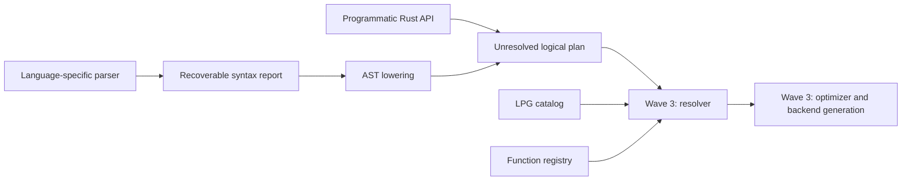

# Grust v2 — Wave 2

Wave 2 delivers the unresolved logical plan and a Gremlin-like programmatic
Rust API, with revised prerequisite contracts from Sem’s October 5 review.
These are independently usable **design sketch crates**, outside the released
Grust workspace, all `publish = false`. They are not a production migration.
The agreed deliverable is traits, flow, a short design and small compiled examples.

## Flow and crate boundaries



| Crate                   | Contract and implemented sketch                                                                                                                              |
| ----------------------- | ------------------------------------------------------------------------------------------------------------------------------------------------------------ |
| `grust-lpg`             | Logical schema groups, optional property keys, opaque identity, multilabel types and inheritance; free catalog checks.                                       |
| `grust-functions`       | Replaceable scalar/aggregation registry, overload descriptors, type variables, null rules, volatility, provider and backend support.                         |
| `grust-unresolved-plan` | Typed expressions, patterns and relational operators; named graph references and unresolved function names. Optional portable JSON.                          |
| `grust-programmatic`    | Parser-free fluent traversals and relational builders producing that IR; typed binding and hop-range errors.                                                 |
| `grust-syntax`          | Parser/recovery and lowering traits, multiple diagnostics, partial AST retention, refusal to plan an erroneous parse; small read-query AST adapter.          |
| `grust-kernel-contract` | Algorithm parameters, reverse-adjacency requirements, input feature alignment, placement, checked estimates, host executor and admission/reservation traits. |

The plan depends on logical types and function descriptors, without Arrow,
Sail, a parser, a storage reader, an executor or a kernel. The programmatic
API depends on the plan. Parsing remains language-specific and replaceable.
The registry exists before Sail binding; lookup retains overloads but does not
choose one. Resolution, coercion and backend implementations belong to Wave 3.

## Revisions against Wave 1

[Wave 1](../wave-1/README.md) remains historical evidence. This sketch supersedes
its mandatory vertex property key, single edge label and dense-ID-shaped group
identifier assumptions:

- `GroupId` and `TypeId` identify schema metadata. Object identity is separately
  opaque or an explicitly declared property key; physical row indices and CSR
  encodings are backend decisions.
- Each object has one owning group. A group’s element type can have several
  labels and supertypes; inherited labels do not imply duplicate ownership.
- Logical extension types do not prescribe a file encoding. LEX/LDBC mapping,
  GraphAr and icebug-disk remain possible future adapters, not dependencies.
- Edge-aligned fields and vertex-aligned feature tables are distinct contracts.
  Timestamp and embedding metadata examples do not implement temporal queries,
  tensor execution or a storage format.
- Algorithms declare parameters, reverse adjacency, placement and working-set
  estimates. Local CSR and distributed execution are separate placements.
  A host-supplied executor avoids requiring an algorithm-owned thread pool.
- Admission covers scratch, output, bookkeeping and reverse storage estimates.
  Reservation is a release-on-drop contract. No runtime allocator or complete
  byte accounting is implemented by these traits.

## Semantics retained by the plan

Path direction, hop bounds, path mode, selector and optional matching are
explicit. Scalar and aggregation calls retain namespace, arguments, distinct
and aggregate filter. Projection, aggregation, joins, unions, unwind, ordering
and expression-valued slices do not select physical operators. An extension
operator retains logical arguments and inputs, without an execution pointer.
Anonymous and named bindings are different variants. Inline element predicates
remain relative to their subject when the builder subsequently names it.

JSON round trips retain floating-point bit patterns, including NaNs and signed
zero. Catalog deserialization runs the same checks as `Schema::new`; it cannot
bypass missing-type or inheritance checks. Incompatible inherited key
properties are refused rather than picked by parent order.

## Run the example and gates

From `sketch/`:

```sh
cargo run --release -p grust-programmatic --example people
cargo fmt --all -- --check
cargo clippy --workspace --all-targets --all-features -- -D warnings
cargo test --workspace --all-features --release
cargo test --workspace --release
```

[Gate evidence](GATE.md) records the native detached-worktree verification.
Tests cover contracts and IR construction, not graph execution or performance.

## Remaining decisions and Wave 3

This is a read-plan sketch, not full Cypher/GQL or Gremlin compatibility.
`ReadLowering` accepts a synthetic read-query AST; no new text parser is shipped.
Its malformed-path diagnostic has no language source map yet. Recovering parser
implementations must supply byte spans and preserve all diagnostics; a partial
AST with errors is for tooling, never execution.

General inherited-property conflict/override policy, graph identity across
catalogs, complete GQL path semantics, writes and transactions remain open.
The key check conservatively refuses incompatible inherited declarations.
Host executor and reservation traits are Rust contracts, not a stable C ABI.
Feature ownership and full accounting need integration with the existing
[Wave 1 kernel ABI](../wave-1/README.md) before execution is qualified.

Wave 3 must add resolved and optimized plan crates, catalog/function binding,
statistics and costs, explain output and backend generation. Those layers must
report unsupported semantics rather than silently execute a different query.
No production crate or existing parser was replaced; no benchmark was run.

## Review basis

[Sem’s requirements](https://github.com/querygraph/grust/pull/36#issuecomment-5992818702),
[storage/standards clarification](https://github.com/querygraph/grust/pull/36#issuecomment-6000697247)
and [our revised boundaries](https://github.com/querygraph/grust/pull/36#issuecomment-6001753829)
govern this wave. Additional F2a remains paused.
