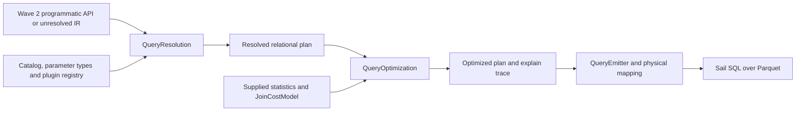

# Wave 3 execution: resolver, join costs and live Sail

Branch: `work/grust-v2-wave3-execution`, following [PR #41](https://github.com/querygraph/grust/pull/41). This extends the sketches with a working relational query compiler and native Sail result qualification. The standalone workspace remains unpublished and separate from the production Grust workspace; production adapters and parsers are not migrated by this branch.

## Implemented flow

| Piece               | Implementation                                                                                                                          |
| ------------------- | --------------------------------------------------------------------------------------------------------------------------------------- |
| Resolved IR         | `grust-resolved-plan::query`: query-wide typed slots, nullable expressions, relational nodes and output schemas                         |
| Resolver            | `grust-resolution::query::QueryResolver` behind `QueryResolution`; catalog and parameter typing stay replaceable                        |
| Optimized IR        | `grust-optimized-plan::query::Plan`, independently usable without the optimizer crate                                                   |
| Costs and optimizer | `grust-optimizer::query::JoinOptimizer`, replaceable `JoinCostModel`, optional `Statistics`, actual rewritten tree and explain          |
| Backend             | `grust-backend::query::SailSql` behind `QueryEmitter`; `QueryStorage` owns tables, physical column roles and provider/function names    |
| Qualification       | `grust-query-qualification` emits fixture manifests; [native client](live/qualify.py) runs both resolved and optimized SQL against Sail |

Each logical node and expression is owned metadata. There are no engine pointers in the core and no graph validation/statistics collection jobs in the resolver or optimizer. The original design-sketch APIs remain alongside the executable `query` modules so their review record is preserved.

## Query resolution

The resolver handles Unit, MATCH/OPTIONAL MATCH, filter, project/distinct, grouped/global aggregation, all seven join kinds, union/all, unwind, sort and literal offset/limit. Expressions cover literal/parameter/binding/property, binary/unary operations, scalar and aggregate plugins, lists, structs and CASE. Parameters have declared types and nullability; values are checked in memory during SQL generation, including their actual literal kind.

MATCH enumerates all feasible schema paths, resolves inherited labels and boolean label expressions, checks endpoint direction, correlates repeated bindings by both group and identity, and expands fixed-hop paths. Walk, trail, simple and acyclic restrictions become explicit predicates. Simple permits a closing cycle but forbids edge reuse; acyclic forbids repeated vertices. Undirected/either expansion suppresses the second orientation of an actual self-loop, preserving parallel edges and bag multiplicity.

Polymorphic bindings expose a common property shape: a property missing from a candidate group becomes typed NULL, conflicting types or inherited declarations refuse. Projection resets binding scope. Entity projections use a declared **draft result envelope** (`identity`, `group`, `graph`, `kind`, nested `properties`), preserve entity property access through aliases, and return NULL for an absent optional entity. This is a compiler result representation, not a claim of a standardized GQL/LEX object encoding. Physical object identities and edge endpoints in this Sail adapter follow the BIGINT graph contract; schema group identifiers remain separate.

The function binder selects exact, numeric, generic and variadic signatures without implicit casts, retains provider/null/volatility/backend metadata, and refuses ambiguity. Aggregate nesting, scalar-versus-aggregate contexts and ungrouped output expressions are checked. NULL-only values use a namespaced LPG logical extension; union branches are explicitly cast to their resolved common type.

## Costed join reordering

The optimizer enumerates binary alternatives in pure inner-join regions, bounded by the configured relation count (hard maximum ten; qualification uses eight). It places each predicate at the first join where all referenced slots are available, keeps local predicates with their leaf, and restores output slot order. Outer joins, union, aggregation, sort, projection and other operator boundaries are not flattened; non-immutable expressions refuse reordering.

Supplied row counts and distinct counts estimate equality selectivity. Endpoint distinct counts have a separate optional statistics method. Missing selectivity uses the conservative factor one; missing cardinality keeps the existing tree. The default cost adds scan rows, child costs, left probe rows, twice right build rows and estimated output rows. `JoinCostModel` can replace those weights and operations. Only a lower estimated cost authorizes a rewrite; the trace records the original and chosen estimate and statistics revision.

These are heuristics, not measured operator timings or a speed claim. For example, the unit fixture with 100,000/10,000/10 rows proves a lower-cost join tree is chosen while retaining output slots. Live tests compare both actual trees against hand-authored expected results, including bag multiplicity and explicit ordering.

## Live Sail boundary

The compiler emits quoted Sail SQL with CTEs, physical role mapping, provider-aware function names, strict parameter binding, aggregate DISTINCT/FILTER, unions, explode, optional joins and ordering/caps. Arbitrary UTF-8 string values use hex decoding, avoiding SQL parser escape modes. Struct field names currently use a qualified constant-name subset. Root sorting is emitted at the result boundary, and ORDER BY and LIMIT share a SQL level.

Qualification runs the existing **native optimized** Sail binary at source `9f0aa7d2a50f1258544d37c05dd19b3ff3d915b3`, SHA-256 `ee80ac3cf9d028639561f3cf32435985192719d629807fcf6a368324fa84946e`, over freshly written/read Parquet fixtures, in local mode with two execution/Tokio workers. The build receipt records `cargo build --locked --release -p sail-cli`, opt level 3, LTO, one codegen unit, stripped debug-free output. No VM or performance benchmark is used. The client owns and closes its native server and verifies binary identity before and after.

Two failures found during development are retained: named_struct requires a constant field name, so decoded field names were replaced; Sail inferred VOID from a NULL-first union, so every differing union branch now has an explicit cast. The NULL-union fault was caught by checking output types in addition to rows.

## Qualification and exact-source evidence

See [execution gate](EXECUTION-GATE.md) for commands and the exact tested source receipt. The fixture matrix covers fixed paths and all path modes, parallel edges/self-loops, optional predicate placement, inherited labels/missing properties, every join kind, grouping, DISTINCT/FILTER, union bags, null type promotion, empty/null unwind, strings/structs, entity materialization/aliases, ordering/caps and the Wave 2 programmatic API through Sail. Both emitted alternatives must match the independently authored answer and resolved output types.

## Explicit limits

This is full relational resolution for the admitted IR, not a complete GQL/Cypher language implementation. Recursive/variable-length paths, selected shortest/ANY paths, materialized path objects and relation extensions require graph-operator/provider implementations and currently return typed refusal. Timestamp/duration/unknown extension type casts, unqualified struct names, zero-column result roots and dynamic/negative caps also refuse. Diagnostics currently stop at the first semantic error; parser recovery is outside this compiler. No unsupported query silently becomes a different query.

The compiler is usable through the Rust modules and generated SQL now. Release integration, parser migration, additional graph operator providers and empirical calibration of the cost model remain separately reviewable work. The existing newspaper, Grust production release and Sail engine source are untouched.

## Graph operator follow-up

The `work/grust-v2-graph-providers` follow-up adds finite-range traversal,
shortest-path selection and checked relation-provider lowering. Its admitted
surface, limitations and exact-source gates are recorded in
[GRAPH-PROVIDERS.md](GRAPH-PROVIDERS.md). Unbounded traversal still requires an
iterative execution adapter.
