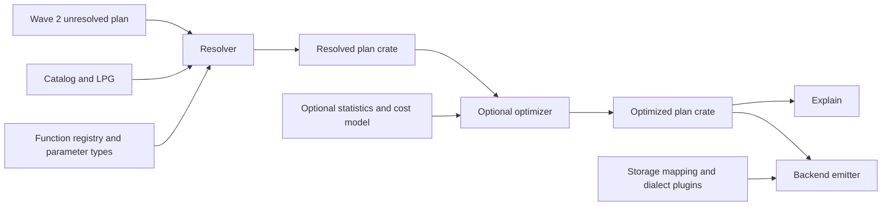

# Grust v2 Wave 3: resolution, optimization and backend boundaries

**Implementation follow-up:** [Executable resolver, costed joins and live Sail qualification](EXECUTION.md). The original sketch below is retained as the design record.

Review branch: `work/grust-v2-wave3`. This completes the **interface-sketch deliverable** agreed on [PR #36](https://github.com/querygraph/grust/pull/36), continuing [Wave 2](../wave-2/README.md). These five unpublished crates are separate from the released Grust workspace. They are not a production query engine.

## Flow and replaceable pieces

| Crate                  | Contract                                                                                                         | Compiled example                                                                                      |
| ---------------------- | ---------------------------------------------------------------------------------------------------------------- | ----------------------------------------------------------------------------------------------------- |
| `grust-resolved-plan`  | Typed output slots, entity bindings, feasible schema paths, explicit graph operators; no engine/catalog pointers | Owned resolved IR                                                                                     |
| `grust-resolution`     | Replaceable catalog, parameter types and resolver, multiple typed diagnostics                                    | Exact scalar/aggregate plugin binding; one-hop schema feasibility with inherited labels and direction |
| `grust-optimized-plan` | Owns resolved semantics, access choices, estimates, provenance and rewrite trace                                 | Independently consumable plan                                                                         |
| `grust-optimizer`      | Optional statistics, replaceable cost/optimizer traits, explain API                                              | Identity optimizer, stable candidate scan ranking, schema-path explain                                |
| `grust-backend`        | Associated output type, physical mapping outside logical catalog, typed unsupported result                       | Sail-dialect SQL for a resolved nonempty scan only                                                    |

The resolver trait consumes Wave 2's `UnresolvedPlan`; a caller can replace it without linking a parser. The optimized IR does not depend on the optimizer crate. Backend emitters do not depend on either the resolver or the optimizer implementation. Existing Wave 2 crates are path dependencies and remain unchanged.

## Resolution policy

1. Resolve graph references through `Catalog`; retain a canonical graph identity, not a Parquet filename. Catalog implementations own version consistency.
2. Enumerate feasible group paths using inherited labels and endpoint direction. A group identifier names a schema group, not an object or CSR offset. The compiled one-hop helper returns an empty set for infeasible labels; the full resolver must distinguish unknown labels from known-but-infeasible patterns.
3. Assign binding and output slots, checking scope and incompatible repeated bindings. Resolve each property over all candidate groups and inherited types. Missing/ambiguous property and incompatible inheritance must be diagnosed, never silently selected.
4. Bind scalar and aggregate calls through the registry, retaining provider, signature, null semantics, backend support and volatility. The example binder accepts exact signatures only; generic/variadic resolution and coercion policy remain replaceable future implementation.
5. Resolve parameter types and boolean predicates. Extract equijoins while retaining residual filters and optional-match boundaries. Aggregation scope, variable-length paths, selectors and path modes need explicit IR support or typed refusal. The current sketch does not lower all Wave 2 relations.

A schema-path orientation is not an instruction to union both scans blindly: undirected edge self-loops must appear once by object identity, while a same-group schema pair can contain non-self edges in both orientations. Path alternatives preserve bag semantics. No data validation or statistics collection job runs during resolution.

## Statistics, optimization and explain

Statistics are supplied metadata: row counts, property distinct counts and degree summaries, with a revision when available. `Unknown` is distinct from a known zero. A host can omit statistics and optimization entirely; `preserve` produces an optimized-plan wrapper with unchanged semantics and no rewrite claims.

The scan-ranking example orders known counts before unknown counts, keeping ties stable. It is **not join reordering**. A real join optimizer must estimate intermediate cardinalities using endpoints, keys and selectivity, cost alternatives via `CostModel`, and preserve output slot order, bag multiplicity, optional joins and volatile evaluation. Missing/stale metadata must not authorize semantic changes. Join reordering remains an implementation after review of these interfaces.

Explain includes catalog/statistics revisions, graph/group paths and orientation, bindings, predicates, optional boundaries, output items, candidate estimates and rewrite reasons. This example emits deterministic text; a structured explain representation can be added without changing the plan crates.

## Backend generation and today's code

SQL remains the first output route from the Wave 1 research. `BackendEmitter::Output` allows SQL, an adapter-owned Spark Connect relation, or another physical format without importing those formats into the core. This draft does not reverse the agreed SQL-first decision or claim a tested Connect integration.

Today's `grust-cypher` parsing/resolution/planning should migrate behind frontend and resolver interfaces; its engine-specific translation belongs behind backend emitters. Today's `grust-sail` session/execution remains the adapter's responsibility. No existing production implementation is moved by this review sketch.

The bounded `SailScanSql` example only emits named nonempty column scans, using adapter-supplied table components and backtick escaping. All filters, matches, projects and graph operators are refused. It neither submits SQL to Sail nor proves dialect execution compatibility. Production emitters must map physical columns from slots, verify plugin support, preserve null/aggregate/float semantics, and reject unsupported operators before executing. Recursive and shortest paths cannot silently become one-hop joins.

## Qualification and next implementation

Run the standalone workspace gates in [GATE.md](GATE.md). Tests pin exact overload ambiguity/no implicit casts, aggregate separation, inherited-label/direction feasibility, unknown versus zero estimates, stable ordering, unchanged baseline semantics, explain paths, identifier escaping and unsupported/storage refusals.

Next implementation is a bounded full resolver plus a relational Sail SQL emitter, qualified against query-result fixtures before any migration. Generic overload selection, complete expression typing, multi-hop/path semantics, physical column mapping and costed join reordering are not implemented here. A standalone compiler example is not evidence of performance or full GQL/Cypher support.
