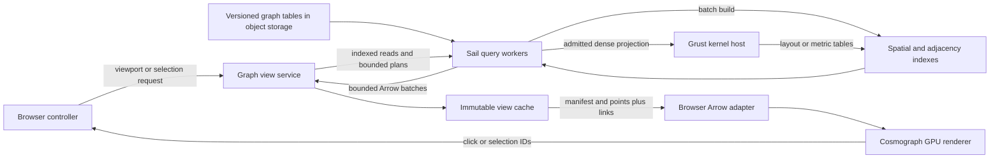

# Cosmograph over Sail and Grust: projections and subsets as bounded views

Design addition to the [visualization study](README.md), requested by Alexy.
Official interfaces checked on 2026-10-04; this is a proposal, with no new
implementation or performance measurement. The original study's shared-host,
warm-cache measurements establish useful query shapes. They do not establish
browser latency, remote-storage performance, or service capacity at a billion
vertices.

## 1. Recommendation and review

Embed Nikita Rokotyan's **Cosmograph SDK** behind a **graph view service**.
Sail owns large tables, filtering, endpoint joins, aggregation and durable
materialization. Grust supplies algorithms when their admitted projection fits
the kernel host. The service turns a spatial frontier or a semantic selection
into a versioned, bounded pair of point/link tables. Cosmograph displays that
pair and supports interaction within it.

The study's strongest building block is `VK`/`EK` pruning by Morton ranges,
combined with coarse pseudo-edges. Keep that for zoom and pan. Add a separate
index by vertex ID for topology queries: nearby on screen and connected by an
edge are different predicates. Keep layouts separate from graph computation.

Three contracts need tightening before building a service:

- The head's roughly 33 MiB estimate at a billion vertices assumes a uniform
  layout. Deeply skewed cells need a maximum depth, compressed unary paths and
  a byte cap; overflow stays in indexed storage.
- A leaf vertex threshold does not bound incident edges. Admission must also
  account for edge rows scanned, returned links and encoded/decoded bytes.
- A single Arrow IPC stream has one schema. The study's proposed `cells`,
  `nodes` and `edges` responses require separate streams or an explicit envelope.
  This proposal uses a manifest and two independently typed Arrow objects.

**Projection has two meanings here.** A graph projection selects vertex and
edge groups, predicates, direction and weights. A visual projection assigns
coordinates. Version and cache both separately. Spatial cell membership is
defined in one fixed coordinate system; a local force layout cannot change it.

## 2. Components and ownership



| Component | Responsibility | Resource boundary |
|---|---|---|
| Graph catalog | Pin graph snapshot, property groups, edge semantics and layout/metric versions | Metadata on the driver; graph rows remain in storage/workers |
| Index builder | Build spatial tables and optional endpoint indexes for repeated queries | Offline Sail joins/sorts; explicit worker memory and spill budgets |
| Query workers | Apply predicates, semi-join endpoints, expand frontiers and aggregate | No full-graph collection to the gateway; deadline and scan/working-memory budgets |
| Grust kernel host | Execute an admitted CSR projection and return Arrow results | CSR plus declared scratch must fit; large requests use a relational route or return a refusal |
| View service | Admission, immutable views, identity mapping, response assembly and cache | Only bounded output and metadata; separately limited concurrent requests |
| Browser controller | Navigation, selection tokens, cancellation and view generations | One current bounded view plus a bounded replacement; stale responses discarded |
| Cosmograph adapter | Arrow input, SDK configuration and ID-based selection restoration | Local browser/WASM/GPU budgets; no full-graph dataset in the browser |

The kernel split follows the [Grust design response](../grust-design/README.md):
the engine owns dense mappings and storage; kernels consume CSR and return Arrow.
That v2 boundary is proposed work. Existing Pecan/table paths can deliver the
first view service; it does not depend on the Grust redesign being released.

Keep serving and batch work in separate resource pools so layout/index builds
cannot exhaust interactive workers. Deploy the gateway separately from Sail
sessions; use Spark Connect first to share the existing table/query machinery.
The study's Flight SQL probe is an alternative with its own session/catalog and
authentication limitations, not a transparent substitute. Keep engine endpoints
behind the gateway, which resolves application authorization and selection scope.

## 3. Storage and precomputation

Publish immutable artifacts under `(graph_snapshot, graph_projection,
layout_version, index_version)`, with a manifest listing exact objects, schemas,
counts, coordinate transform and directed/multigraph policies. Build into a
fresh directory, check actual file/page statistics, then publish the manifest.
The writer hazards described in study section 3.4 remain release gates: avoid
sorting before `checkpoint()`, and verify sorted files rather than assuming
overwrite or range repartition preserves order.

| Artifact | Layout and use | Precompute policy |
|---|---|---|
| Vertex/property tables | Canonical Int64 IDs; column projection and property/time partitions | Existing graph snapshot; omit wide text from draw payloads |
| `VK`, `LEVELS`, coarse `PE` | Morton-key ranges, cell summaries and aggregated edges | Per layout; precompute expensive coarse/dense cells using `deg_sum` and measured scan budgets |
| Source adjacency | Endpoint-ID buckets with sorted ID ranges and file/row-group statistics | Add for repeated neighborhood queries; retained ID-to-file/range manifest enables pruning |
| Destination adjacency | Same layout by destination | Optional for repeated incoming/bidirectional queries; disclose extra storage |
| `METRICS`/community membership | `(snapshot, algorithm/options, vid, value)` | Reuse PageRank/WCC/community results; time filters cannot reuse invalid aggregates |
| Materialized membership and edges | `MEMBERS(selection_id, vid)` and selected endpoint relations | Reuse a popular filter/selection; no CSR needed just to draw |
| View objects | Compact `points.arrow`, `links.arrow`, manifest | Byte-limited LRU for generated views; shared immutable objects for approved popular overviews |

A Morton rectangle becomes several prefix ranges followed by an exact
coordinate predicate. A neighborhood expands by endpoint ID and then joins
coordinates. Neither index substitutes for the other. Parquet predicate syntax
alone does not prove pruning: record files/row groups/bytes actually read.
GraphAr ordered adjacency is a future alternative, not a deployed capability.

Filtered cell counts and edge aggregates need the same predicate as their
vertices. Unfiltered `PE` is reusable only for the unfiltered snapshot, or for a
declared precomputed facet. Arbitrary filters use a bounded live query, a
materialized filtered projection, or an asynchronous build; they cannot return
an unfiltered overview with an "exact filtered" label.

## 4. How each request reaches a view

| Interaction | Backend path | Semantic result |
|---|---|---|
| Open / zoom / pan | Read the adaptive spatial frontier; coarse `PE` or admitted `EK` ranges; map endpoints to visible cells | Aggregated graph over an explicit spatial cut |
| Open a leaf | Fetch `VK` members and induced edges; map outside endpoints to declared boundary aggregates | Real vertices plus labelled aggregate boundary objects |
| Filter by time, properties or community | Push predicates/column projection into Sail; form membership; semi-join **both** edge endpoints | Exact induced graph if complete, otherwise explicitly sampled/aggregated |
| Expand k hops | Source/destination adjacency reads for each bounded frontier; direction and vertex/edge predicates are explicit | Exact reached set only if all requested hops complete; otherwise a disclosed partial/sampled result |
| Lasso over the full layout | Coordinate-system version plus polygon; Morton candidate ranges then exact polygon predicate | Selection token for full matching membership, even when only some representatives were displayed |
| Run an algorithm | Reuse a versioned result, or schedule an admitted native/relational graph job | Result keyed to the graph/selection/options, then a separate visual view |

For an arbitrary induced subgraph, compute `M = selected vertices`, then
`E_M = E semi-join M on src semi-join M on dst`. Project only requested
properties. Materialize the membership/endpoint relation when reused. Expensive
work returns a job/selection token; the gateway does not collect it to determine
whether it fits. For a small admitted result, the gateway numbers its bounded
rows; larger admitted materializations can number rows in a streaming exporter.
Neither uses `monotonically_increasing_id()` before writing.

| Cost boundary | What makes it fast / what remains expensive |
|---|---|
| Spatial refine | Indexed cell/page reads plus mapping the bounded frontier; no full graph projection per click |
| Repeated semantic view | Reuse membership/edge materialization or prepared Arrow objects; cache lookup/export is proportional to the delivered view |
| First arbitrary predicate | May scan vertex/edge tables and shuffle endpoint joins; schedule asynchronously when an indexed/precomputed route does not exist |
| k-hop expansion | Work tracks visited adjacency rows, not just returned vertices; hubs can exceed admission even for one hop |
| Optional local algorithm | Build/reuse CSR only for an admitted selection: unweighted arrays require `8(n+1)+4m` bytes while `n < 2^32`, plus mapping and kernel scratch; weights add `8m` bytes |

These are complexity boundaries, not measured speedups. A cached global
PageRank/community table can style many views without rerunning its algorithm.
The same selected graph can feed multiple metrics/layouts without repeating
membership and endpoint joins when its versions and semantics match.

For hub expansion, count/degree metadata is an admission estimate, not a promise
that every filtered neighborhood fits. Meter actual scanned bytes/rows and
working memory while reading. If the exact query exceeds its budget, return a
typed refusal or asynchronous job, or apply an explicitly requested deterministic
sampling/aggregation policy. `LIMIT` after a full scan bounds output only.

The service first chooses the frontier within a vertex budget, computes admitted
edges, and resolves every displayed endpoint. It caps aggregate edges using a
deterministic rank and records omitted edge counts/weight totals. If totals were
not computed within budget, they are `unknown`, not zero. No boundary link may
point to an absent point. Preserve direction, multiplicity and self-loop policy;
do not treat the study's doubled undirected `EK` arcs as two original edges.

Precomputed `PE` blocks have their own scan row/byte estimates and admission
limits: top-k output does not bound an arbitrarily dense aggregate block. For
an oversized block, serve a separately prepared bounded overview, coarsen the
frontier, or queue the exact view. Actual scan-budget enforcement is new service
work to qualify; current Sail statistics/metrics alone do not establish a hard
runtime quota. Spatial tiles clipped to nearby tiles omit long-range graph
edges; represent that boundary explicitly rather than claiming a full neighborhood.

Mixed-level frontiers require special care: a coarse `PE` block cannot identify
individual finer destination cells. Return a labelled ancestor/boundary point,
read an admitted finer block, or use exact endpoint mapping. Never assign the
ancestor's total to an arbitrary child. Expanding one cell also updates incident
links elsewhere; collapsed/top-k child edges cannot be blindly summed into an
exact parent edge. Use the server's aggregate blocks.

## 5. Cosmograph view contract

Cosmograph accepts Arrow tables/buffers and Arrow/Parquet files or URLs.
[Supported formats](https://cosmograph.app/docs-lib/data-requirements/supported-formats/).
Prepared input has unique point IDs, sequential point indices, and matching
source/target IDs **and** indices on links.
[Advanced data usage](https://cosmograph.app/docs-lib/data-requirements/advanced-data-usage/).

| Object | Proposed schema / fields |
|---|---|
| Manifest | `view_id`, generation, snapshot, graph projection, layout/index versions, selection token, predicate digest, coordinate transform, edge policy, completion status, represented/returned counts, omissions, actual bytes, two object URLs/digests, requested and applied budgets |
| Points | `id Utf8`, `idx UInt32`, `kind Utf8`, `x Float32`, `y Float32`; selected small metrics/labels; aggregate mass/counts retained without lossy ID conversions |
| Links | `source Utf8`, `target Utf8`, `src_idx UInt32`, `dst_idx UInt32`; optional stable edge ID, display weight and separate exact aggregate count/weight fields |

IDs encode their kind and namespace: for example `v/patent/-123` for a canonical
vertex, `c/<layout>/<cid-decimal>` for a cell. Canonical Int64 IDs and cell IDs
remain Int64 in storage; the browser receives lossless decimal strings. The
draw index is local to one view, `0..n-1`, and never substitutes for an origin ID.
Preserve counts as exact Arrow integers/BigInt or strings where required; styling
may use a separate approximate numeric value. Reindex and remap both endpoints
for every complete replacement.

Configuration shape, using the official
[configuration reference](https://cosmograph.app/docs-lib/api/interfaces/CosmographConfig/):

```typescript
// Proposed adapter; pointsArrow and linksArrow are prepared bounded tables.
const config = {
  points: pointsArrow, links: linksArrow,
  pointIdBy: 'id', pointIndexBy: 'idx',
  linkSourceBy: 'source', linkTargetBy: 'target',
  linkSourceIndexBy: 'src_idx', linkTargetIndexBy: 'dst_idx',
  pointXBy: 'x', pointYBy: 'y',
  enableSimulation: false, rescalePositions: false,
};
```

Explicit `rescalePositions: false` matters: automatic rescaling otherwise changes
the correspondence with backend viewport predicates when simulation is disabled.
Apply one versioned affine transform before Float32 conversion and invert it
for spatial requests. Deep zoom needs an explicitly versioned local origin/scale
when Float32 loses detail. A separate local exploration can enable GPU layout;
its coordinates do not define membership in the global spatial index.

Cosmograph's external DuckDB connection is a **browser DuckDB-WASM** integration,
not an automatic connection to remote Sail. Initially supply prepared Arrow
directly; an external browser connection is an optional way to share the already
bounded view with local charts.
[External connection](https://cosmograph.app/docs-lib/data-requirements/external-duck-db-connection/).

## 6. HTTP, updates, caching and interaction semantics

`POST /views` accepts a typed selection/viewport request, snapshot, direction,
coordinate version and budgets. It returns a ready manifest, a pending job token,
or a resource refusal. `GET /views/{id}/points.arrow` and `links.arrow` each expose
one schema. Attribute lookup is a separate bounded request. Graph analytics can
write a Parquet selection/result artifact without forcing it into a display view.

Use Arrow IPC for first interactive delivery; Parquet remains useful for durable
materializations and exports. HTTP serves complete bounded objects with correct
CORS. Browser range reads are an optimization to qualify, not the capacity plan:
DuckDB-WASM documents a 4 GB memory ceiling and potentially tighter browser
limits, and notes that some remote Parquet paths download the whole file.
[DuckDB-WASM limitations](https://duckdb.org/docs/current/clients/wasm/overview#limitations).
That ceiling is not a whole-tab/GPU budget.

Start with whole bounded-view replacement: fetch/validate both objects, then
install a consistent points/links generation. Carry selections and focus by
stable ID; restore the camera unless the user requested a new coordinate system.
Abort superseded requests, debounce viewport queries, and reject stale responses.
Account for the old/new tables being resident together during replacement.

The SDK supports incremental point/link addition/removal and retaining positions.
Use those later for small patches after qualifying indices, endpoint existence
and multiedge-removal semantics. Full replacement is the initial contract;
changing layout versions must apply new coordinates rather than preserving old
ones by ID.
[Hot data updates](https://cosmograph.app/docs-lib/features/data-update/).

Browser timeline/histogram filters and selections initially describe **downloaded
objects**. A histogram over cell masses differs from one over original vertices.
Expose full-dataset filtering/aggregation as a separate explicit backend request;
return its selection token and properly labelled global statistics. A browser
selection callback is not proof of a full-dataset predicate result.
[Selection API](https://cosmograph.app/docs-lib/api/classes/Cosmograph/).

Cache shared raw blocks by snapshot/graph projection/layout/index/predicate facet; cache mapped
views by those keys plus frontier, selection, direction, algorithm version,
sampling seed, requested columns and budgets. Cache identity also includes the
authorization scope. Do not cache expiring URLs as data identity. Pin a view's
versions until released; publish new manifests atomically. The service owns
cache eviction because the study found Sail `persist()` is not a result cache.
Include hierarchy and aggregation-policy versions when community/spatial cuts
or pseudo-edge rules change.
The graph-projection identity covers vertex/edge groups, predicates, direction,
weights, multiplicity and loop policy; a display name alone is not a cache key.

## 7. Proposed budgets and qualification

These are starting policies to measure, not Cosmograph capacities:

| Boundary | Initial policy |
|---|---|
| Overview | At most 10,000 aggregate points; top-16 outgoing links per cell, additionally capped by the whole-view edge/byte budget |
| Detailed view | At most 50,000 total points and 200,000 links; begin with 10,000-vertex leaves |
| Network objects | Combined encoded payload at most 32 MiB; decoded Arrow columns at most 128 MiB, plus per-attribute limits |
| Backend scan | `deg_sum`/statistics guide admission; initial 1M-edge-row on-demand budget with actual byte, deadline and working-memory limits; asynchronous route for heavier work |
| Service resident data | Byte-limited head (initially 128 MiB) and block/view caches (initially 1 GiB), plus per-request output/scratch admission |
| Browser | Device-calibrated admission for decoded Arrow, WASM, JavaScript, GPU buffers and replacement overlap; lower caps on constrained devices |

At 50,000 points and 200,000 links, `idx/x/y` use 12 bytes per point and
`src_idx/dst_idx/display_weight` use 12 bytes per link: **3,000,000 bytes** before
IDs, offsets, labels, exact counts, validity buffers and copies. Repeated endpoint
strings can dominate. Cap actual bytes even when row counts fit. Measure the
Arrow-to-SDK copies and GPU uploads; Arrow support is not an end-to-end zero-copy
guarantee. Initially target first meaningful view p95 under 2 s and warm
refinement p95 under 1 s, with device/network profiles stated; neither is proven.

| Phase | Deliverable / acceptance evidence |
|---|---|
| 1. Prepared bounded views | cit-Patents and official LDBC graph500-24: server filter plus two endpoint joins, Arrow points/links, exact IDs including negative and >2^53 cases, endpoint/index round-trip, fixed coordinates and manifested edge policy |
| 2. Spatial overview/refinement | Existing Morton tables plus real service, `deg_sum`, head byte cap, edge caps and mixed-level frontier; compare aggregate counts to independent full source queries, including skew and boundary cells |
| 3. Semantic drill-down | Incoming/outgoing k-hop and property/time/community subsets; compare exact membership/edges separately from display sampling; measure real pruning, reused materialization and hub refusals |
| 4. Browser qualification | Pin Cosmograph/Arrow/DuckDB versions; cold and warm load, network bytes, decode/preparation, GPU upload, first frame, frame/selection latency and peak memory on target devices; qualify view replacement and cancellation |

Record each phase separately on native optimized hosts. Retain resource refusals,
timeouts and sampled/partial results as distinct outcomes. Test object-storage
and worker-distributed routes before claiming those modes are interactive.
The original study has no browser/service implementation; its timings must not
be relabelled as these acceptance results.

## 8. Cosmograph and cosmos.gl deployment choice

Cosmograph provides the richer SDK/UI. Its published license distinguishes
noncommercial CC BY-NC use and commercial proprietary licensing; confirm the
embedded deployment entitlement for a product.
[Library licensing](https://cosmograph.app/licensing/).
The underlying **`@cosmos.gl/graph`** renderer is MIT licensed and exposes typed
position/link buffers. It is a renderer alternative behind the same view adapter,
with browser charts/filtering implemented separately.
[Renderer source and license](https://github.com/cosmosgl/graph).

Evaluate Cosmograph first for its exploration interface. Keep the view contract
independent of it. The architecture's scaling comes from Sail's indexed reads,
materialized selections and explicit view admission; larger GPU capacity can
increase a qualified view budget without changing the canonical graph store.

## 9. Cosmolang exploration protocol

The [Cosmolang 0.1 proposal](COSMOLANG.md) extends this architecture with one
typed control protocol for browser gestures, a proposed Cosmograph MCP adapter
and Sail/Nutmeg requests. It supplies JSON Schema and illustrative wire exchanges
for camera rotation/zoom/pan, hierarchy expansion, topology traversal, spatial
and embedding nearest neighbors, degree filtering, WCC and layout jobs.

[Hierarchy and anticipation](COSMOLANG-HIERARCHY.md) defines disjoint semantic
and spatial cuts, exact quotient provenance, a negotiated resident-point ceiling
of one million and bounded prediction of likely next views. The earlier 10,000/
50,000-point policies remain initial targets; one million is an application cap,
not a measured device capacity. Genuine 3D serving requires new spatial indexing
and a qualified SDK camera binding. Prefetch can warm admitted Nutmeg projections
and layout providers but cannot stage the entire billion-node source locally.

These are proposal/contracts, not new live integration or benchmark results.
The new versioned endpoint and installation semantics supersede the earlier
unversioned HTTP sketch when implemented.
