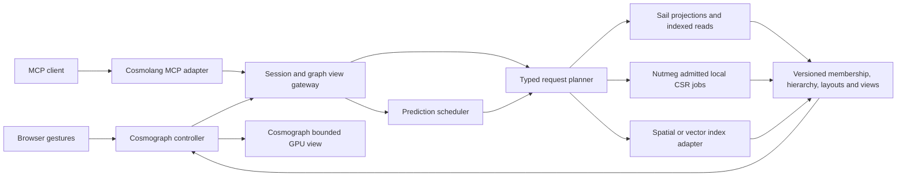

# Cosmolang 0.1 — graph exploration protocol proposal

Cosmolang describes graph-exploration intent shared by a browser controller,
a Cosmograph MCP adapter and a Sail/Nutmeg view service. It extends the
[Cosmograph architecture](COSMOGRAPH-ARCHITECTURE.md). This revision supplies
portable request/response schemas and example exchanges. The live gateway,
Cosmograph adapter, MCP server, hierarchy builder and predictor are proposed
implementation work; none is claimed to be deployed or benchmarked.

## 1. Execution model

A **graph projection** selects graph groups, vertices, edges, direction,
weights, time/property predicates, loop and multiplicity policy. A **selection**
is an immutable membership relation within that projection. A **layout** maps
members to coordinates. A **view** is a bounded drawable quotient or subset.
The authoritative objects are server-side relations, not the downloaded screen.
Their identifiers and versions accompany every result.

Camera motion is immediate and local. Coalesced absolute camera poses notify
the service for view refinement and prediction; no graph scan runs for every
pointer movement. Session operations coordinate browser state. Graph operations
produce selections, result artifacts or jobs; they do not silently move the
camera or replace the current view. An explicit view request installs results.

The gateway plans table operations and delegates admitted CSR operations to
Nutmeg. It never asks Nutmeg to stage a multibillion-node graph in one process.
Larger algorithms use a supported relational/distributed route, an offline
artifact, or a resource refusal. Cosmolang can precede Grust v2 Wave 3: its first
planner handles these limited typed operations directly; the future resolver
can become an implementation behind the same protocol.

## 2. Wire format and identity

Use JSON control messages and separately fetched Arrow IPC point/link objects.
Large membership, nearest-neighbor and component results remain Arrow/Parquet
resources behind opaque handles. Never put a million IDs into JSON or MCP text.
The schemas live in [cosmolang/](cosmolang/README.md).

A request is `{cosmolang, request_id, session_id, expect_revision, context,
budget, command}`. `session.open` omits session/revision; all other operations
require them. `request_id` is an idempotency key for the authenticated session:
retrying the same payload returns the original outcome; reuse with a changed
payload returns `IDEMPOTENCY_CONFLICT`.

`context` pins graph, snapshot, graph-projection identity (with a catalog-backed digest), hierarchy version,
layout version and selection handle. For a new session these are resolved by
`session.open`; subsequent requests echo the resolved context. Layout and
hierarchy versions are nullable only for operations independent of them.
A mismatched snapshot never receives a result computed from a different one.
A session’s currently displayed view is separate from the selection a graph
operation computes. Responses carry the effective context, session revision,
request ID and optional job/resource/view handles.

All Int64 vertex IDs, hierarchy IDs, exact counts, byte counts and sequence
counters are strings. Bounded small values such as `k`, hop count, draw index
and point cap are JSON numbers. Source IDs are namespaced strings; an object
reference distinguishes `vertex`, `aggregate` and `component`. A draw index is
local to a single view and is never accepted as a durable graph identifier.
JSON coordinate values must be finite. Wire budgets cannot raise server policy. Initial JSON messages are capped at
1 MiB and predicate depth at 32; these are gateway admission checks, not graph
validation jobs.

Protocol versions use major/minor negotiation. Unsupported major versions or
operations fail explicitly. Optional advertised capabilities extend a minor
version; unknown semantics are not ignored. The first handshake includes SDK,
Nutmeg/provider versions, dimensionality, supported operations, index versions,
filter semantics, algorithm contracts and negotiated budgets.

## 3. Operation vocabulary

| Operation                             | Parameters and outcome                                                                                                          | Execution                                                                                      |
| ------------------------------------- | ------------------------------------------------------------------------------------------------------------------------------- | ---------------------------------------------------------------------------------------------- |
| `session.open` / `sync` / `close`     | Pin context and capabilities; read or release session state                                                                     | Gateway metadata; close releases leases, not shared immutable artifacts                        |
| `camera.set`, `rotate`, `zoom`, `pan` | Absolute resulting pose, coordinate version, interaction epoch; acknowledge camera state                                        | Browser-local first; aliases all carry a complete pose, so retries cannot apply a delta twice  |
| `camera.fit`                          | Target selection/view and padding; fitted pose                                                                                  | Browser command after bounds are available; requires attached browser                          |
| `view.request`                        | Selection handle, viewport/frontier, requested columns and budgets; ready manifest or job                                       | Indexed Sail reads, bounded quotient export and cache                                          |
| `view.install`                        | Ready view ID and generation; compare-and-swap installation through the attached browser                                        | Prepare both objects before granting an install lease; acknowledge actual browser installation |
| `hierarchy.expand` / `collapse`       | Aggregate reference, current frontier/view ID; replacement frontier/view                                                        | Server recomputes every affected incident edge, preserving endpoints                           |
| `graph.follow`                        | Vertex seeds, in/out/both, hop bound, vertex/edge predicates, complete/aggregate/sample policy; reached-set handle and boundary | Endpoint indexes plus bounded frontier expansion; seeds can be a handle                        |
| `graph.nearest`                       | Spatial or embedding space, reference vertex/vector, `k`, metric, exact/ANN and index version; ranked result handle             | Spatial tree or vector adapter; source neighbors are never inferred from screen proximity      |
| `graph.filter`                        | Typed property/time predicate and input selection; new membership handle                                                        | Sail pushdown and two-endpoint induced edge selection                                          |
| `graph.degree_filter`                 | Input domain, in/out/total, edges/distinct-neighbors, minimum/maximum; membership handle                                        | Reuse valid metric table or compute degree of the pinned domain                                |
| `graph.wcc`                           | Input domain, method/provider/options and exactness; component membership and summary handles                                   | Reuse matching artifact, admitted Nutmeg WCC, or explicit large-job route                      |
| `layout.prepare`                      | Selection/frontier, 2D/3D, algorithm/version/seed and anchor policy; immutable layout handle                                    | Admitted background/local or offline job; changing coordinates requires a new layout version   |
| `prefetch.hint`                       | Hover/focus/navigation observation and short TTL; scheduler may prepare bounded candidates                                      | Read-only intent hint; never installs a view or starts a global build                          |
| `job.get` / `cancel`                  | Job ID; progress/outcome or cancellation acknowledgement                                                                        | Gateway scheduler; job cancellation is separate from an MCP transport request                  |
| `view.release`                        | View lease ID                                                                                                                   | Release browser/server residency; does not delete canonical data                               |

[Examples](cosmolang/examples/) cover camera rotation/zoom, following edges,
nearest neighbors, degree filtering, WCC, hierarchy refinement and layout jobs.
A future readable text syntax can compile to these objects; v0.1 needs no parser.

### Camera and spatial semantics

A 2D pose contains center, world units per screen pixel and viewport size. A 3D
pose contains eye, target, up, vertical field of view and near/far clip planes.
`coordinate_frame` resolves to the versioned affine transform in the layout
manifest. Rotation messages carry the final orbit pose, not unrepeatable deltas.
v0.1 rotation is a 3D operation; a flat 2D rotation is unsupported.
Navigation preserves coordinates; GPU simulation does not rewrite the server’s
spatial index. A locally simulated view has a separate ephemeral layout ID.

Current Cosmograph documents a perspective orbit camera, drag rotation,
dolly/zoom and pan in 3D, with optional `pointZBy` for fixed coordinates.
[Official 3D interface](https://cosmograph.app/docs-lib/features/3d/).
Its public API documents zoom/fitting and selection operations; we have not
qualified complete programmatic 3D pose read/write through the published SDK.
[API](https://cosmograph.app/docs-lib/api/classes/Cosmograph/).
The adapter must advertise `camera.pose3d` only after an integration test, or
return `UNSUPPORTED_CAPABILITY`; do not fabricate an SDK method or mutate private
renderer state. Ship 2D navigation first if that binding remains unavailable.

The existing spatial prototype is 2D Morton indexing. A 3D view of its coordinates
at `z=0` still queries that plane. Genuine 3D layouts require a versioned octree
or equivalent 3D bounds index; frustum-plane tests replace axis-aligned rectangle
membership. Rotation may change visible cells without changing graph semantics.

### Graph semantics

- `follow` follows stored directed arcs according to the requested direction.
  A displayed aggregate requires an explicit member/boundary selection first;
  it is not silently substituted by its centroid or representative vertex.
  Hub truncation yields disclosed boundary aggregates or partial/sampled results.
- Spatial nearest means distance in the pinned layout, not the camera’s pixels.
  Embedding nearest names model, dimensions, normalization, distance and index
  snapshot. Exact and ANN are distinct outcomes; ANN reports provider/search
  settings without an unsupported recall claim. Filtered ANN must honor its
  candidate domain or declare a short/partial result; it cannot claim the exact
  filtered top-k after merely filtering an unfiltered top-k. `l2` returns
  Euclidean distance ascending; `cosine` returns one minus cosine similarity
  ascending; `dot` returns inner product descending. Ties use namespace then
  numeric source Int64 ID. Missing embeddings/zero-norm cosine vectors are outside
  a declared eligible-vector domain, not silently counted as searched vertices.
- Degree is evaluated once on the pinned input domain, before applying the new
  degree predicate. This is not iterative k-core. State whether parallel edges
  count individually or neighbors are deduplicated. Total edge degree counts a
  self-loop twice; incoming/outgoing edge degree counts it once. Distinct-neighbor
  degree is the union of eligible neighbors, including self once when present.
  Undirected input degree uses original logical edges, not doubled storage arcs.
  Renderer degrees are degrees of the downloaded view and receive that label.
- WCC ignores edge orientation but preserves the input selection and predicates.
  Running WCC on a visible quotient does not establish source-graph components:
  spatial grouping can merge disconnected components. Component IDs are opaque
  and versioned; membership equality, not numeric label equality, is the oracle.
  A min-original-ID label is an explicit optional provider convention.
- Scope is `projection`, `selection` or `display`. Default remote analytics use
  the pinned selection/projection. The display domain resolves the installed view at the pinned session revision.
  Display-only results are labelled and never
  reused as full-graph metrics. A scope change changes artifact/cache identity.

## 4. Session ordering, jobs and replacement

A session has a compare-and-swap revision. A command that changes camera,
frontier or installed view names `expect_revision`; the gateway rejects stale
state with `REVISION_CONFLICT`. Graph reads pin their input revision but do not
advance it. `session.sync` is a read and can recover current state even when the
client revision is stale. Serialize state-changing commands from browser and MCP;
a rejected MCP command receives current state instead of overwriting a gesture.

Camera actions can update predicted local state immediately; acknowledgements
reconcile it. Coalesce updates and allow one state write in flight per session.
Each settled navigation intent has an epoch; jobs include its origin but are not
implicitly cancelled when a camera moves. Superseded view requests lose their
install lease; completed immutable artifacts may remain reusable.

Job states: `queued`, `running`, `cancelling`, then exactly one terminal state
`ready`, `cancelled`, `refused`, `failed` or `expired`. A cancellation request is
not a claim that a running kernel stopped immediately. Cap orphaned work and
release reservations only after workers finish or are terminated safely.
Return provider cancellation support at admission. An uncancellable expensive
job does not share the interactive worker pool.

`deadline_ms` is the requested execution allowance, including queued work;
asynchronous work still has a deadline and reservation. Submission/transport
timeouts are separate. Expensive jobs need an explicitly admitted larger budget.

Responses are `ready`, `accepted`, `refused` or `error`. `accepted` includes a
job ID; `ready` includes bounded metadata and artifact/view references.
Progress events have monotonic event sequence, originating request/job ID,
context and revision. Reconnect with last event sequence; if retained events
are unavailable, synchronize state. Delivery may repeat; clients deduplicate.
Do not promise exactly-once transport execution.

A ready view is installed atomically: fetch both Arrow objects, verify digest,
counts, indices, endpoints and budgets, prepare the SDK, then switch generation.
The browser acknowledges installation separately from server computation.
Until then its prior view remains active. v0.1 uses full replacement; incremental
patches wait for endpoint/index/multiedge qualification. The cap applies to
**all resident points**, including old/new replacement overlap and prefetched
GPU views. Prefer prefetching encoded objects; decode/upload only after admission.

## 5. Transport and MCP bindings

- Browser: `POST /cosmolang/v0/sessions`, then
  `POST /cosmolang/v0/sessions/{id}/commands`; bounded JSON responses and
  optional SSE job/state events. Arrow objects are fetched independently over
  HTTP with content digests and renewable authorized resource references.
  `GET /cosmolang/v0/resources/{handle}` resolves protocol resource URIs to
  authorized metadata or objects; a `cosmolang://` URI is not fetched as HTTP
  directly by the renderer.
- MCP: expose discoverable `cosmo_open`, `cosmo_camera`, `cosmo_view`,
  `cosmo_expand`, `cosmo_follow`, `cosmo_nearest`, `cosmo_filter`,
  `cosmo_degree_filter`, `cosmo_wcc`, `cosmo_layout`, `cosmo_job` and `cosmo_sync`
  tools. Tools may take a session handle and compact typed parameters; the adapter
  supplies the session’s pinned context and negotiated defaults. State-changing
  tools still require the caller’s observed revision. Each maps to the same
  canonical command schema and handler. Published MCP tool
  schemas bundle referenced definitions locally; clients need no URN resolver.
  MCP JSON-RPC IDs and Cosmolang idempotency keys serve different purposes.
  A camera tool needs an attached browser; otherwise `BROWSER_NOT_ATTACHED`.
- Return small `structuredContent`, a readable text summary, and resource links
  for results/views. MCP does not carry Arrow arrays in its JSON-RPC responses.
  Tool inputs/outputs have JSON Schema; tool errors use MCP `isError` plus the
  Cosmolang error code. Session-changing tools advertise mutation; graph-source
  reads remain distinct from changing the displayed view.

These are our proposed bindings, not an assertion that Cosmograph already
provides an MCP. MCP supports tool schemas, structured results and resource
links. [Official tools contract](https://modelcontextprotocol.io/specification/2025-11-25/server/tools).
Its stdio or Streamable HTTP transport wraps the same application messages;
browser SSE is our gateway interface, not a replacement MCP transport.
[Official transports](https://modelcontextprotocol.io/specification/2025-11-25/basic/transports).

Authorization is applied before selection/cache lookup and prediction. Scope
comes from the authenticated connection, never a client-provided authority
field. All session/artifact tokens are bound to that scope and their lifetime.
Large selections use handles; inline seeds have a small configured cap. Predicate
columns and operators are typed/catalog-resolved; raw SQL and object-storage
paths are not protocol input. UI rate limits/deadlines and scan/byte quotas are
explicit admission terms, not a guarantee furnished by Sail’s current metrics.

## 6. Hierarchy, prediction and build sequence

The [hierarchy and prediction design](COSMOLANG-HIERARCHY.md) defines a disjoint
multilevel cut, quotient-edge semantics, the one-million-point ceiling and
bounded next-action precomputation. A point may represent billions of source
vertices; no membership list is sent just because it is rendered.

The first build can reuse Sail’s table path, Morton prototype and Nutmeg’s
admitted WCC projection. New work is the gateway, typed exporter, browser/MCP
adapters, hierarchy publication, vector index adapter, layout-provider binding
and predictor. Full-source nearest-neighbor indexes, 3D spatial indexing and
multibillion-node layouts are substantial offline jobs; no latency claim exists
until measured. The staging redesign and Wave 3 remain separate work.
